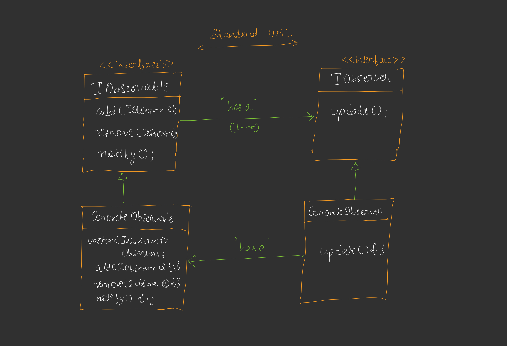
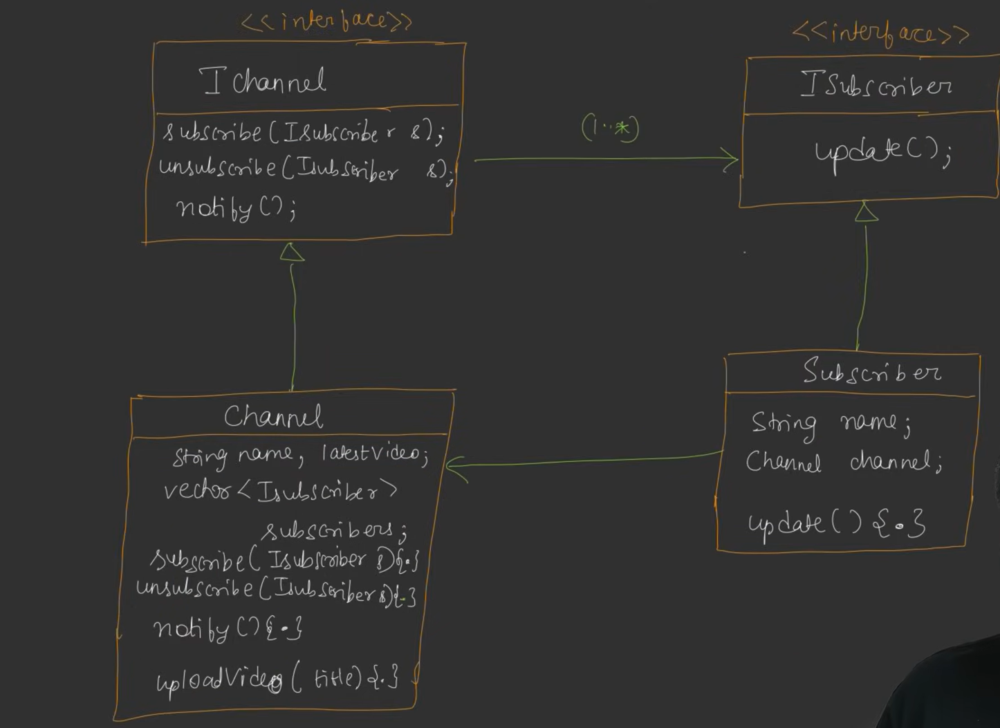

---

# 📘 **LLD – DAY 12**

## 🔔 **Observer Design Pattern**

---

## 🔹 **Introduction (Problem Statement)**

### 🧠 Scenario

> Socho jab bhi koi **YouTuber new video upload karta hai**,
> uske **sab subscribers ko notification milta hai**.

📌 Question:

* Humara **account** aur **YouTuber ka account**
  **automatically kaise interact** karte hain?
* Subscriber ko kaise pata chalta hai ki **kab change hua**,
  **kya change hua**, aur **naya data kya hai**?

---

### 🔴 **Core Problem Type**

Ye ek **specific category of problem** hai jisme:

> Jab bhi **ek object (Subject)** ki **internal state change hoti hai**,
> toh **dusre dependent objects (Observers)** ko **automatically update / notify** hona chahiye.

📌 Example:

* Video upload hua → sab subscribers ko pata chala

---

## 🔹 **Observer Design Pattern – Definition**

> **Observer Pattern** ek **behavioral design pattern** hai jo
> **one-to-many relationship** define karta hai objects ke beech,
> taaki **ek object ke change hote hi**
> **uske saare dependents notify ho jaayein**.

📌 **Simple words (Hinglish):**

> *“Ek jagah change ho → sabko khud-ba-khud pata chale.”*

---

## 🔹 **Real Life Example**

✔ YouTube channel
✔ News notification apps
✔ Stock price updates
✔ Event handling systems

---

## 🔹 **Techniques to Implement Observer Pattern**

### ❌ **1. Polling (BIG NO isko use nhi krte h)**

📌 Polling ka matlab:

* Observer baar-baar poochta rahe:

  > “Change hua kya?”
* Fixed time interval pe check karta hai

#### ❌ Problems:

* Performance waste hoti hai
* Time interval decide karna mushkil
* Real-time update nahi milta

```
Observer ----> Observable (check)
Observer ----> Observable (check)
Observer ----> Observable (check)
```

👉 **Isliye polling avoid karte hain**

---

### ✅ **2. Pushing (WE USE THIS)**

📌 Yahan:

* **Observable khud observer ko batata hai**
* Jab bhi state change hoti hai

👉 Observable:

* Observers ki **list maintain** karta hai
* Change hote hi **sabko notify** karta hai

```
Observable ----> Observer1
Observable ----> Observer2
Observable ----> Observer3
```

---

## 🔹 **Naming Convention**

📌 UML me:

* `<<abstract>>` likhne ka matlab
  👉 **Interface / Abstract Class isko ham (I + classname) ke sath likhte h**

📌 C++ me:

* Interface = **pure abstract class**

---

## 🔹 **UML Diagram – Observer Pattern (Core)**

### 🖊️ **Standard UML DIAGRAM**




### 🔹 **Diagram Explanation**

* **IObservable** → add/remove/notify observers
* **IObserver** → update()
* **ConcreteObservable** observers ki list maintain karta hai
* **ConcreteObserver** update logic implement karta hai

👉 **Textbook / Interview-standard Observer Pattern UML**

---

## 🔹 **Full YouTube Example**



### 🔹 **Diagram Explanation**

* **Channel = Observable**, **Subscriber = Observer**
* Channel subscribers ki list rakhta hai
* Jab **video upload hota hai**, channel **notify()** karta hai
* Sab subscribers ka **update()** call hota hai

👉 **Real-life example of Observer Pattern**


---

### 🔄 **Flow Explanation**

1. Subscriber channel ko subscribe karta hai
2. Channel subscribers ki list maintain karta hai
3. Jab `uploadVideo()` hota hai
4. Channel `notify()` call karta hai
5. Sab subscribers ka `update()` call hota hai

👉 **Automatic notification system**

---

## 🔹 **SRP (Single Responsibility Principle) Issue**

### ❗ Important Observation

📌 **Channel class SRP break karta hai**, kyunki:

* Business logic handle karta hai (video upload)
* Subscriber management bhi karta hai
* Notification bhi wahi bhejta hai

👉 **SRP strictly follow nahi hota**

---

### 🤔 **But phir bhi kyun use karte hain?**

📌 Kyunki:

* Ye pattern **Open–Closed Principle follow karta hai**
* New subscriber add karna easy
* Existing code change nahi hota

👉 **Trade-off pattern** hai

---

## 🔹 **Trade-off Explanation**

> Observer Pattern me hamesha decision hota hai:

```
SRP follow kare?
        OR
Design simple rakhe?
```

📌 Real systems me:

* Readability + scalability ko zyada priority milti hai

---

## 🔹 **11. Real-Life Use Cases**

* Notification Service
* Event Handling Systems
* UI listeners (button click, key press)
* Messaging systems
* Stock market apps

---

## 🎯 **Interview Golden Lines**

* *Observer Pattern allows automatic notification of dependent objects*
* *It promotes loose coupling between subject and observers*
* *Polling is inefficient; pushing is preferred*
* *Observer pattern is heavily used in event-driven systems*

---

