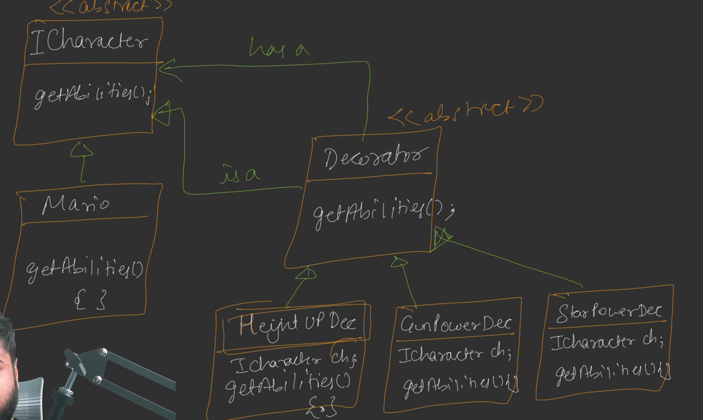
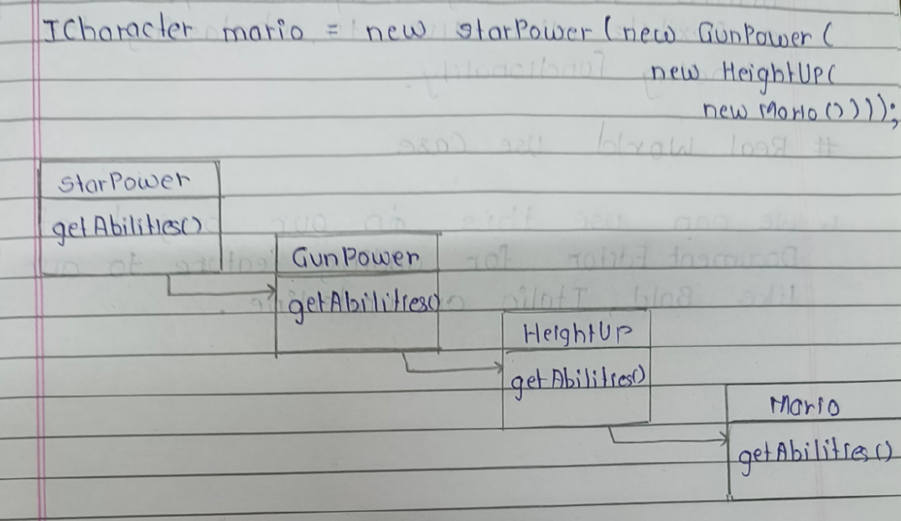
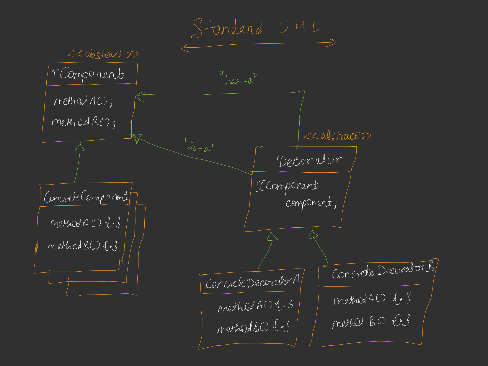

---

# 📘 DAY 13 – DECORATOR DESIGN PATTERN

---

## 🔷**Introduction**

### 🔹 Problem Statement

> Kabhi-kabhi hume **ek object ko runtime par additional responsibilities / features** deni hoti hain.

### 🧠 Simple Example

```text
obj.doSomething()
Output: "I did something"
```

Later runtime par:

```text
Output: "I did something amazing"
```

📌 **Important Point**
👉 Output **runtime par decide hota hai**, compile time par nahi.

---

### ❌ Why NOT Inheritance?

* Inheritance se **static behavior** milta hai
* Multiple features ke combination ke liye:

  * Height + Gun
  * Height + Star
  * Gun + Fly
  * Height + Gun + Fly

➡️ **Bahut saari child classes ban jaati hain**

📌 This leads to **CLASS EXPLOSION PROBLEM**

---

## 🔷**Mario Example – Problem with Inheritance**

### 🎮 Mario Abilities

* Height Increase
* Gun Power
* Star Power (temporary invincible)
* Fly Power

---

### ❌ Inheritance Based UML (Problem)

```
        Mario
          |
    ----------------
    |              |
MarioWithHeight  MarioWithGun
```

Aage:

* MarioWithHeightGun
* MarioWithGunFly
* MarioWithHeightGunFly
  ❌ **Unmanageable hierarchy**

---

### ❌ Issue Summary

* Too many subclasses
* Hard to maintain
* Not scalable
* Violates **Open-Closed Principle**

---

## 🔷**Decorator Pattern – Core Idea**

### ✅ Solution Concept

> **Object ko object se wrap karo**
> aur uski functionality enhance karo.

---

### 🧠 Hinglish Samjho

* Ek base object hota hai
* Uske upar decorator lagta hai
* Decorator **same interface** follow karta hai
* Decorator ke andar **original object hota hai (HAS-A)**

---

### 🔁 Infinite Wrapping Possible

```
obj
 ↓
Decorator1(obj)
 ↓
Decorator2(Decorator1(obj))
 ↓
Decorator3(Decorator2(Decorator1(obj)))
```

📌 Runtime par behavior change 🔥

---

## 🔷**IS-A + HAS-A Combo**

Decorator Pattern uses **both**:

| Relationship | Use                                |
| ------------ | ---------------------------------- |
| IS-A         | Decorator behaves like base object |
| HAS-A        | Decorator wraps base object        |

📌 यही Decorator Pattern ki **power** hai.

---

## 🔷**UML – Mario Example using Decorator**

### 🖊️ UML DIAGRAM for Mario Example



---

### 🧠 Explanation

* `ICharacter` → common interface
* `Mario` → base concrete class
* `Decorator` → wraps `ICharacter`
* Each power → separate decorator class

---

## 🔷**Runtime Combination Example**

```cpp
ICharacter* mario =
    new StarPower(
        new GunPower(
            new HeightUp(
                new Mario()
            )
        )
    );
```

📌 Ab Mario ke paas:

* Height
* Gun
* Star Power
  ➡️ **Without new subclass**

---

## 🔷**Execution Flow Diagram**

### 🖊️ DIAGRAM

```
StarPower
   |
GunPower
   |
HeightUp
   |
Mario
```

Call Flow:

```text
getAbilities()
↓
StarPower adds ability
↓
GunPower adds ability
↓
HeightUp adds ability
↓
Mario base ability
```


---

## 🔷**Standard UML – Decorator Pattern**



---

### 📌 Key Points

* Decorator **implements same interface**
* Decorator **HAS-A component**
* Behavior is added **before / after delegation**

---

## 🔷**Formal Definition**

> **Decorator Pattern dynamically adds responsibilities to an object.
> It provides a flexible alternative to subclassing for extending functionality.**

---

## 🔷**Real World Use Case**

### 📝 Document Editor Example

* Base Text
* Decorators:

  * Bold
  * Italic
  * Underline

```
Underline(
   Bold(
      Italic(
         Text
      )
   )
)
```

📌 Runtime formatting without subclass explosion

---

## 🔷**Why Decorator Pattern is Powerful**

* Runtime flexibility
* No class explosion
* Open-Closed Principle
* Composition > Inheritance
* Highly scalable

---

## 📝 **FINAL QUICK REVISION**

* Decorator = **Wrapper pattern**
* Adds behavior **at runtime**
* Uses **IS-A + HAS-A**
* Avoids inheritance explosion
* Best for **optional & combinable features**

---

## 🎯 **Interview Golden Line**

> *Decorator Pattern allows us to add new behavior to objects dynamically without modifying existing code or creating excessive subclasses.*

---
