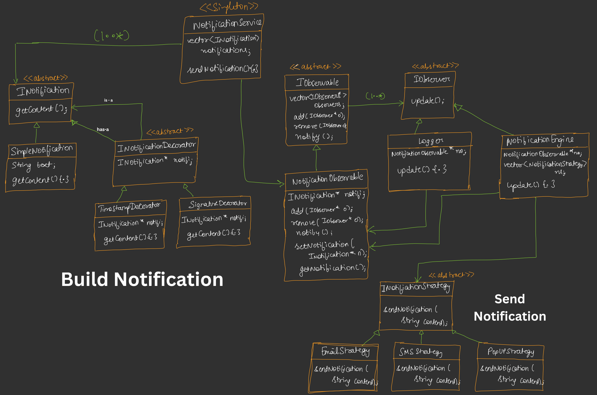

---

# 📘 DAY 14 – Building Notification System (LLD)

---

## 🔷 🧩 PROBLEM STATEMENT

### Hume ek **Notification System design** karna hai jisme:

### 1️⃣ Plug & Play Model

➡ Kisi bhi application me integrate ho jaye
➡ Minimal code change
➡ Architecture change nahi hona chahiye

🧠 Hinglish:

> “Service ko bas plug karo aur chal jaaye”

---

### 2️⃣ Highly Extensible

Initial:

* SMS
* Email
* Popup

Future:

* WhatsApp
* Push Notification
* Slack

Without changing old code
👉 **Follow OCP + Strategy**

---

### 3️⃣ Notification khud extensible ho

Runtime par add kar pao:

* Header
* Footer
* Timestamp
* Signature

👉 **Decorator Pattern**

---

### 4️⃣ Logging Feature

All notifications store ho
👉 Logger observer

---

# 🧠 PATTERNS USED

| Feature           | Pattern   |
| ----------------- | --------- |
| Dynamic content   | Decorator |
| Multiple channels | Strategy  |
| Auto update       | Observer  |
| Single service    | Singleton |

🔥 Real LLD level design.

---

# 🔷 🏗️ HIGH LEVEL FLOW

```
Client
   ↓
NotificationService (Singleton)
   ↓
NotificationObservable
   ↓ notify()
Observers:
   → Logger
   → NotificationEngine
            ↓
      Strategy (Email/SMS/Popup)
```
---

# UML Diagram of Notification Engine 



# 🧠 1️⃣ OVERVIEW – SYSTEM KYA KAR RAHA HAI?

System ka kaam:

1. Notification **banana (decorate karna)** → left side
2. Notification **store & trigger karna** → top (Singleton Service)
3. Notification **observers ko bhejna** → middle (Observer)
4. Notification **multiple channels se send karna** → bottom (Strategy)

---

# 🔶 2️⃣ BUILD NOTIFICATION (Decorator Pattern – LEFT SIDE)

## 🔹 Base Interface

```
INotification
   getContent()
```

👉 Ye common contract hai.

---

## 🔹 SimpleNotification

```
SimpleNotification
   string text
   getContent()
```

👉 Normal notification content.

---

## 🔹 Abstract Decorator

```
INotificationDecorator
   INotification* notification
```

🧠 HAS-A relation
Decorator ek notification ko wrap karta hai.

---

## 🔹 Concrete Decorators

```
TimestampDecorator
SignatureDecorator
```

👉 Ye runtime par content modify karte hain.

---

### 🧠 FLOW

```
SimpleNotification
   ↓
TimestampDecorator
   ↓
SignatureDecorator
```

Final content dynamically banta hai 💥

---

# 🔶 3️⃣ NOTIFICATION SERVICE (Singleton – TOP)

```
NotificationService
   vector<INotification> notifications
   sendNotification()
```

### 🔑 Role

✔ History store karta hai
✔ Ek hi instance (Singleton)
✔ Observable ko trigger karta hai

🧠 Pure system ka **entry point**

---

# 🔶 4️⃣ OBSERVER PART (MIDDLE)

## 🔹 Abstract Observable

```
IObservable
   add()
   remove()
   notify()
```

---

## 🔹 Concrete Observable

```
NotificationObservable
   INotification* notification
   setNotification()
   notify()
```

### 🧠 Role

Jab new notification aati hai:

```
setNotification()
   → notifyObservers()
```

---

## 🔹 Abstract Observer

```
IObserver
   update()
```

---

## 🔹 Concrete Observers

### 1️⃣ Logger

```
update()
→ notification log karta hai
```

### 2️⃣ NotificationEngine

```
vector<INotificationStrategy>
update()
→ sab strategies ko call
```

---

# 🔶 5️⃣ STRATEGY PART (SEND NOTIFICATION – BOTTOM)

## 🔹 Strategy Interface

```
INotificationStrategy
   sendNotification(content)
```

---

## 🔹 Concrete Strategies

```
EmailStrategy
SMSStrategy
PopupStrategy
```

🧠 Ye **same content** ko different mediums se send karte hain.

---

# 🔄 6️⃣ COMPLETE RUNTIME FLOW

### STEP 1️⃣ – Client

```
NotificationService.getInstance()
```

---

### STEP 2️⃣ – Build Notification

```
Simple → Timestamp → Signature
```

---

### STEP 3️⃣ – Send

```
sendNotification(notification)
```

---

### STEP 4️⃣ – Observable trigger

```
notify()
```

---

### STEP 5️⃣ – Observers update

#### Logger

```
log print
```

#### NotificationEngine

```
Email
SMS
Popup
```

---

# 🔥 7️⃣ RELATIONSHIPS IN UML

### IS-A (Inheritance)

```
SimpleNotification → INotification
Logger → IObserver
EmailStrategy → INotificationStrategy
```

---

### HAS-A

```
Decorator → INotification
Observable → Notification
Engine → Strategies
Service → Notifications
```

---

# 🎯 8️⃣ WHY THIS DESIGN IS POWERFUL?

✔ Runtime par features add
✔ New channel add without changing code
✔ Loose coupling
✔ Plug & play
✔ Highly scalable


---

# 🔷 🧠 CODE EXPLANATION – STEP BY STEP

---

## 🟡 STEP 1 – DECORATOR PART

### Base

```cpp
class INotification
```

👉 common interface

---

### Concrete

```cpp
SimpleNotification
```

👉 normal text

---

### Decorator

```cpp
INotificationDecorator
```

HAS-A → notification

---

### Features add

```cpp
TimestampDecorator
SignatureDecorator
```

👉 runtime par content change

---

### Runtime creation

```cpp
notification =
new SignatureDecorator(
    new TimestampDecorator(
        new SimpleNotification(...)
))
```

🔥 CLASS explosion nahi.

---

## 🟡 STEP 2 – OBSERVER PART

### Observable

```cpp
NotificationObservable
```

Kaam:

* observers list
* setNotification()
* notifyObservers()

---

### Observer 1 – Logger

```cpp
update()
→ log print
```

---

### Observer 2 – NotificationEngine

```cpp
update()
→ strategies ko call
```

---

## 🟡 STEP 3 – STRATEGY PART

```
EmailStrategy
SMSStrategy
PopupStrategy
```

NotificationEngine:

```
vector<strategy>
```

Loop:

```
sendNotification()
```

---

## 🟡 STEP 4 – SINGLETON SERVICE

```cpp
NotificationService
```

Kaam:

* Observable hold karta hai
* sendNotification()
* history maintain karta hai

---

# 🔷 🆕 UPDATED CODE IMPROVEMENT

Old:

Observer manually attach.

New:

```cpp
Logger()
{
observable = NotificationService::getInstance()
observable->addObserver(this)
}
```

🔥 Auto self-registration
Loose coupling
Better design.

---

# 🔷 🔄 COMPLETE RUNTIME FLOW

### MAIN()

### 1️⃣ Service

```
getInstance()
```

---

### 2️⃣ Observers auto attach

```
Logger
NotificationEngine
```

---

### 3️⃣ Strategies add

```
Email
SMS
Popup
```

---

### 4️⃣ Notification build (Decorator)

```
Simple → Timestamp → Signature
```

---

### 5️⃣ sendNotification()

```
Observable.notify()
        ↓
Logger.update()
NotificationEngine.update()
        ↓
All strategies execute
```

---

# 🎯 INTERVIEW EXPLANATION (GOLD LINE)

> This system uses
> Observer for event propagation,
> Strategy for multiple delivery channels,
> Decorator for dynamic content,
> Singleton for centralized service.

---

# 🧠 REAL WORLD MAPPING

Same design used in:

* Amazon order notification
* Swiggy updates
* Banking alerts
* YouTube notifications