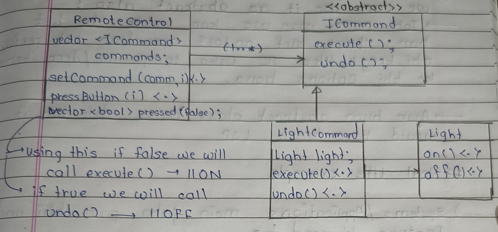
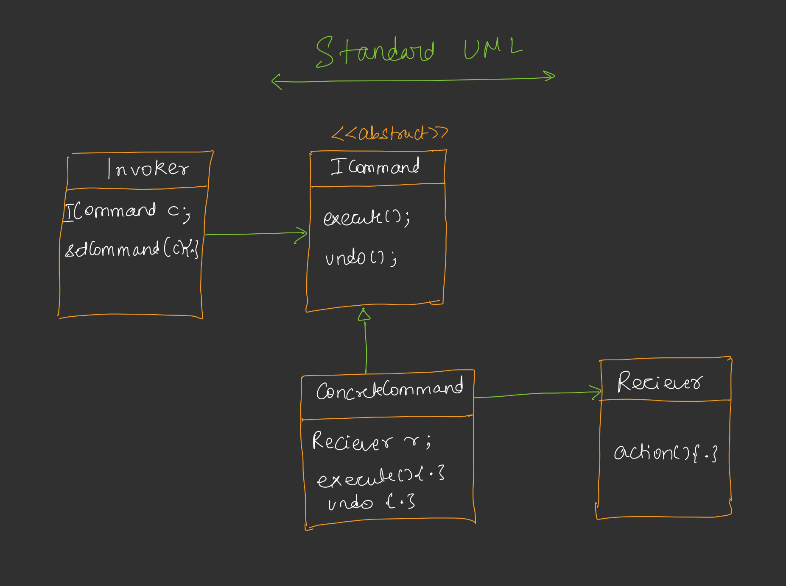

---

# 📘 DAY 15 - COMMAND DESIGN PATTERN (LLD)


---

# 🔷 INTRODUCTION

### 🔹 Core Idea

➡ Command pattern **request ko object me convert** karta hai.

Normal flow:

```
Source  --------->  Receiver
          call method directly
```

Command pattern flow:

```
Source  →  Command Object  →  Receiver
```

### 🧠 Samjho

> “Kaam directly karwane ki jagah uska remote bana diya.”

### ❓ Why convert request into object?

✔ Loose coupling between source & receiver
✔ Runtime pe receiver change ho sakta hai
✔ Undo/Redo support
✔ Queue / Log possible

---

# 🔷 REAL WORLD PROBLEM (Smart Home)

### ❌ Without Command Pattern

Remote tightly coupled:

```
Remote
 ├── button1 → Light ON
 ├── button2 → Fan ON
 ├── button3 → AC ON
```

🔴 Issue:
Agar future me Fan ki jagah Refrigerator control karna ho →
Remote class change → ❌ OCP break

---

# 🔷 BASIC UML (Single Button Design)

```
Remote (Invoker)
   |
   | has-a
   v
<<interface>> ICommand
    execute()

        ▲
        |
LightCommand (ConcreteCommand)
   |
   | has-a
   v
Light (Receiver)
   on()
   off()
```

### 🧠 Flow

```
Remote → command.execute() → light.on()
```

---

# 🔷 MULTIPLE DEVICES SUPPORT

Fan add karne ke liye:

```
FanCommand → Fan
```

Remote same rahega ✅
OCP follow ✅

---

# 🔷 OPTIMAL DESIGN WITH UNDO

### UML

```
RemoteControl (Invoker)
--------------------------------
vector<ICommand*> commands
vector<bool> pressed

setCommand(i, cmd)
pressButton(i)

            |
            v

     <<interface>>
        ICommand
        execute()
        undo()

            ▲
            |
     -------------------
     |                 |
LightCommand     FanCommand
     |                 |
     v                 v
   Light             Fan
```


### 🧠 Button Logic

```
if pressed == false → execute() → ON
if pressed == true  → undo()    → OFF
```

---

# 🔷 IMPORTANT DOUBTS

### ❓ Why ICommand does NOT have Light reference?

Because:

✔ ICommand ka kaam = execute/undo define karna
❌ Device decide karna iska kaam nahi

ConcreteCommand ka kaam:

```
LightCommand → Light
FanCommand → Fan
```

➡ This follows **Single Responsibility**

---

### ❓ Why not make Light abstract?

Because:
Different devices → different operations

Example:

```
Light → on/off
AC → temp up/down
Fan → speed control
```

Ek common abstraction banaoge → ❌ LSP break

---

# 🔷 REAL LIFE EXAMPLES

### 🧠 Where used?

#### 1️⃣ Undo Feature

✔ Text editor
✔ Photoshop
✔ Formatting

#### 2️⃣ Keyboard Shortcuts

```
Ctrl + Z → UndoCommand
Ctrl + C → CopyCommand
```

#### 3️⃣ Brightness Control

```
BrightnessUpCommand
BrightnessDownCommand
```

---

# 🔷 OFFICIAL DEFINITION

> **Encapsulate a request as an object**, allowing parameterization of clients with different requests, queueing/logging requests and supporting undoable operations.

---

# 🔷 STANDARD UML


---

# 🔷 MAPPING WITH YOUR CODE

## Roles

### 1️⃣ Command Interface

```cpp
class Command {
   execute();
   undo();
}
```

### 2️⃣ Receivers

```cpp
Light → on/off
Fan   → on/off
```

### 3️⃣ Concrete Commands

```cpp
LightCommand → Light
FanCommand   → Fan
```

### 4️⃣ Invoker

```cpp
RemoteController
```

### 5️⃣ Client

```cpp
main()
```

---

# 🔷 EXECUTION FLOW (YOUR CODE)

### Step-by-step

```
Client
  ↓
create Light & Fan

  ↓
create LightCommand & FanCommand

  ↓
setCommand(remote)

  ↓
pressButton()

  ↓
command.execute()

  ↓
receiver.action()
```

---

# 🔷 TOGGLE BEHAVIOR IN YOUR CODE

```
First press → execute() → ON
Second press → undo() → OFF
```

Using:

```cpp
bool buttonPressed[]
```
---

# 🔷 INTERVIEW READY POINTS

### ❓ When to use?

When:

* Request sender ≠ request executor
* Undo required
* Runtime command change

### ❓ Difference from Strategy?

Strategy → behavior change
Command → request encapsulation

---

# 🔷 ONE-LINER

> “Remote ko pata nahi hota kaunsa device hai — bas command execute karta hai.”


