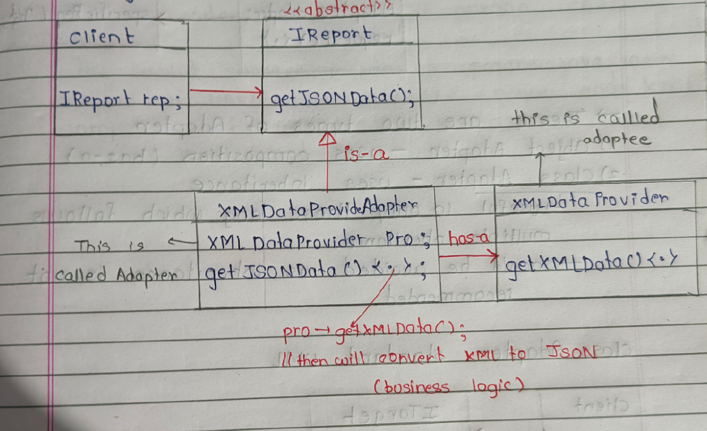
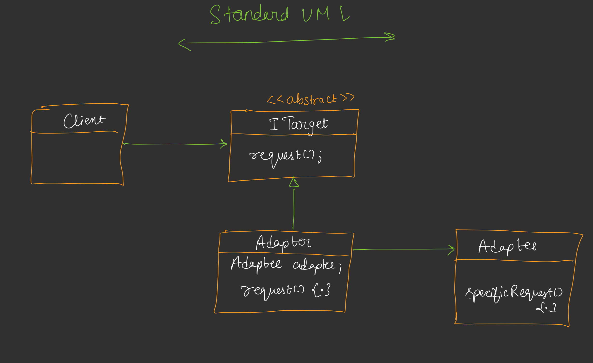
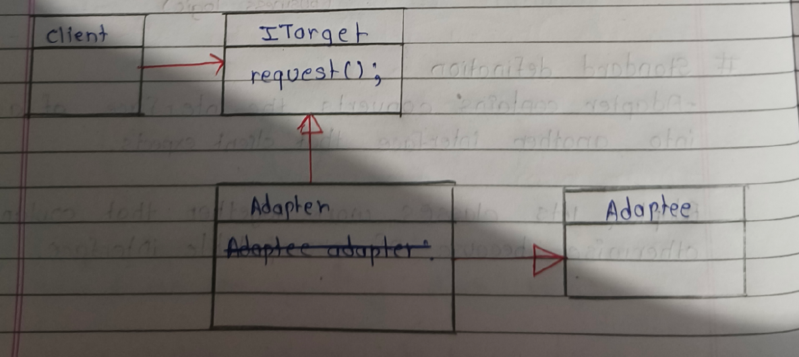

---

# 📘 DAY 16 -- ADAPTER DESIGN PATTERN (LLD)
 

---

# 🔷 Introduction (Concept + Real Life Analogy)

### 🧠 Real-life example (Hotel room socket)

* Tumhara charger **Indian plug** hai
* Hotel ka socket **different type** ka hai
* Direct connect ❌
* Adapter use karo → connect ho gaya ✅

👉 **Same in software:**
Do classes directly baat nahi kar pa rahi → Adapter beech me lagate hain.

---

### 🧠 Type-C → USB converter

Interface mismatch → adapter solve karta hai.

---

### 🧠 Software context

> Two objects cannot communicate due to incompatible interface → use adapter.

---

# 🔷 Need for Adapter Pattern

### ✔ 1. Third-party integration

Notification / Payment gateway / Razorpay
👉 existing code change nahi karna → adapter use

```
Existing Code → Adapter → 3rd Party Library
```

---

### ✔ 2. Different language return format

Library XML return kar rahi
App ko JSON chahiye
→ Adapter converts

---

### ✔ 3. Loose coupling

3rd party change → only adapter change
Main system safe ✅

---

# 🔷 Example – Report System

### 🧠 Problem

Application ko JSON chahiye
Library XML deti hai

### 🎯 Solution

Adapter XML → JSON convert karega

---

## 🖊️ TEXT UML DIAGRAM – REPORT EXAMPLE



### 🔥 Flow

Client → IReports
Adapter → XML provider call
→ convert → JSON return

---

# 🔷 Standard Definition

> Adapter converts the interface of a class into another interface that client expects.

> Adapter lets classes work together that couldn’t otherwise because of incompatible interface.

---

# 🔷 Standard UML – Object Adapter

## 🖊️ TEXT DIAGRAM



### 🧠 Flow

Client → request()
Adapter → specificRequest()

---

# 🔷 Types of Adapter

## 1️⃣ Object Adapter (Recommended ✅)

* Uses **composition (has-a)**
* Flexible
* Most used in LLD

---

## 2️⃣ Class Adapter (Rare ❌)

* Uses **inheritance**
* Needs multiple inheritance
* Not recommended in modern design

---

## 🖊️ CLASS ADAPTER UML



---

# 🔷 Real World Use Cases

## ✔ 1. Third-party vendor integration

Our system ↔ vendor system
Adapter → communication bridge

---

## ✔ 2. Legacy code

Old Java system
New modern app
Adapter → compatibility

---

# 🔷 Your Code Mapping to UML

## 🎯 Target

```
IReports
```

## 🎯 Adaptee

```
XmlDataProvider
```

## 🎯 Adapter

```
XmlDataProviderAdapter
```

## 🎯 Client

```
Client class
```

---

# 🔷 CODE FLOW (Step-by-step)

### 1️⃣ Client only knows:

```
IReports
```

### 2️⃣ Adapter created:

```
XmlDataProviderAdapter(xmlProvider)
```

### 3️⃣ Client call:

```
getJsonData()
```

### 4️⃣ Adapter:

* XML get karta
* parse karta
* JSON return karta

---

# 🔷 Your CODE FLOW – VISUAL

```
Raw Data → XmlDataProvider → XML
                       ↓
                Adapter converts
                       ↓
                     JSON
                       ↓
                     Client
```

---

# 🔷 1️⃣1️⃣ Complete Working Flow

```
Client
  ↓
IReports (Target)
  ↓
XmlDataProviderAdapter
  ↓
XmlDataProvider (Adaptee)
```

---

# 🔷 Key Advantages

✔ Third-party integration
✔ Loose coupling
✔ Reuse legacy code
✔ No modification in client
✔ OCP follow

---

# 🔷 When to Use

✅ Interface mismatch
✅ Third-party system
✅ Legacy system
✅ Data format conversion

---

# 🔷 Interview Golden Lines ⭐

> Adapter acts as a bridge between incompatible interfaces.

> Client always talks to Target interface.

> Object adapter uses composition → most preferred.

---

# 🧾 FINAL QUICK REVISION

Adapter = Converter 🔄

```
Client → Target → Adapter → Adaptee
```
