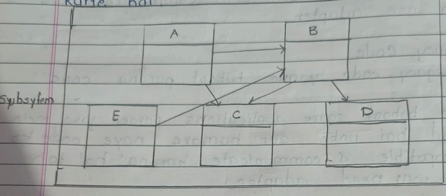
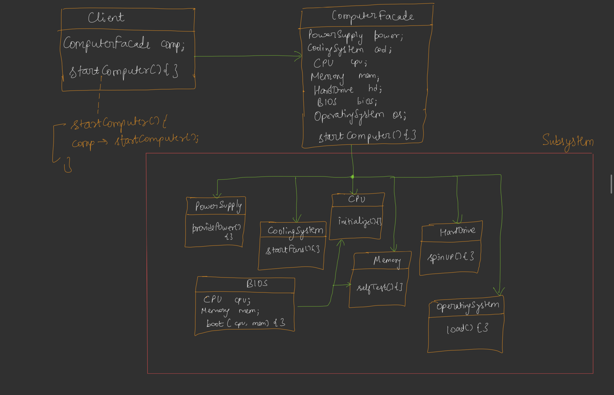
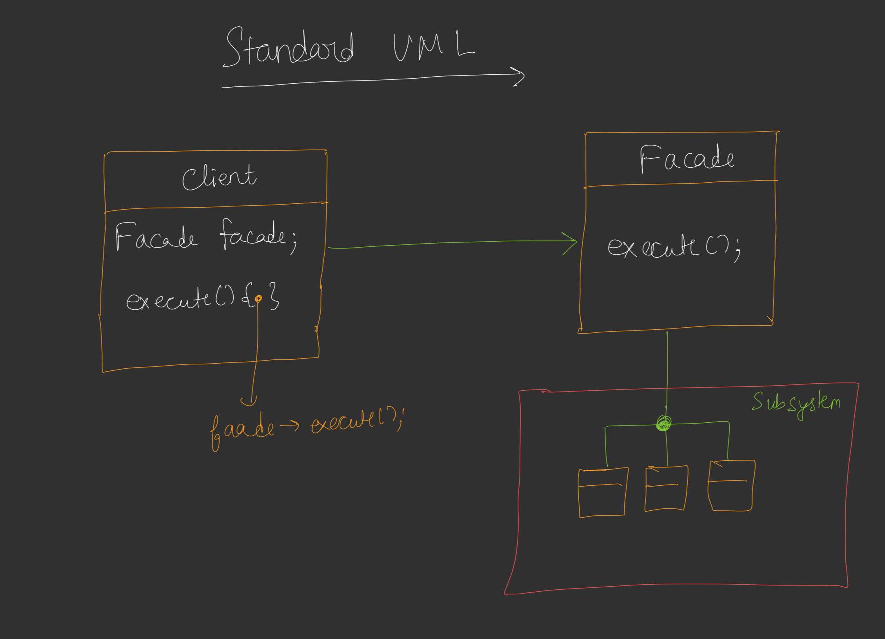

---

# 📘 DAY 17 – FACADE DESIGN PATTERN

---

# 🔷 INTRODUCTION

### 🧠 Problem

Real systems me:

* Bahut saare **classes**
* Ek dusre se **interact**
* Milke **ek task complete**

📌 Diagram (page 1 subsystem):



👉 Yeh sab milke ek **complex subsystem** banate hain.

### ❌ Issue

Client ko agar directly in sab se baat karni pade:

* Code confusing
* Tight coupling
* Client ko internal flow pata hona chahiye

---

## ✅ Solution → FACADE

Ek **facade class** introduce karo:

✔ Client → facade se baat karega
✔ Facade → subsystem ko handle karega

📌 Short line:

> Facade = gateway to complex system

---

# 🔷 WHY FACADE?

✔ Client aur subsystem decouple ho jate
✔ Code simple ho jata
✔ Principle of Least Knowledge follow hota

---

# 🔷 COMPUTER START EXAMPLE

## 🧠 Real Flow

Computer ON karne ke liye:

* PowerSupply
* CoolingSystem
* CPU
* Memory
* HardDrive
* BIOS
* OS

sabko sequence me call karna padta.

---

## ❌ Without Facade

Client ko sab manually call karna padega.

---

## ✅ With Facade

Client:

```
computerFacade.startComputer()
```

Bas.

---

## 📌 UML

### Client

```
ComputerFacade comp;
comp.startComputer();
```

---

### Facade



---

## 🔁 Actual Execution Flow

```
Client
  │
  ▼
ComputerFacade.startComputer()

   power.providePower()
   cool.startFans()
   cpu.initialize()
   mem.selfTest()
   hd.spinUp()
   bios.boot()
   os.load()
```

---

# 🔷 STANDARD UML


---

# 🔷 STANDARD DEFINITION

> Facade provides a **simplified unified interface** to a complex subsystem
> and hides internal complexity.

---

# 🔷 FACADE vs ADAPTER (CONFUSION)

| Facade           | Adapter                                  |
| ---------------- | ---------------------------------------- |
| Hides complexity | Converts interface                       |
| Same system      | make interaction b/w Different interfaces|
| Simplifies usage | Makes incompatible classes work together |

📌 Key line:

> Difference = **INTENT**

---

# 🔷 REAL-LIFE EXAMPLES

---

## 🎮 Game Engine

Game start hone pe:

* load assets
* load map
* memory management
* physics engine

Client:

```
startGame()
```

Engine facade sab handle karta.

---

## 💳 Payment Gateway

Payment se pehle:

* PIN check
* balance check
* mobile verification

Client:

```
makePayment()
```

Facade sab internally karega.

---

# 🔷 PRINCIPLE OF LEAST KNOWLEDGE

(VERY IMPORTANT FOR INTERVIEW)

## 🧠 Rule

> Talk only to your immediate friends

---

### ❌ Wrong

```
A → B → C
A directly C ko call kare ❌
```

---

### ✅ Correct

```
A → B
B → C
```

A sirf B ko call karega.

---

## 📌 Diagram

```
A.m1() → B.m2() → C.m3()
```

A ko directly C nahi pata hona chahiye.

---

# 🔷 GUIDELINES or RULES of PRINCIPLE OF LEAST KNOWLEDGE

Method ke andar aap sirf in objects ke methods call kar sakte ho:

✔ Object itself
✔ Object passed as parameter
✔ Object created inside method
✔ HAS-A relation object

---

## 📌 Example

Allowed:

```
class A
{
 B b;     ✔ (HAS-A)

 m1(B b)  ✔ (parameter)

 m2()
 {
   D d = new D(); ✔ (local object)
 }
}
```

## ✅ A ko kin objects se baat karne ki permission hai?

### ✔ 1️⃣ Object itself

Matlab current class ka khud ka method.

```
class A {
   void m1() {
       m2();   // ✔ allowed (same class ka method)
   }

   void m2(){}
};
```

📌 Kyun allowed?
Kyuki khud ko to jaanta hi hai 😄

---

### ✔ 2️⃣ Object passed as parameter

```
class B {
public:
   void show(){}
};

class A {
public:
   void m1(B b) {
       b.show();   // ✔ allowed
   }
};
```

📌 Kyun allowed?
Kyuki method me parameter ke through directly mila.

---

### ✔ 3️⃣ Object created inside method (local object)

```
class D {
public:
   void work(){}
};

class A {
public:
   void m1() {
       D d;
       d.work();   // ✔ allowed
   }
};
```

📌 Kyun allowed?
Kyuki A ne khud banaya → direct relation hai.

---

### ✔ 4️⃣ HAS-A relation object (member variable)

```
class B {
public:
   void show(){}
};

class A {
   B b;   // HAS-A
public:
   void m1() {
       b.show();   // ✔ allowed
   }
};
```

📌 Kyun allowed?
Kyuki yeh A ka part hai → direct friend.

---
## ❌ NOT ALLOWED (MOST IMPORTANT)

### 🚫 Chain calling

```
a.getB().getC().doSomething();
```

### Example

```
class C {
public:
   void work(){}
};

class B {
public:
   C getC();
};

class A {
public:
   void m1(B b) {
       b.getC().work();   // ❌ NOT allowed
   }
};
```

📌 Kyun wrong?

A → B → C
A ko C ke baare me pata hi nahi hona chahiye.

Ye tight coupling hai.

---

## ✅ Correct way

B se hi kaam karwao:

```
class B {
public:
   void doWorkWithC() {
       C c;
       c.work();
   }
};

class A {
public:
   void m1(B b) {
       b.doWorkWithC();   // ✔ correct
   }
};
```

---

# 🎯 INTERVIEW GOLD LINES

✔ Facade simplifies complex subsystem
✔ Client talks only to facade
✔ Promotes loose coupling
✔ Follows Least Knowledge Principle

---

# 🧾 FINAL SUMMARY

Agar system me:

❌ Bahut saare classes
❌ Complex interaction

Toh:

✅ Ek facade bana do
Client ko sirf ek method milega
Baaki ka kaam facade karega

---


