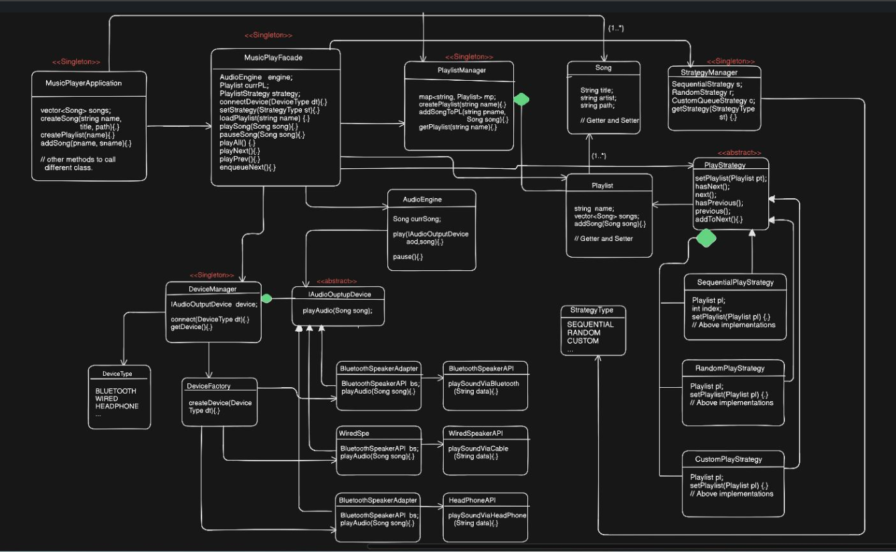

---

# 📘 DAY 18 – BUILD SPOTIFY (LLD DESIGN)

---

# Functional Requirements

User should be able to:

1. **Play and pause songs**
2. **Create playlists**
3. **Add songs to playlists**
4. **Play entire playlist in any order**
5. App should support **multiple output devices**

   * Bluetooth speaker
   * Wired speaker
   * Headphones
   * etc

---

# Non-Functional Requirements


1. System should be **scalable**
2. **New features / devices** should be easily added.

Example:

If tomorrow we add

* Car stereo
* Smart speaker
* Alexa

System should support them without major changes.

---

# Happy Flow (Execution Flow)


Application behavior:

1. Application has **multiple songs and playlists**
2. Each playlist contains **different songs**
3. User can

   * play playlist
   * pause song
   * play songs according to order
4. Application supports **different output devices**

   * Bluetooth
   * Wired speaker
   * Headphones
5. System must be **extensible** to add more devices.

---

# Design Patterns Used


The system uses multiple patterns together.

### Patterns used

1️⃣ **Strategy Pattern**
→ for playing songs order

2️⃣ **Singleton Pattern**
→ for managers (playlist manager / strategy manager)

3️⃣ **Adapter Pattern**
→ for third-party audio device APIs

4️⃣ **Facade Pattern**
→ to simplify interaction with system

5️⃣ **Factory Pattern**
→ to create devices

---

# Song Class

First create a **Song class**

### UML

```
Song
-------------------------
string name
string artist
string path
-------------------------
getters/setters
```

Explanation

* name → song name
* artist → singer
* path → file location of audio

---

# 1️⃣ Playing Songs – Device Integration

We want to play songs using devices like:

* Bluetooth Speaker
* Wired Speaker
* Headphones

But these are **3rd party APIs**.

Example:

```
BluetoothSpeakerAPI
WiredSpeakerAPI
HeadphoneAPI
```

So we cannot modify them.

Solution → **Adapter Pattern**

---

# 2️⃣ Adapter Pattern – Audio Devices


### Abstract Interface

```
IAudioOutputDevice
----------------------
playAudio(Song s)
```

Every audio device must implement this interface.


### Bluetooth Adapter

```
BluetoothSpeakerAdapter
---------------------------
BluetoothSpeakerAPI bs
playAudio(Song s)
```

Internally calls

```
bs.playSoundViaBluetooth()
```


### Wired Speaker Adapter

```
WiredSpeakerAdapter
-------------------------
WiredSpeakerAPI ws
playAudio(Song s)
```

Internally calls

```
bs.playSoundViaWire()
```


### Headphone Adapter

```
HeadphoneSpeakerAdapter
----------------------------
HeadphoneAPI hp
playAudio(Song s)
```

Internally calls

```
bs.playSoundViaHeadphone()
```


## Audio Engine

Audio engine controls song playback.

### UML

```
AudioEngine
-----------------------
Song currentSong
-----------------------
play(IAudioOutputDevice d, Song s)
pause()
```

Explanation

* It decides **which device to use**
* Calls adapter internally.


## Device Manager (Singleton)


Device manager manages **all devices**.

### UML

```
DeviceManager <<Singleton>>
---------------------------
IAudioOutputDevice device
---------------------------
connect(DeviceType dt)
getDevice()
```

It stores currently connected device.

---

### Device Types

```
DeviceType (enum)

Bluetooth
WiredSpeaker
Headphone
```


## Device Factory


Factory creates correct adapter.

### UML

```
DeviceAdapterFactory
---------------------------
createDevice(DeviceType dt)
```

Example:

```
Bluetooth → BluetoothAdapter
Wired → WiredAdapter
Headphone → HeadphoneAdapter
```

---

# 3️⃣ Facade – Music Player Facade


User should not interact with:

* AudioEngine
* DeviceManager
* PlaylistManager

Instead we create **Facade**

### UML

```
MusicPlayerFacade
--------------------------
AudioEngine ae
DeviceManager dm
--------------------------
playSong(Song s)
pauseSong()
connectDevice(DeviceType dt)
playAll()
```

Facade hides complexity.

---

# 4️⃣ Playlist System


## Playlist class

```
Playlist
------------------------
string name
vector<Song> songs
------------------------
addSong(Song s)
```


## Song ↔ Playlist Relation

```
Playlist 1 ---- * Song
```

A playlist contains multiple songs.


## Playlist Manager (Singleton)


Manages multiple playlists.

### UML

```
PlaylistManager <<Singleton>>
--------------------------------
map<string, Playlist> playlists
--------------------------------
createPL(name)
getPL(name)
addSong(plName, song)
```


#  5️⃣ Strategy Pattern – Playing Songs


Different ways to play songs.

Examples

1️⃣ Sequential order
2️⃣ Random order
3️⃣ Custom order


### Strategy Interface

```
PlayingStrategy (abstract)
----------------------------
setPlaylist(Playlist pl)
next()
previous()
hasNext()
hasPrev()
nextSong()
```


## Concrete Strategies

### Sequential Strategy

```
SequentialPLStrategy
-------------------------
Playlist pl
index
```

Plays songs in order.


### Random Strategy

```
RandomPLStrategy
```

Plays songs randomly.

---

### Custom Strategy

```
CustomPLStrategy
```

User defined order.

---

# 6️⃣ Strategy Manager (Singleton)


Maintains strategies.

### UML

```
PlayingStrategyManager <<Singleton>>
------------------------------------
SequentialStrategy s
RandomStrategy r
CustomStrategy c
------------------------------------
getStrategy(type)
createStrategy(type)
```


### Strategy Type Enum

```
StrategyType

Sequential
Random
Custom
```
---

# 7️⃣ Updating MusicPlayerFacade


Facade now stores:

```
Strategy strategy
Playlist currentPL
```

Methods:

```
setStrategy(StrategyType)
loadPlaylist(name)
playAll(name)
playNext()
playPrev()
```


# 8️⃣ Final Orchestration Class


### MusicPlayerApplication

This is **entry point of system**

### UML

```
MusicPlayerApplication
------------------------------
vector<Song> songs
------------------------------
createSong(name, artist, path)
createPlaylist(name)
playAll()
playNext()
playPrev()
```

Application interacts with **MusicPlayerFacade only**.

---

# Final UML Diagram



---

# Final System Architecture (Simplified)

```
User
  |
MusicPlayerApplication
  |
MusicPlayerFacade
  |
--------------------------------
| AudioEngine                  |
| PlaylistManager              |
| DeviceManager                |
| PlayingStrategyManager       |
--------------------------------
      |
   Adapters
      |
Bluetooth / Wired / Headphone APIs
```

---

# Full System UML (Conceptual)

```
User
 ↓
MusicPlayerApplication
 ↓
MusicPlayerFacade
 ├── AudioEngine
 ├── PlaylistManager
 ├── DeviceManager
 └── StrategyManager

AudioEngine → IAudioOutputDevice
IAudioOutputDevice → Adapters
Adapters → Device APIs

PlaylistManager → Playlist → Songs

StrategyManager → PlayStrategy
PlayStrategy → Sequential / Random / Custom
```

---

# 🎯 Key Design Learnings

This project combines multiple patterns.

| Pattern   | Purpose                   |
| --------- | ------------------------- |
| Strategy  | Different play orders     |
| Singleton | Managers                  |
| Adapter   | Third-party device APIs   |
| Factory   | Create device adapters    |
| Facade    | Simplify system interface |


