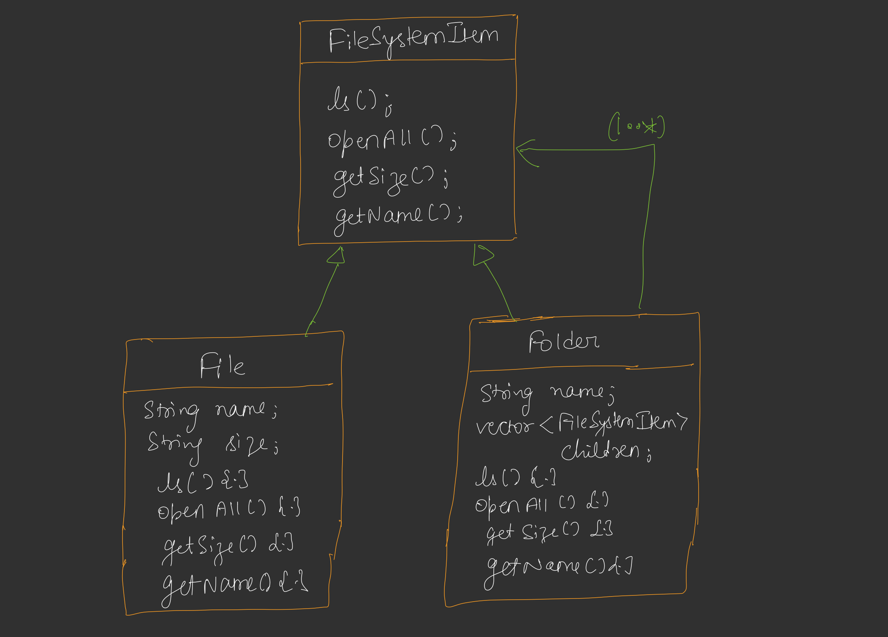
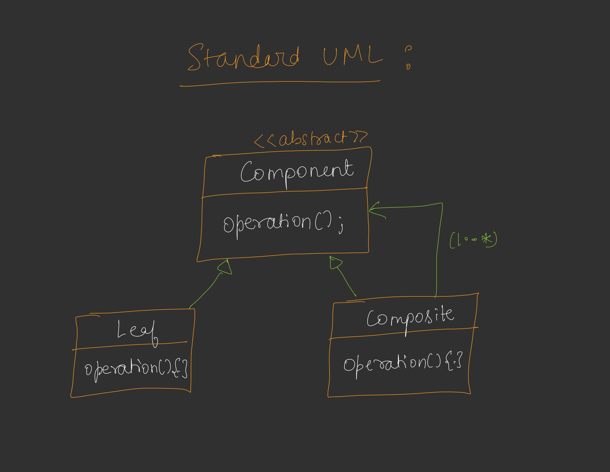

 
---

# 🎨📘 **DAY 19 – COMPOSITE DESIGN PATTERN**

---

# 🔵 **Introduction**

<u>Composite Design Pattern</u>

Earlier we studied many design patterns but **they are not applicable for every problem**.

Composite pattern is mainly used **when we deal with hierarchical structures**.

Example hierarchy structures:

* File System
* Organization structure
* Menu system
* DOM tree
* Folder structure

---

### 💡 Key Idea

In hierarchical problems we have **two types of nodes**:

```
1️⃣ Leaf Node
2️⃣ Composite Node (Intermediate Node)
```

Example in File System:

```
FileSystem
   |
   |---- Folder
   |        |
   |        |---- Folder
   |        |---- File
   |
   |---- File
```

✔ File → Leaf Node
✔ Folder → Composite Node

---

# 🟢 **Classic Problem – Designing File System**

You use **file system as example**.

### Structure

```
FileSystem
   |
   |---- Folders  (intermediate node)
   |       |
   |       |---- Folders
   |       |---- Files
   |
   |---- Files (leaf node)
```

✔ Folders can contain both **files and folders**.

---

## Without Composite Pattern

If composite pattern didn't exist:

```
Files
----------------
name
size()
open()

Folders
----------------
name
vector<File> files
vector<Folder> folders
```

Problem:

Folder must maintain **two separate lists**

```
vector<File>
vector<Folder>
```

This creates **implementation complexity**.

---

# 🟣 **Folder Behaviour**

Folder can contain:

```
File
Folder
File
Folder
```

Example:

```
root
 ├── file1.txt
 ├── file2.txt
 ├── docs
 │     ├── resume.pdf
 │     └── notes.txt
 └── images
       └── photo.jpg
```

---

# 🔴 **Why Implementation Becomes Hard**

Suppose we implement **ls command**

```
ls()
```

This prints:

```
files and folders in directory
```

Example:

```
root
 file1.txt
 file2.txt
 docs
 images
```

---

### Another command

```
openAll()
```

This prints **complete hierarchy recursively**.

Example:

```
+ root
    file1.txt
    file2.txt
    + docs
        resume.pdf
        notes.txt
    + images
        photo.jpg
```

---

### Problem without Composite Pattern

We must write code like:

```
if object is file
   print file
else if object is folder
   recursive call
```

And also maintain **two lists**.

This makes code **complex and hard to maintain**.

---

# 🟡 **Composite Pattern Idea**

Composite pattern solves this problem.

### Concept

Treat **file and folder in same way**.

Both should follow **same interface**.


### Common Interface

```
FileSystemItem
```

```
ls()
openAll()
getSize()
getName()
```

Both File and Folder implement this.

---

# 🟠 **Composite Pattern Structure**

### Text Diagram

```
              FileSystemItem
            (Common Interface)
                    |
          -------------------------
          |                       |
        File                  Folder
       (Leaf)               (Composite)
```

Both classes implement same methods.

---

# 🟤 **UML for File System**

### Component Interface

```
FileSystemItem
--------------------------------
ls()
openAll()
getSize()
getName()
```

### File (Leaf)

```
File
------------------------
string name
string size
------------------------
ls()
openAll()
getSize()
getName()
```

File cannot contain children.


### Folder (Composite)

```
Folder
-----------------------------
string name
vector<FileSystemItem> children
-----------------------------
ls()
openAll()
getSize()
getName()
```

Folder stores **list of FileSystemItem**.

This allows it to store both:

```
File
Folder
```


---

# 🟢 **File System Hierarchy Example**

Example structure:

```
root
 |
 |-- file1.txt
 |-- file2.txt
 |
 |-- core
 |      |
 |      |-- file3.txt
 |      |-- file4.txt
 |
 |-- user
        |
        |-- file5.txt
```

Symbol meaning:

```
+ → Folder (expandable)
```

---

# 🔵 **How openAll() Works**

If we call

```
root.openAll()
```

Execution flow:

```
for each child
    call child.openAll()
```

---

### Case 1: Child is File

```
file.openAll()

→ prints file name
```


### Case 2: Child is Folder

```
folder.openAll()

→ prints folder name
→ recursively calls openAll()
```

---

### Recursive Traversal

```
root
  |
  + core
      |
      file3.txt
      file4.txt
```

Traversal becomes **tree recursion**.

---

# 🟣 **Standard UML – Composite Pattern**

```
                 <<abstract>>
                 Component
                 operation()

               /              \
              /                \
         Leaf                 Composite
       operation()           operation()
                              children
```



Composite contains **multiple components**.

```
Composite
   |
   |--- Leaf
   |--- Leaf
   |--- Composite
```

---

# 🟡 **Standard Definition**

Composite Pattern:

> Composes objects into tree structures to represent part-whole hierarchy.

It allows clients to treat:

```
individual objects (leaf)
and
compositions (composite)
```

**uniformly**.

---

# 🟠 **Real World Use Cases**

Composite pattern is useful in:

### 1️⃣ File System

```
Folder
   |
   |--- Folder
   |--- File
```


### 2️⃣ Menu System

Example:

```
Menu
  |
  |--- File
  |      |--- New
  |      |--- Open
  |
  |--- Edit
         |--- Copy
         |--- Paste
```


### 3️⃣ Organization hierarchy

```
CEO
 |
 |--- Manager
 |       |
 |       |--- Developer
 |
 |--- HR
```

---

# 🧠 **Composite Pattern Key Benefits**

✔ Simplifies hierarchical structures
✔ Treat leaf and composite objects uniformly
✔ Makes recursive algorithms easy
✔ Improves extensibility

---

# ⚠️ **When NOT to Use**

Avoid when:

* Hierarchy doesn't exist
* Objects don't share common operations

---

# 💻 **Code Mapping (Your Program)**

Your code implements:

```
FileSystemItem → Component
File → Leaf
Folder → Composite
```

Folder contains

```
vector<FileSystemItem*>
```

So folder can store:

```
File
Folder
```

---

# 🧠 **Interview One-Line Answer**

Composite pattern lets you treat individual objects and compositions of objects **in the same way** using a common interface.

---

# 🎯 **Final Visualization**

```
FileSystemItem
      |
      |----------------|
      |                |
     File            Folder
                      |
               vector<FileSystemItem>
                      |
                File / Folder
```

---

