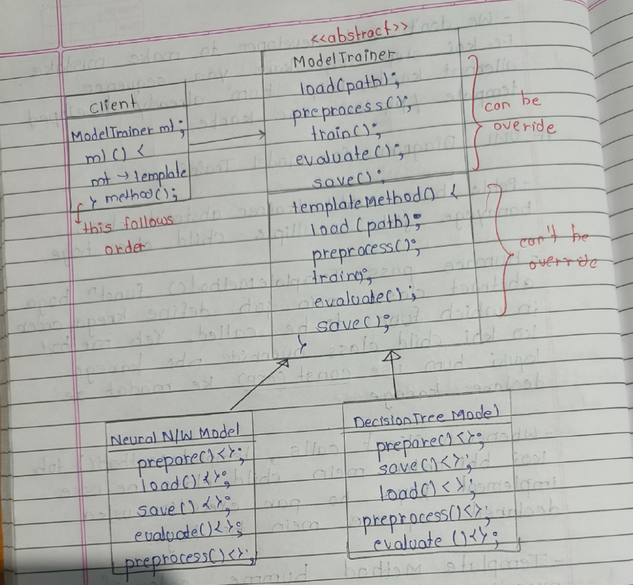
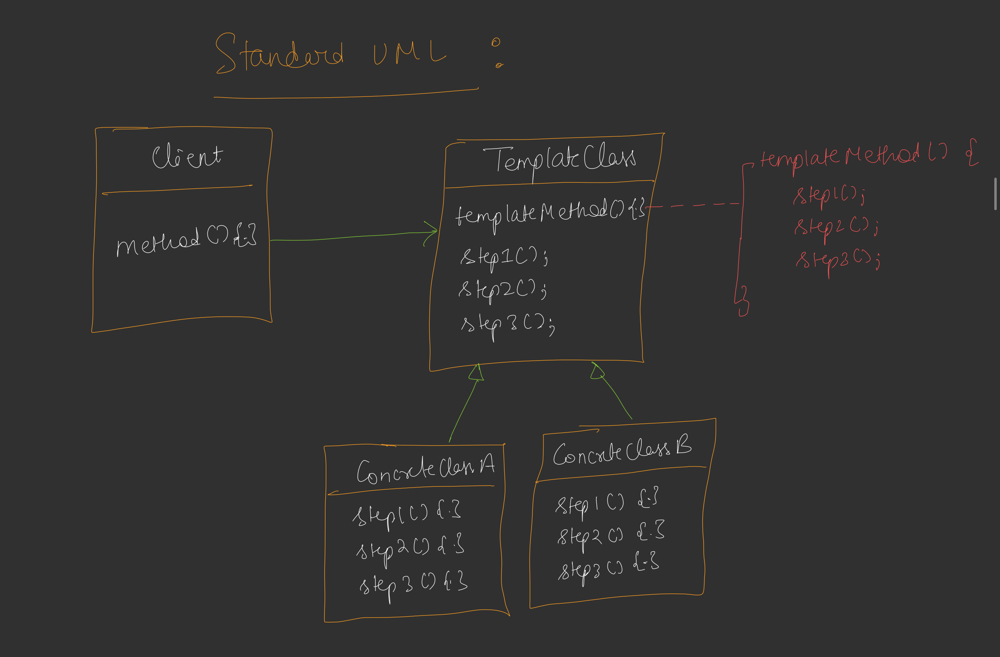

---

# 🎨📘 DAY 20 – TEMPLATE METHOD DESIGN PATTERN

---

#  <span style="color:blue;">🟦 Introduction</span>
 

Earlier we studied many design patterns like:

* Strategy Pattern
* Composite Pattern
* Factory Pattern
* Adapter Pattern

But those patterns are mostly used for **specific problems**.

Template Method Pattern is useful when:

✔ A **process must follow a fixed sequence of steps**
✔ Some steps may change depending on the implementation.

---

### 💡 Problem it solves

Many applications have **pipelines**.

Example pipeline:

```
Step1 → Step2 → Step3 → Step4 → Step5
```

But the implementation of some steps may vary.

Example:

```
Load Data
Preprocess Data
Train Model
Evaluate Model
Save Model
```

This sequence **must remain fixed**, but the implementation may differ.

Example:

```
Neural Network Model
Decision Tree Model
Random Forest Model
```

All models follow the **same pipeline**.

This problem is solved using **Template Method Pattern**.

---
# <span style="color:green;">🟩 Example – AI Model Training Pipeline</span>

In your notes the example is **Machine Learning Model Training**.

### Pipeline

```
Load Data
   ↓
Preprocess Data
   ↓
Train Model
   ↓
Evaluate Model
   ↓
Save Model
```

This **sequence must always remain same**.

Every model must follow this order.

📌 This sequence is called a **Template**.

---
# <span style="color:orange;">🟨 Why Template Method is Needed</span>

If developers implement this pipeline manually:

Problems may occur:

* Step skipped
* Wrong order
* Incorrect implementation

Example mistake:

```
Train Model
Load Data
Preprocess Data
```

Wrong sequence.


### Solution

We define a **fixed template pipeline**.

Developer cannot change the order.

But developer **can customize some steps**.

---


# <span style="color:red;">🟨 Template Method Concept</span>

The main idea:

```
Define algorithm skeleton in base class
Allow subclasses to override specific steps
```

Example:

```
Base Class → defines order
Child Class → defines implementation
```

---

# <span style="color:red;">🟨 UML Diagram for Model Training</span>

According to the diagram in your notes (Page 3) 

### Text UML

```
                <<abstract>>
                ModelTrainer
-----------------------------------
load(path)
preprocess()
train()
evaluate()
save()

templateMethod()
-----------------------------------
load()
preprocess()
train()
evaluate()
save()
```

Here:

```
templateMethod()
```

defines the **fixed order**.

---

### Child Classes

Two example models:

```
NeuralNetworkModel
DecisionTreeModel
```

Both extend **ModelTrainer**.

---
# <span style="color:purple;">🟨 Class Hierarchy Diagram</span>

```
                   ModelTrainer
                     (Abstract)
                         |
           --------------------------------
           |                              |
   NeuralNetworkTrainer           DecisionTreeTrainer
```

Each subclass implements:

```
train()
evaluate()
save()
```



---


# <span style="color:brown;">🟨 Code Structure Explanation</span>

### Base Class

```cpp
class ModelTrainer
```

This class defines **template pipeline**.

---

### Template Method

```
trainPipeline()
```

Pipeline:

```
loadData()
preprocessData()
trainModel()
evaluateModel()
saveModel()
```

This method **controls execution order**.

Subclasses cannot change this order.

---

### Methods Types

| Method         | Type                    |
| -------------- | ----------------------- |
| loadData       | common                  |
| preprocessData | optional override       |
| trainModel     | abstract                |
| evaluateModel  | abstract                |
| saveModel      | default but overridable |

---

# 🟦 <u>Neural Network Implementation</u>

Child class:

```
NeuralNetworkTrainer
```

Implements:

```
trainModel()
evaluateModel()
saveModel()
```

Example operations:

```
Train for 100 epochs
Calculate accuracy
Save weights in .h5 file
```

---

# 🟩 <u>Decision Tree Implementation</u>

Child class:

```
DecisionTreeTrainer
```

Implements:

```
trainModel()
evaluateModel()
```

Uses default:

```
saveModel()
```

Example operations:

```
Build decision tree
Compute precision/recall
```

---

# 🟨 <u>Execution Flow</u>

Main program:

```
ModelTrainer* trainer = new NeuralNetworkTrainer();
trainer->trainPipeline();
```

Execution:

```
trainPipeline()
   ↓
loadData()
   ↓
preprocessData()
   ↓
trainModel()
   ↓
evaluateModel()
   ↓
saveModel()
```

But actual implementation depends on subclass.

---

# 🟧 <u>Standard UML – Template Method</u>

From your notes (Page 4) 

```
Client
  |
  v
TemplateClass
----------------------------------
templateMethod()
step1()
step2()
step3()

     /            \
    /              \
ConcreteClassA   ConcreteClassB
step1()           step2()
step2()           step3()
```

Template class controls sequence.

Subclasses implement steps.



---

# 🟥 <u>Standard Definition</u>

Template Method Pattern:

> Defines the skeleton of an algorithm in a base class and allows subclasses to redefine certain steps without changing the algorithm structure.

---

# 🟪 <u>Real World Use Case</u>

Template pattern is used when **execution order must remain fixed**.

Example:

### 1️⃣ UPI Payment

```
Validate Balance
Enter Amount
Enter PIN
Debit Sender
Credit Receiver
```

Steps must always follow same order.

---

### 2️⃣ Machine Learning Pipeline

```
Load Data
Preprocess
Train
Evaluate
Save
```

---

### 3️⃣ Online Order System

```
Add Items
Calculate Price
Make Payment
Generate Invoice
Send Confirmation
```

---

# 🟫 <u>Advantages</u>

✔ Enforces algorithm structure

✔ Avoids duplicate code

✔ Allows customization through subclasses

✔ Prevents incorrect execution order

---

# 🟦 <u>1️⃣5️⃣ Disadvantages</u>

❌ Less flexibility in algorithm sequence

❌ Tight coupling with base class

---

# 🧠 <u>16️⃣ Key Interview Point</u>

Template Method Pattern:

```
Algorithm Structure → Base Class
Implementation → Child Class
```

---

# 🎯 <u>Final Visualization</u>

```
                Template Method Pattern

                   ModelTrainer
                       |
           --------------------------------
           |                              |
  NeuralNetworkTrainer          DecisionTreeTrainer
           |                              |
     trainModel()                   trainModel()
     evaluateModel()                evaluateModel()
     saveModel()                    saveModel()

Pipeline (Fixed)
------------------------
loadData()
preprocessData()
trainModel()
evaluateModel()
saveModel()
```

---

# 📌 Final Summary

Template Method Pattern is useful when:

* Execution order must remain **fixed**
* Some steps may vary
* Subclasses provide implementation
* Base class controls algorithm structure.

---

