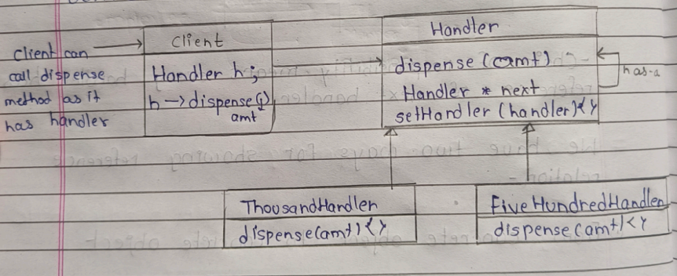
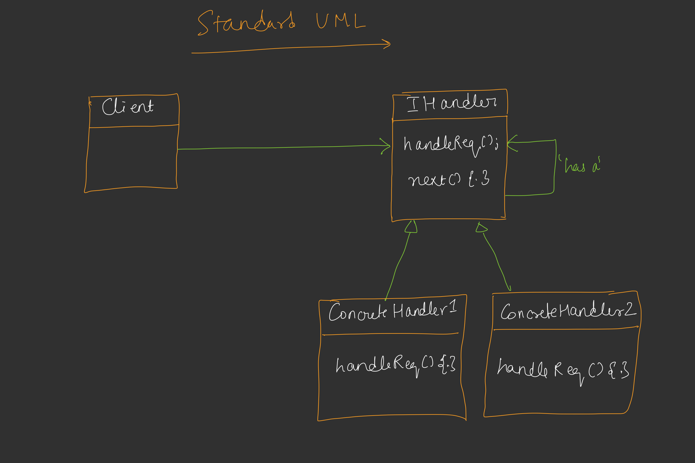

---

# 🟦 Day 22 – Chain of Responsibility (CoR) Pattern

---

# 🟩 Introduction

* It is a **use-case specific design pattern**
* Used when a **request needs to pass through multiple objects (handlers)**

---

### 🧠 Concept

Client request ko ek **chain of objects** ko pass kiya jata hai.

```text
Client → R1 → R2 → R3 → ...
```

---

### 📌 Flow (diagram explanation)

```id="cor1"
Client → R1 → R2 → R3
```

* R1 check karega → kya request handle kar sakta hai?
* If YES → process & stop
* If NO → next handler ko pass karega

👉 Same way response bhi wapas aata hai

---

### 🔥 Important

> Yeh Linked List jaisa lagta hai but intent different hai

---

# 🟩 ATM Example (Cash Dispensing)

## 📌 Scenario 

ATM machine ke paas multiple handlers hote hain:

* H1 → 1000 notes
* H2 → 500 notes
* H3 → 100 notes

---

## 🧾 Case 1: Client asks ₹5000

```id="atm1"
Client → H1(1000) → H2(500) → H3(100)
```

* H1 → 5 × 1000 = 5000 → Done

---

## 🧾 Case 2: Client asks ₹6000


```id="atm2"
Client → H1 → H2 → H3
```

* H1 → gives 5 × 1000 = 5000
* Remaining = 1000
* H2 → handles remaining (2 × 500)

Final:

```text
5000 + 1000 = 6000
```

---

## 🧾 Case 3: Client asks ₹150

(edge case)

❌ No handler for 50

So 2 options:

1. Return partial (₹100 only)
2. Cancel transaction

👉 Depends on use-case

---

# 🟩  Core Idea

> Each handler has a reference to the **next handler**

```id="cor2"
Handler → Next Handler → Next Handler
```

---

# 🟦 UML Diagram (Basic)


```id="uml1"
        <<abstract>>
          Handler
        -------------
        dispense(amt)
            |
     -------------------
     |                 |
ThousandHandler   FiveHundredHandler
```


---

### 📌 Important Rule

✔ Every handler has:

```id="handler"
Handler* next
```

---

# 🟦 Reference Relationship

## ✔ Method 1: Concrete → Concrete (BAD)


```id="bad"
ThousandHandler → FiveHundredHandler
```

❌ Problem:

* Hardcoding order
* Future change difficult
* Tight coupling

---

## ✔ Method 2: Interface → Interface (BEST)


```id="good"
Handler → Handler → Handler
```

✔ Flexible
✔ Loosely coupled
✔ Extensible

---

### 📌 Handler Structure

```id="handlercode"
class Handler {
    Handler* next;

    void dispense(int amt);
    void setNext(Handler* h);
}
```

---

### 📌 Client

```id="clientcor"
Handler* h;

h->dispense(amt);
```

Client only talks to first handler.

---

# 🟦 Full UML (Clean Version)


```id="uml2"
Client
  |
  v
Handler (abstract)
  - Handler* next
  - dispense()
  - setNext()

   /           \
  /             \
Thousand      FiveHundred
Handler       Handler
```


---

# 🟦 Standard UML

```id="stduml"
Client → IHandler

IHandler:
   handleReq()
   next

ConcreteHandler1
ConcreteHandler2
```


---

# 🟦 Standard Definition


> Chain of Responsibility allows a request to pass through a chain of handlers.
> Each handler decides:

* Process request OR
* Pass to next handler

---

# 🟦 Linked List vs CoR


| Feature    | Linked List  | Chain of Responsibility |
| ---------- | ------------ | ----------------------- |
| Purpose    | Data storage | Request handling        |
| Structure  | Nodes        | Handlers                |
| Connection | Same type    | Interface-based         |
| Intent     | Store data   | Process request         |

---

### 📌 Key Point

> Linked List stores data
> CoR processes requests

---

# 🟦 Important Notes


❌ Hardcoding order → Tight coupling
✔ Interface usage → Loose coupling

---

# 🟦 Real World Use Cases


---

## ✔ 1. Logger System

3 Levels:

```id="logger"
INFO → DEBUG → ERROR
```

* Each logger decides:

  * Handle OR
  * Pass forward

---

## ✔ 2. Leave Request System

```id="leave"
Employee → TL → Manager → Director
```

* TL → small leave approve
* Manager → medium leave
* Director → long leave

---

# 🟦 Final Flow Summary

```id="finalcor"
Client → Handler1 → Handler2 → Handler3
```

✔ First handler tries
✔ If fails → next
✔ Continue till handled

---

# 🟦 Key Advantages

✔ Loose coupling

✔ Flexible chain

✔ Easy to extend

✔ Follows Open/Closed Principle

---

# 🟦 One-Line Interview Answer

> Chain of Responsibility is a behavioral pattern where a request is passed along a chain of handlers until one of them processes it.


