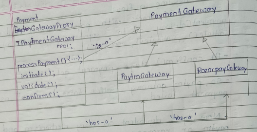
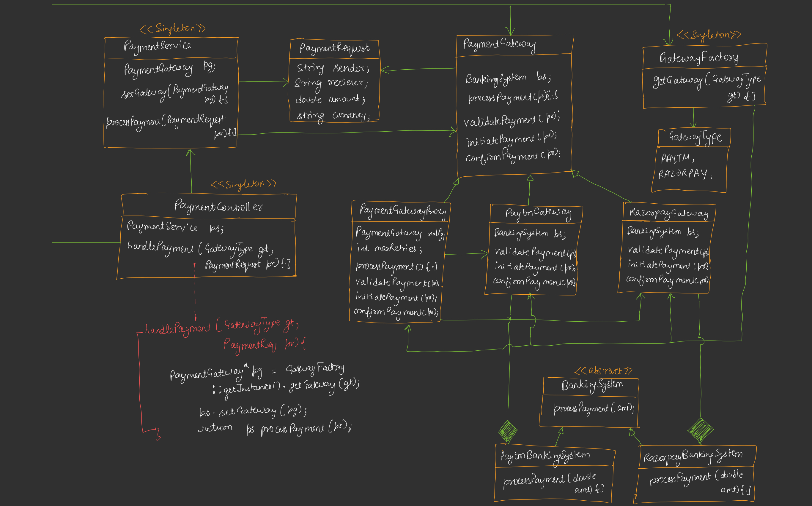

---

# 🟦 Day 23 – Build Payment Gateway System

---

# 🟩 Requirements

## 📌 Functional Requirements

✔ Support **multiple providers**

* Paytm
* Razorpay

✔ Easily **add new gateways in future**

✔ Standard **payment flow**

* validate
* initiate
* confirm

✔ Proper **error handling + retry mechanism**

---

## 📌 Additional Features

✔ Retry strategies:

* Linear Retry
* Exponential Backoff

✔ Subscription / recurring payments

---

# 🟩 High-Level Idea

```
        Client
           |
           v
    PaymentGateway   (OUR SYSTEM)
           |
    -------------------------
    |           |          |
  Paytm     Razorpay    Future
           (External Systems)

```


### 📌 Key Concept

```text
Client → Payment Gateway → External Systems
```

❌ Client should NOT know:

* Paytm
* Razorpay
* Internal logic

✔ Only interacts with **Gateway**

---

# 🟩 What is Gateway?


```
[ INTERNAL SYSTEM ]      |      [ EXTERNAL WORLD ]
-----------------------------------------------
    Classes                  Bank APIs / Internet
        |
        v
    Payment Gateway  --------->  HTTP Calls ---------> Bank

```

👉 Gateway = **Boundary of system**

* Internal system → Gateway → External APIs (Bank)


### 📌 Flow


```
    Client
       |
       v
    PaymentRequest
       |
       v
    PaymentGateway
       |
       v
    ------------------------
    | Paytm | Razorpay |
    ------------------------
       |
       v
    Banking System
       |
       v
    Response → Gateway → Client
    
```


✔ Internal classes talk to Gateway

✔ Gateway talks to Internet

✔ Internal system safe hai

✔ External complexity hidden


---

# 🟩 UML Diagram Start 

## 1.Modal Class Design

### 📦 PaymentRequest

```
+----------------------+
|   PaymentRequest     |
+----------------------+
| sender : string      |
| receiver : string    |
| amount : double      |
| currency : string    |
+----------------------+

```

✔ Only data holder
✔ No logic
✔ SRP Followed

---

## 2.Banking System Layer

```
        <<interface>>
        IBankingSystem
        + processPayment()

              ▲
      ---------------------
      |                   |
PaytmBankingSystem   RazorpayBankingSystem
```


✔ Different bank logic
✔ Runtime selection

👉 **Strategy Pattern**

---

## 3.Why Proxy Needed?

❌ Banking system is external → cannot directly access

✔ Solution → **Proxy** → Remote Proxy

```text
App → Proxy → External Banking System
```

✔ Proxy handles:

* Communication
* Validation
* Security

---

## 4.Template Method Pattern 

### 📌 Standard Flow of Making Payment 

```text
processPayment():
   validate()
   initiate()
   confirm()
```

✔ Defined in base class
✔ Implemented by child classes

---

## 5.Payment Gateway Design

### 📌 Structure


```
             <<abstract>>
             PaymentGateway
             -----------------
             IBankingSystem bs
             PaymentRequest pr
             processPayment(){...}
                initiate()
                validate()
                confirm()

                    ▲
        ---------------------------
        |                         |
   PaytmGateway            RazorpayGateway
    initiate()                initiate()
    validate()                validate()
    confirm()                 confirm()

```

### 📌 Concrete Classes

```text
PaytmGateway
RazorpayGateway
```

✔ Each has:

* Its own validation
* Own logic

### 📌 HAS-A Relation

```text
PaytmGateway → PaytmBankingSystem
RazorpayGateway → RazorpayBankingSystem
```

---

## 6.Retry Mechanism Problem

### ❌ Problem

* Retry logic depends on:

  * Paytm / Razorpay
  * Different strategies

👉 Leads to:
❌ Code duplication
❌ Tight coupling

---

### ❌ Wrong Approach

* Handle retry in client
* Handle retry in validation

---

## 7.Solution → Proxy Pattern

### 📌 Which Proxy?

| Type       | Use |
| ---------- | --- |
| Virtual    | ❌   |
| Remote     | ❌   |
| Protection | ✔   |

✔ Used because:
👉 We validate + control access

### 📌 Structure



* Before Calling the real concreate class,Proxy gateway make sure that it should validate retry mechanism


### 📌 Flow

```text
Client → Proxy → Real Gateway → Banking System
```

### 📌 Responsibility

✔ Retry mechanism
✔ Validation
✔ Control

---

## 8.Factory Pattern

```
        <<singleton>>
        GatewayFactory
        -----------------
        createGateway(type)

                |
        ------------------
        |                |
     Paytm         Razorpay
```


### 📌 Gateway Factory

```text
GatewayFactory (Singleton)
   createGateway(type)
```

### 📌 Enum

```text
GatewayType:
   PAYTM
   RAZORPAY
```

✔ Factory returns:
👉 Proxy wrapped gateway

👉 Client unaware of:
* Paytm / Razorpay

---

# Final Architecture 


---

## 📌 Components Breakdown

---

### 1. PaymentController (Singleton)

✔ Entry point
✔ Handles request

```text
handlePayment()
```

---

### 2. PaymentService (Singleton)

✔ Uses selected gateway
✔ Executes payment

---

### 3. GatewayFactory (Singleton)

✔ Creates gateway
✔ Applies Proxy

---

### 4. PaymentGateway (Template Pattern)

✔ Defines flow
✔ validate → initiate → confirm

---

### 5. Proxy Layer

✔ Retry
✔ Protection

---

### 6. Strategy Layer

✔ Banking systems

---

# 🟩 Code Understanding (VERY IMPORTANT)

Source: 

---

## 🟨 Step-by-Step Flow

---

### 🧾 Step 1: Create Request

```cpp
PaymentRequest req("Aditya", "Shubham", 1000, "INR");
```

---

### 🧾 Step 2: Controller Call

```cpp
PaymentController::getInstance().handlePayment(type, req);
```

---

### 🧾 Step 3: Factory

```cpp
GatewayFactory → returns Proxy(Gateway)
```

---

### 🧾 Step 4: Service

```cpp
PaymentService → uses gateway
```

---

### 🧾 Step 5: Proxy

```cpp
for retries:
   call realGateway->processPayment()
```

---

### 🧾 Step 6: Template Method

```cpp
validate()
initiate()
confirm()
```

---

### 🧾 Step 7: Strategy Call

```cpp
bankingSystem->processPayment()
```

---

# 🟩 <u>15. Patterns Used (IMPORTANT)</u>

| Pattern         | Where Used          |
| --------------- | ------------------- |
| Template Method | Payment flow        |
| Strategy        | Banking systems     |
| Proxy           | Retry + control     |
| Factory         | Create gateway      |
| Singleton       | Controller, Service |

---

# 🟩 Real World Understanding

✔ Amazon / Flipkart:

```text
User → Gateway → Paytm/Razorpay → Bank
```

✔ Retry happens automatically
✔ User unaware of failures

---

# 🟩 <u>17. Final Summary</u>

```text
Client
   ↓
Controller (Singleton)
   ↓
Factory → Proxy
   ↓
Gateway (Template)
   ↓
Banking System (Strategy)
```

---

# 🟩 <u>18. Interview One-Liner</u>

> Payment Gateway system combines Template, Strategy, Proxy, and Factory patterns to provide a scalable, extensible, and fault-tolerant payment processing system.


