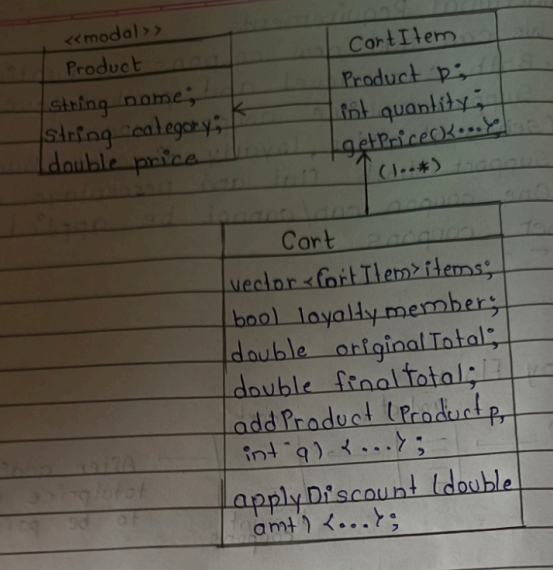
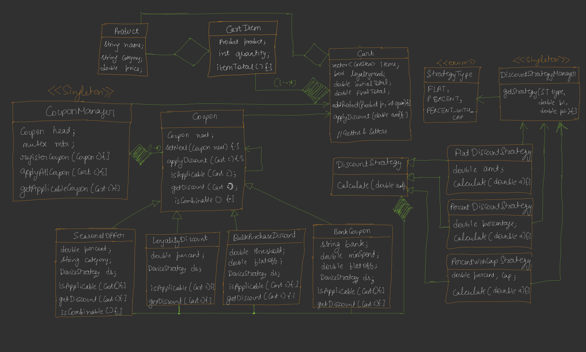

---

# 🟦 📚 Day 24: Build Discount Coupon System

---

# 🟩 Functional Requirements

### ✅ Requirements

1. Add coupons at runtime
2. Support:

   * Cart level discount
   * Product level discount
3. Multiple coupon types:

   * Seasonal
   * Loyalty
   * Banking
4. Support:

   * Flat discount
   * Percentage discount
5. Coupons may or may NOT be combinable

## 🧠 Understanding (Important)

👉 System should be:

* **Dynamic (runtime coupons)**
* **Extensible (new coupon types easily add ho)**
* **Flexible (flat / % / capped discount)**

---

# 🟨 Happy Flow

## 🖊️ TEXT DIAGRAM

```
User → Product → Cart → Apply Coupons → Final Price

Flow:
1. User adds product
2. Cart is created
3. Coupons applied
4. Final price generated
```

👉 Final output:

✔ Total price after all coupons

---

# 🟧 Core Design Idea

✔ Plug & Play Model

✔ No dependency on specific app (Zepto / Blinkit etc.)

✔ Generic design

✔ Fow now, we take Inventory Mnanagement System like Zepto , Blinkit

---
---

# 🟦 Core Entities (UML)


## 🖊️ TEXT UML

```
<<Model>>
Product
-------------------
string name
string category
double price


CartItem
-------------------
Product product
int quantity
getPrice()


Cart
-------------------
vector<CartItem> items
bool loyaltyMember
double originalTotal
double finalTotal

addProduct(Product, qty)
applyDiscount(amount)
```




## 🧠 Understanding

👉 Cart = central class

👉 Everything applies on cart

---

# 🟪 Strategy Pattern (Discount Logic)


## 🖊️ TEXT DIAGRAM

```
            DiscountStrategy
          calculate(double amt)
                 ▲
     -----------------------------
     |            |             |
FlatStrategy  PercentStrategy  PercentWithCapStrategy
```

---

## 💡 Meaning

👉 Discount logic changeable hai runtime pe

Examples:

* ₹100 OFF → FlatStrategy
* 10% OFF → PercentStrategy
* 10% max ₹50 → CapStrategy

---

# 🟥 Coupon Design (Chain of Responsibility)

## 🖊️ TEXT DIAGRAM

```
Cart
  ↑
Coupon (Abstract)
--------------------------
Coupon next
setNext()
applyDiscount(cart)
isApplicable(cart)
isCombinable(cart)
getDiscount(cart)

        ▲
----------------------------------------
|        |          |         |
Bank     Loyalty   Bulk     Seasonal
```


## 🧠 Key Idea

👉 Coupons chain me lagte hai

```
Coupon1 → Coupon2 → Coupon3
```

👉 Each coupon decides:

* apply kare ya skip
* next ko call kare

---

# 🟨 Coupon Types (Detailed)

## 🖊️ TEXT DIAGRAM

```
Coupon
  ▲
------------------------------------------
|          |          |           |
Bank      Loyalty    Bulk        Seasonal
```


## 📦 Each Coupon Contains:

### 1️⃣ BankingCoupon

```
string bank
double minSpend
double percentOff
DiscountStrategy ds
isApllicable (cart c)
isCombinable(cart c)
```


### 2️⃣ LoyaltyCoupon

```
double percent
DiscountStrategy ds
isApllicable (cart c)
isCombinable(cart c)
```

### 3️⃣ BulkPurchaseCoupon

```
double threshold
double flatOff
DiscountStrategy ds
isApllicable (cart c)
isCombinable(cart c)
```

### 4️⃣ SeasonalCoupon

```
string category
double percent
DiscountStrategy ds
isApllicable (cart c)
isCombinable(cart c)
```

## 🧠 Important Concept

👉 Coupon **HAS-A DiscountStrategy**

```
Coupon → DiscountStrategy
```

✔ Flexible design

✔ Reusable logic

---

# 🟩 Strategy Manager (Factory Pattern)


## 🖊️ TEXT DIAGRAM

```
<<enum>> StrategyType
----------------------
FLAT
PERCENT
PERCENT_WITH_CAP


StrategyManager
----------------------
getStrategy(type)
```


## 💡 Meaning

👉 Factory pattern use ho raha hai

```
type → object create
```

Example:

```
FLAT → FlatStrategy
```

---

# 🟦 Coupon Manager (Main Controller)


## 🖊️ TEXT DIAGRAM

```
<<Singleton>>
CouponManager
----------------------
Coupon* head
mutex mtx

registerCoupon(coupon)
applyAllCoupons(cart)
getApplicableCoupons(cart)
```

---

## 🧠 Role

👉 System ka **entry point**

✔ Coupons register karega
✔ Chain banayega
✔ Apply karega

---
---

# 🟥 FINAL COMPLETE UML (IMPORTANT)


## 🖊️ FULL TEXT DIAGRAM

```
                 <<Singleton>>
               CouponManager
                    |
                    v
                 Coupon (Chain)
                    |
   ---------------------------------------
   |        |        |        |
 Seasonal  Loyalty  Bulk     Bank


Coupon → HAS-A → DiscountStrategy

                DiscountStrategy
                       ▲
     -----------------------------------------
     |             |                |
 FlatStrategy  PercentStrategy  PercentCap


Cart → contains → CartItem → contains → Product
```


---

# 🧠 Full Flow Understanding

### 🔥 Step-by-Step Execution

```
1. User adds products → Cart
2. Cart total calculate
3. CouponManager:
      ↓
   applies coupon chain
      ↓
4. Each coupon:
   - check applicable
   - apply discount
   - pass to next
      ↓
5. Strategy calculates discount
      ↓
6. Final total generated
```

---

# 🟪 Design Patterns Used</u>

| Pattern                 | Use                      |
| ----------------------- | ------------------------ |
| Strategy                | Different discount logic |
| Chain of Responsibility | Multiple coupons         |
| Factory                 | Strategy creation        |
| Singleton               | CouponManager            |

---

# 🟨 Interview Key Points</u>

🔥 Must बोलना:

* Runtime extensibility ✔
* OCP followed ✔
* Loose coupling ✔
* Multiple patterns used ✔

---

# 🟧 Real Life Example

🛒 Amazon / Flipkart:

```
Cart Total = ₹1000

Coupons:
- Bank: 10% off
- Seasonal: 5%
- Loyalty: 100 flat

Execution:
1000 → 900 → 855 → 755
```

---

# 🟩 One-Line Summary</u>

> Coupon system is built using **Strategy + Chain of Responsibility + Factory + Singleton** to support flexible and scalable discount application.


