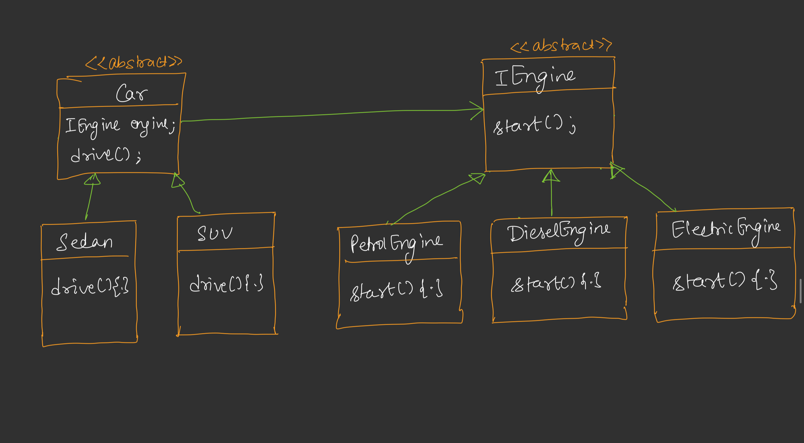
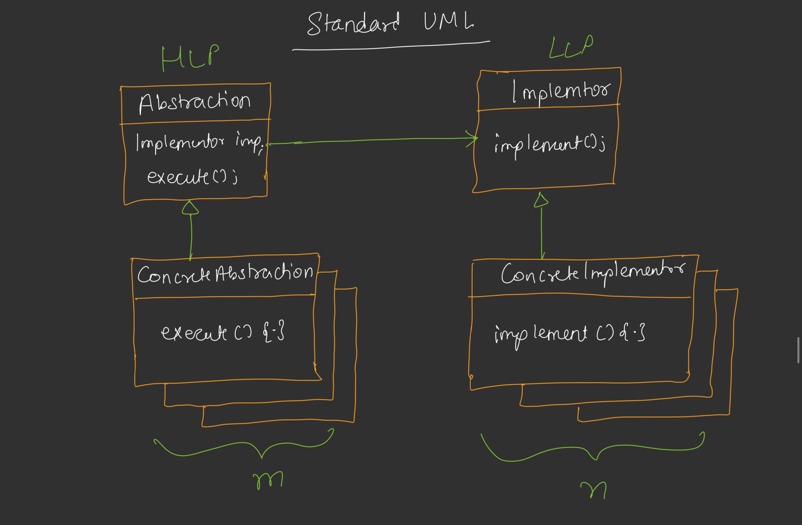

---

# 🟦 📚 Day 25: Bridge Design Pattern

---

# 🟩 Introduction

* Bridge Design Pattern is a **use-case specific pattern**
* Used when:

  👉 System mein **multiple dimensions of variation** ho

---

## Easy Explanation

> Bridge ka matlab = “connection banana between 2 independent parts”

---

# 🟥 Problem – Class Explosion

## 🔥 Example

```text
Car Types (m):
- Sedan
- SUV
- Hatchback

Engine Types (n):
- Petrol
- Diesel
- Electric
```

## ❌ Without Bridge

Model of car can have multiple types of the engine like as below:

```id="bad"
SedanPetrol
SedanDiesel
SedanElectric

SUVPetrol
SUVDiesel
SUVElectric

HatchbackPetrol
HatchbackDiesel
HatchbackElectric
```

👉 Total classes = m × n


## ⚠️ Problem

👉 Class Explosion


## ✅ Solution

> Use Bridge Pattern → reduce m × n → m + n

---

# 🟨 Core Idea of Bridge

## 📌 Concept Division

```id="bridge_concept"
Concept
   |
-------------------------
|                       |
HLP (Abstraction)    LLP (Implementation)
```


## 🧠 Meaning

### 🔹 HLP (High Level Part)

* Abstraction
* Kisi bhi chiz ko upar se dekhna 
* Example: Car Type

### 🔹 LLP (Low Level Part)

* Implementation
* kisi bhi chiz ka internal working dekhna 
* Example: Engine Type


## 💡 Mapping

```id="mapping"
Car Types → HLP
Engine Types → LLP
```

---

# 🟪 Car Example UML</u>

## 🖊️ TEXT DIAGRAM

```

                <<abstract>>
                -------------------
                |    Car          |
                -------------------
                  Engine* engine  
                  drive()

                        ▲
                -------------------
                |                 |
                SUV             Sedan

                   Car (HAS-A) relation with Engine 

                <<abstract>> 
                ------------------
                |   Engine        |
                ------------------
                    start()

                        ▲
                ---------------------------
                |           |             |
                Petrol     Diesel      Electric
```




## 🧠 Important Point

👉 Car HAS-A Engine

👉 Not inheritance → composition

---

# 🟦 Key Understanding

✔ Abstraction (Car) separated from Implementation (Engine)

✔ Both can change independently

---

# 🟧 Standard UML of Bridge

## 🖊️ TEXT DIAGRAM

```

            HLP (Abstraction)
            -------------------------
                Abstraction
                Implementor* imp
                execute()

                    ▲
            ConcreteAbstraction
                execute(){...}


            LLP (Implementation)
            -------------------------
                implement()

                    ▲
            ConcreteImplementor
              implement(){...}
```



## 🔥 Relation

```id="relation"
Abstraction → HAS-A → Implementor
```


## 📌 Key Result

👉 m × n → m + n classes

---

# 🟩 Standard Definition

> Bridge decouples abstraction from implementation
> so both can vary independently

* Abstraction: High-level Layer(Car)
* Implementations: Low-level Layer(Engine)


## 🧠 Simplified

👉 “Upper layer aur lower layer ko alag kar do”

---

# 🟥 Strategy vs Bridge


## --> STRATEGY Pattern

👉 **Focus: Behavior change karna**

### 🧠 Meaning

> Ek kaam karne ke **multiple tareeke (algorithms)** hote hain
> Aur tu runtime pe choose karta hai kaunsa use karna hai


### 📌 Example

```cpp
Payment
  → UPI
  → Credit Card
  → Net Banking
```

👉 Tum bolte ho:

* aaj UPI use karo
* kal card use karo


### 🧠 Key Point

✔ Same object → **different behavior use kar sakta hai**

✔ Runtime pe change possible


### 💡 Hinglish Line

> Strategy = “kaam ka tareeka change karna”

---

## --> BRIDGE Pattern

👉 **Focus: Structure separate karna**


### 🧠 Meaning

> System me **2 independent cheezein hoti hain**
> Unko alag kar dete hain taki combinations na banane pade


### 📌 Example (Car + Engine)

```cpp
Car → Sedan, SUV
Engine → Petrol, Diesel
```

👉 SUV petrol ho sakti hai

👉 SUV diesel bhi ho sakti hai

BUT 👉 ek object me **ek hi engine hoga at a time**

### ❗ Important Clarification

❌ “SUV petrol hai to diesel nahi ho sakta” → **same object ke liye true hai**

✔ But design me:

```cpp
SUV + Petrol  ✔
SUV + Diesel  ✔
```

👉 Dono possible hain, bas **alag objects honge**

## 🧠 Key Point

✔ Structure separate hai

✔ Combination possible hai

✔ But object ek time pe ek hi implementation use karega

# 🟨 Real Life Examples

---

## 📺 1. TV & Remote

### 🖊️ TEXT DIAGRAM

```id="tv_remote"
Remote (Abstraction)
   |
   v
TV (Implementation)

Remote Types:
- T1 Remote
- T2 Remote

TV Types:
- LCD
- OLED
- AMOLED
```

## 🧠 Meaning

👉 Remote ≠ TV tightly coupled

✔ Remote change ho sakta

✔ TV change ho sakta

---

## 🖥️ 2. GUI Example

### 🖊️ TEXT DIAGRAM

```id="gui"
Abstraction (UI)
---------------------
Textbox
Radio
Dropdown


Implementation (OS)
---------------------
Windows
MacOS
Linux
```

---

## 🧠 Meaning

👉 Same UI → different OS pe run

---

# 🟪 Final Flow

```id="flow"
Client
  ↓
Abstraction (Car / Remote / UI)
  ↓
Implementation (Engine / TV / OS)
```

---

# 🟦 When to Use Bridge

✔ Multiple independent dimensions

✔ Class explosion problem

✔ Need flexibility

---

# 🟩 Advantages

✔ Reduces class explosion

✔ Loose coupling

✔ High flexibility

✔ Easy extension

---

# 🟥 Disadvantages

✔ Slightly complex design

✔ More classes (but structured)

---

# 🟨 Interview Ready Answer

> Bridge Pattern is used to separate abstraction and implementation so that both can evolve independently and avoid class explosion.

