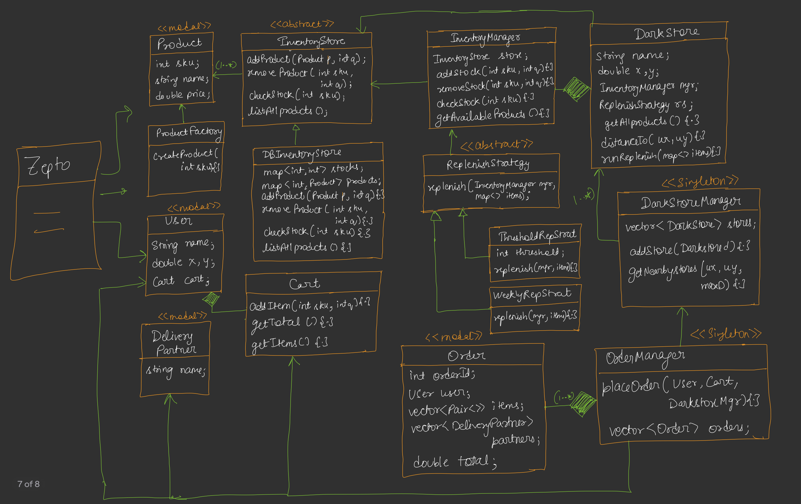

---

# 🟦 DAY 26 – Building Zepto (Inventory Management System)

---

# 🟨 Functional Requirements 

📌 System ko kya-kya karna chahiye:

1. Inventory manage karna (Add / Remove items)
2. Replenishment strategies: Things khtm hone ka baad fill krna 

   * Threshold based
   * Weekly based
3. We can have Multiple inventory stores (DB, warehouse, etc.) and can be further extended.
4. User ko nearby stores (5 km) ka data dikhna chahiye
5. If One Darkstores cannot fulfil order, one order
can be split into:

   * Multiple dark stores
   * Multiple delivery agents

---

# 🟨 System Flow (Happy Flow)

##  <span style="color:blue"><u>🖊️ TEXT DIAGRAM</u></span>

```
    User <---------------------
      ↓                       |
    Browse Items              |
      ↓                       |
    Cart                      |
      ↓                       |
    Order Place               |
      ↓                       |
    Payment (3rd party)       |
      ↓                       |
    Delivery Partner-----------

        +------------------+
        | Background Work  |
        | (Inventory sync) |
        +------------------+
```

📌 Hinglish:

> User order karta hai → backend quietly inventory manage karta hai (background work)

---

# 🟨 Core Design Approach

📌 Bottom-up approach use kiya gaya

👉 Sabse pehle **Product class banega**

---

# 🟨 Basic UML

## <span style="color:blue"><u>🖊️ TEXT DIAGRAM</u></span>

* To create product we need Product factory
* We need to store multiple Products hence, creating Inventory Store

```
           <<model>>
            Product
        ------------------
        | - int sku      |
        | - string name  |
        | - double price |
        ------------------

                ▲
                |
            ProductFactory
        --------------------------
        |  + createProduct(sku)  |
        --------------------------

               (1..*)
    Product -------------> InventoryStore (abstract)
```

##  <span style="color:blue"><u>📌 Inventory Store</u></span>

```
        <<abstract>>
        InventoryStore
        ---------------------------------
            + addProduct(Product, qty)
            + removeProduct(sku, qty)
            + checkStock(sku)
            + listAllProducts()
        ---------------------------------
```


##   <span style="color:blue"><u>🧠 Important Point</u></span>

* Now , in Dark store there will be invientory store
but we can't directly link them as it will
make them tightly coupled

❌ Direct linking avoid kiya

*  DarkStore ↔ InventoryStore directly connect nahi kiya
* Tight coupling avoid

---

# 🟨 Inventory Manager (Middle Layer)

📌 Problem solve karne ke liye introduce kiya

##  <span style="color:blue"><u>🖊️ TEXT DIAGRAM</u></span>

```
            InventoryManager
        -------------------------------
        |    InventoryStore store;    |
        |------------------------------
        |   addStock(sku, qty){..}    |
        |   removeStock(sku, qty){..} |
        |    checkStock(sku){..}      |
        |    listAllStock(){..}       |
        -------------------------------
```


## 🧠 Hinglish Samajh:

> InventoryManager = “Manager / Middleman”

👉 DarkStore directly store se baat nahi karega

👉 Manager ke through karega

---

# 🟨 Important Concepts

##  <span style="color:red"><u>🔹 Dark Store Role</u></span>

```
DarkStore → InventoryManager → InventoryStore
```

👉 DarkStore:

* add/remove items karega
* BUT directly store se baat nahi karega


##  <span style="color:red"><u>🔹 Inventory manager</u></span>

* Inventory manager ko product se mtlb nahi hai
stock se matlab hai.
* Inventory Manager ka kaam hai Inventory
store se kaam karwana

##  <span style="color:red"><u>🔹 DRY Principle Doubt</u></span>

❓ Same methods kyun repeat ho rahe InventoryStore and InventoryManager main?

✔ Answer:

> Methods duplicate nahi hai
> Sirf delegation ho raha hai

👉 InventoryManager → call forward karta hai InventoryStore ko


##  <span style="color:red"><u>🔹 Singleton Doubt </u></span>

❌ InventoryManager should NOT be singleton

### Reason:

```
City:
  DarkStore1 → Manager1
  DarkStore2 → Manager2
```

👉 Agar ek hi manager hua → mess ho jayega

---

# 🟨 Pattern Used

##   <span style="color:green"><u>✅ Bridge Design Pattern</u></span>

👉 Use kiya gaya:

Inventory store wali hierarchy low level hierarchy hai mtlb implementation and Inventory manager high level hierarchy mtlb Abstraction. 

```
Abstraction → InventoryManager
Implementation → InventoryStore
```

### 🖊️ TEXT DIAGRAM  

```
InventoryManager  (Abstraction)
        |
        |
InventoryStore  (Implementation)
        |
   ---------------------
   |                   |
DBStore          CacheStore
```


##  <span style="color:green"><u>🔹 Persistence Layer</u></span>

```
                    <<abstract>>
                    Persistence
                    save()

                     ▲
                     |
            ------------------------
            |                      |
            SQLPersistence     MongoPersistence
```

* Darkstore Manager takes user lacation & check
nearby Store

##   <span style="color:green"><u>🧠 Principle Used</u></span>

👉 **Least Knowledge Principle**

PlaceOrder (user ,cart, darkstore Manager){...}

* cart hum isliye pass karte ki mai nahi chahta ki order
Manager ko ye baat pata ho ki hum user se cart nikal skte
hai (principal of least knowledge)

> OrderManager ko Cart ka internal structure nahi pata


##   <span style="color:green"><u>🟨 Order Flow Logic</u></span>

```
PlaceOrder(user, cart , darkstore Manager)
-----------------------------------
1. Get nearby stores
2. Fetch cart items
3. Check stock
4. If available:
       assign delivery partner
   Else:
       split order
       assign multiple partners
```

---

# 🟨 FULL UML





---

# UML Explanation 

## 🟦 1.High Level Idea (Zepto System)

👉 Ye system basically karta kya hai?

```
User → Cart → Order → Nearby DarkStore → Inventory → Delivery
```

📌 Goal:

* Fast delivery
* Multiple stores
* Smart inventory handling

---

## 🟨 2. Left Side (Basic Models)

## 🔹 Product

```
Product
- sku
- name
- price
```

👉 Ye basic entity hai (item in inventory)


### 🔹 ProductFactory

```
createProduct(sku)
```

👉 Product create karne ke liye use hota hai
👉 Factory pattern use hua hai

🧠 Kyun?

> Object creation ko centralize karne ke liye


### 🔹 User

```
User
- name
- location (x,y)
- cart
```

👉 User ke paas cart hota hai
👉 Location important hai (nearby store ke liye)


### 🔹 Cart

```
Cart
- addItem()
- getItems()
- getTotal()
```

👉 Cart sirf items manage karta hai

👉 Business logic nahi karta (SRP follow)


### 🔹 Delivery Partner

👉 Delivery karega (agent)

---

## 🟨 3. Inventory Side (CORE PART)

### 🔹 InventoryStore (Abstract)

```
addProduct()
removeProduct()
checkStock()
listAllProducts()
```

👉 Ye interface hai

👉 Actual implementation niche hai


### 🔹 DBInventoryStore

```
map<sku, qty>
map<sku, product>
```

👉 Ye actual storage hai
👉 DB level implementation


### 🔥 Important Concept

👉 Direct use nahi kar rahe InventoryStore ka
👉 Use kar rahe **InventoryManager**

---

## 🟨 4. InventoryManager (MOST IMPORTANT)

```
InventoryManager
- InventoryStore store
```

### Functions:

```
addStock()
removeStock()
checkStock()
getAvailableProducts()
```


### 🧠 Hinglish Samjho:

> Ye ek **middleman / manager** hai

👉 DarkStore directly DB se baat nahi karega
👉 Manager ke through karega


### 🔥 Pattern Used

👉 **Bridge Pattern**

```
InventoryManager (Abstraction)
        |
InventoryStore (Implementation)
```

---

## 🟨 5. Replenishment Strategy (Strategy Pattern)

```
ReplenishStrategy (abstract)
   replenish()
```

### Implementations:

```
ThresholdStrategy
WeeklyStrategy
```


### 🧠 Meaning:

* Threshold → stock kam hua → refill
* Weekly → weekly refill

👉 Strategy pattern = behavior change

---

## 🟨 6. DarkStore</u>

```
DarkStore
- name
- location
- InventoryManager mgr
- ReplenishStrategy rs
```


### 🧠 Role:

👉 Store kya karta hai?

* inventory manage
* replenish call karta hai
* nearby calculation


### 🔥 Key Point:

👉 DarkStore ke paas:

* manager bhi hai
* strategy bhi hai

👉 HIGH FLEXIBILITY 💯

---

## 🟨 7. DarkStoreManager (Singleton)

```
vector<DarkStore> stores
getNearbyStores()
```

### 🧠 Role:

👉 Ye sab stores manage karta hai

```
User → DarkStoreManager → Nearby Stores
```

### 🔥 Singleton Kyun?

👉 Ek hi manager hona chahiye (central control)

---

## 🟨 8. Order Flow

### 🔹 Order Class

```
Order
- orderId
- user
- items
- deliveryPartners
- total
```


### 🔹 OrderManager (Singleton)

```
placeOrder(User, Cart, DarkStoreManager)
```


### 🧠 Flow:

```
1. Nearby stores find karo
2. Cart items lo
3. Check stock
4. Agar available:
      assign 1 delivery
   warna:
      split order
      multiple delivery
```

---

## 🟨 9. FULL FLOW (VERY IMPORTANT)

## 🖊️ FINAL FLOW DIAGRAM

```
    User
     ↓
    Cart
     ↓
    OrderManager (Singleton)
      ↓
    DarkStoreManager (Singleton)
      ↓
    DarkStore
       ↓
    InventoryManager
        ↓
    InventoryStore (DB)
        ↓
    Product
        ↓
    Delivery Partner
```

---

## 🧠 10. Patterns Used (VERY IMPORTANT)</u>

| Part             | Pattern   |
| ---------------- | --------- |
| Product Creation | Factory   |
| Inventory Layer  | Bridge    |
| Replenishment    | Strategy  |
| Managers         | Singleton |


---

# 🟨 Final Architecture Insight

✔ Loose coupling
✔ Scalable system
✔ Extendable design

---

# 🟨 Further Extensions

📌 Future improvements:

* Rider assignment algorithm
* Payment / Coupon system
* Modular code structure

---

# 🟩 FINAL REVISION

👉 InventoryManager = middle layer

👉 Bridge Pattern used

👉 Strategy for replenishment

👉 Singleton used for managers

👉 Order can split across stores

---

# 🔥 Interview Golden Lines

1.

> InventoryManager decouples DarkStore from InventoryStore.

2.

> Bridge pattern separates abstraction and implementation.

3.

> Strategy pattern handles replenishment logic.

4.

> Order splitting ensures scalability in distributed systems.
