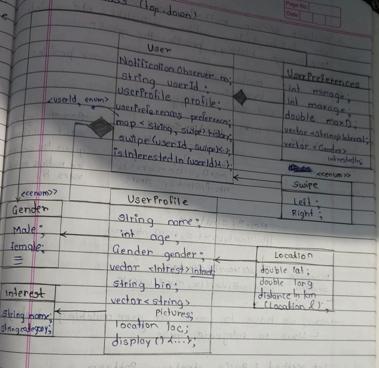
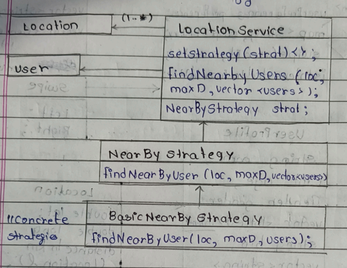
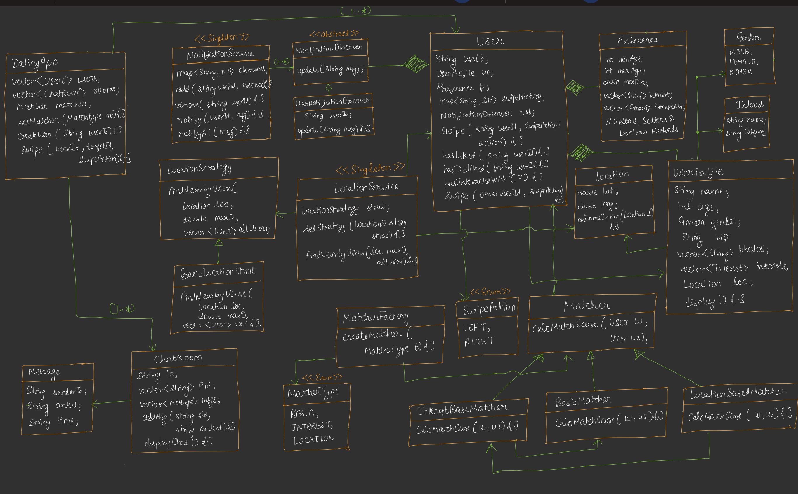

---

# 🟦 DAY 27 –  Building Dating App (like Tinder)

---

# 🟨 Requirement Gathering & Analysis
---

### ✔ Functional Requirements

1. User can **swipe left/right**
2. User can **create profile**
3. User can **set preferences**
4. If **match found → chatroom open**
5. Nearby profiles based on **location strategy**
6. User gets **notification** on:

   * Match
   * Message
7. Matching based on:

   * Interest
   * Location
   * Score

---

# 🟩 Happy Flow (System Flow)

---

```
User → Profile → Profiles List
        ↓
   Left / Right Swipe
        ↓
     Match Found
        ↓
   ChatRoom Created
        ↓
   Notification Sent
```

### ✔ Explanation

* User profile create karta hai
* Nearby profiles dikhti hain
* Swipe:

  * Left ❌ Reject
  * Right ✔ Like
* If both users like → **MATCH**
* Then:

  * Chatroom create
  * Notification send

---

# 🟥 Design Approach


### ❌ Bottom-Up Approach

* Pehle small objects banaoge → complex ho jayega

### ✔ Top-Down Approach (Used)

```
System → User → Profile → Preferences → Matching → Chat
```

👉 Easy to manage & scalable

---

# 🟦 Notification System (Observer Pattern)

---

## 📌 Text Diagram

```
NotificationServer (Singleton)
 ├── map<userId, notificationObserver>Observers;

 addObserver(userId)
 removeObserver(userId,observer)
 notify(userId, msg)
 notifyAll(msg)

        ↓

NotificationObserver (Abstract)
 └── update(string,msg)

        ↓

UserNotificationObserver
 └── update(string,msg)
```

## ✔ Explanation

* Server → Subject
* User → Observer
* Jab match/message aaye:
  → notify()

👉 Loose coupling ✔

---

# 🟨 User System Design(top - down)

## 📌 Text Diagram



## ✔ Important Notes

* Images stored as **string path**
* Location stored as **object** (not separate lat/long)
* Preferences define:
  👉 "User kya chahta hai"
* Multiple boolean methods can be stored in user
like isInterestedIn, islike, isDislike, etc. which
1oop through history, provide the answer.

---

# 🟥 Nearby Users (Strategy Pattern)

---

## 📌 Text Diagram




## ✔ Explanation

👉 Different strategies ho sakti hain:

* Distance based
* Same city
* Premium users

👉 Runtime pe change kar sakte ho

---

# 🟨 Matching System (Strategy Pattern)


## 📌 Text Diagram

```
Matcher
 └── findMatch(u1, u2)

       ↓

InterestMatch
LocationMatch
```

## ✔ Explanation

👉 Match depends on:

* Interest
* Location

👉 Different strategies = flexible system

---

# 🟥 Advanced Matching (Chain of Responsibility)
---

## 📌 Concept

👉 Matching sirf true/false nahi hai
👉 Score based hai


## 📌 Text Diagram

```
Matcher (Abstract)
 └── calcScore(u1, u2)

        ↓

LocMatcher
BasicDetailMatcher
InterestMatcher
```

## ✔ Flow

```
LocMatcher → BasicDetail → InterestMatcher
```

## ✔ Example

```
BasicDetail = 50
Location     = 70
Interest     = 100
-------------------
Final Score  = combined
```
* Assume: Humne locMatchen ka objert banoya --> tho
vo InterestMatcher ko kohega uska score nikane
ke liye → phir InterestMatch basic detail Matcher ko bolega ki apna score nikal le laa...

👉 Best match select hoga


## ✔ Why COR?

* Loose coupling
* Extendable
* Order control

---

# 🟦 Matcher Factory (Factory Pattern)
---

## 📌 Text Diagram

```
            Matcher

                ^
                |

            MatcherFactory
            └── createMatcher(type)

                ^
                |

            MatcherType
            ├── LOCATION
            ├── BASIC
            └── INTEREST
```

## ✔ Explanation

👉 Object creation centralized

---

# 🟨 Chat System

## 📌 Text Diagram

```
            Message
            ├── senderId
            ├── content
            └── time

                ^
                |

            ChatRoom
            ├── id
            ├── participants
            ├── messages
            └── showAllMessages()
            // CRUD operations
```

## ✔ Explanation

* Match → ChatRoom create
* Messages stored in vector

---

# 🟩 Complete System Flow



## 📌 Final Flow

```
                User enters app
                     ↓
                Profile created
                     ↓
                Nearby users fetched (Strategy)
                     ↓
                User swipes
                     ↓
                Matching algorithm (COR)
                     ↓
                Match found
                     ↓
                Notification sent (Observer)
                     ↓
                ChatRoom created
                      ↓
                Messaging starts

```

---

# 🟥 Design Patterns Used

| Pattern   | Usage                |
| --------- | -------------------- |
| Observer  | Notification         |
| Strategy  | Nearby + Matching    |
| Factory   | Matcher creation     |
| COR       | Score-based matching |
| Singleton | Notification Server  |

---

# 🟦 Key Learnings

✔ Real-world system design

✔ Multi-pattern integration

✔ Scalable architecture

✔ Loose coupling

✔ Extendable matching logic

---

# 🔥 Final One Line 

👉 **“System uses swipe-based interaction, strategy-driven filtering, and score-based matching with notifications and chat integration.”**


