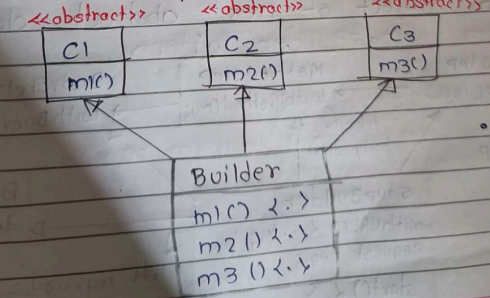
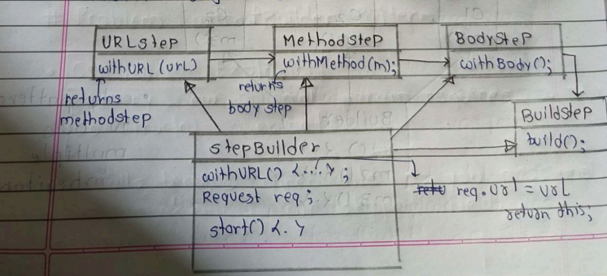
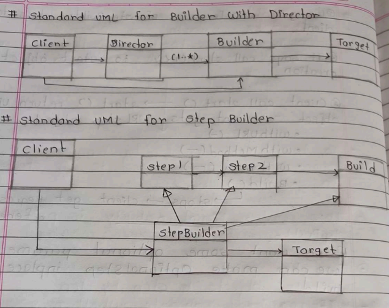

 

---

# 🟦 DAY 28 – BUILDER DESIGN PATTERN 

---

# 🟩 1. Introduction

👉 Builder is **most used design pattern in industry**
👉 Used when:

```text
Object creation is complex
OR
Object has many parameters
```

## 📌 Problem Situation

```cpp
Target t = new Target(t1, t2, t3, t4, t5...);
```

👉 Constructor me bohot parameters → problem


## 🧠 Real Life Example

```
      HTTP Request
Sender ----------> Receiver

```

👉 HTTP Request

```text
URL
Method (GET, POST)
Headers
Query Params
Body
Timeout
```

👉 Sab optional + different combinations

---

# 🟥 Problems WITHOUT Builder

---

## ❌ Problem 1: Constructor Overloading (Telescoping)

* Now creating a class to have execute()
as when we call this, a http request sent
from client to server

```cpp

class HTTPReq{
    string url
    string method
    map <String, string > header;
    map <string, String> query Params;
    string body;
    int timeout;

    public:
    HTTPRe(url, method, header, .... ) {
        this->url = url  --> more statement like this for all variables
    }

    void execute (){
      // HTTP call
    }
}

```
```cpp
HTTPReq(url)
HTTPReq(url, method)
HTTPReq(url, method, headers)
HTTPReq(url, method, headers, body)
...
```

* If we do so there will be multiple constructor such as :

1. Who takes url, method 
2. Other who takes url,method, queryParams
3. url , method , queryParams

👉 Problems:

* Too many constructors 😵
* Confusing
* Hard to maintain

---

## ❌ Problem 2: Immutable Object Issue

* Problem is here of setters. We want that once our object is created we should not be able to change them or its value i.e.Objects should be immutable.

👉 Hum chahte hain:

```text
Object once created → cannot change
```

But setters allow change ❌

---

## ❌ Problem 3: Inconsistent State

* Instead of passing all parameters through constructors and we can pass Only the impootant ones in the constructor and use setters for the remaining values and then run execute() method.In this way we can solve constructor telescoping problem.


```cpp

class HTTPReq{
    string url
    string method
    map <String, string > header;
    map <string, String> query Params;
    string body;
    int timeout;

    public:
    HTTPRe(url, method, header, .... ) {
        this->url = url  // more statement like this for all variables
        this->method = method;
        this->header = header;
    }
    //  getters and setters

    void execute (){
      // HTTP call
    }  
}

main(){
    HTTPReq * req = new HTTPReq(url, method, headers);
    req->setBody();
    req-> setTimeout(-):
    req->executel();
}
```
* We have to make sure now that execute() will only run If all methods are passed or set.

* We pass 3 obj as argument & set body only not timeout and queryparams it shouldn't run.

* But if we do this it will not give us compile time error but runtime erors which is worst if we came to know
about error at runtime. --> Inconsistent state Problenn

---

## ❌ Problem 4: Validation Problem


👉 Developer bhool sakta hai:

```text
Required fields set karna
```

👉 Solution:
```cpp
void execute (){
    if (req->getURL() == null)
    throw ernor;
    if (req->getheader() == null)
    throw error;

}

// execute() me validation daalna
```
* We have to perform this validation everywhere , where  we have used this req object. This problem is known as Scattered Validations

Matlab: 

* Code repetitive ho jata hai ❌

---

# 🟨 Builder Pattern Introduction

---

## 📌 Diagram

```text
Client → Builder → Target
```

👉 Builder object ko **step by step build karta hai**

## 🧠 Definition

```text
Builder separates object creation from representation
```

---

## Before Proceeding Learn about this keyword:

👉 `this` **current object ka reference hota hai**


### `this` return kya karta hai?

👉```text
"current object ka address return karta hai"
```

👉 Matlab:

```text
jis object ne function call kiya hai, usi ko return karta hai
```

### 📌 Example

```cpp
class A {
public:
    A* m1() {
        return this;
    }
};
```

👉 Agar client ne object banaya:

```cpp
A obj;
obj.m1();
```

👉 `this` = `obj`


### Variable set karne me use

👉 Jab same naam ho:

```cpp
class A {
    int x1, x2;

public:
    A(int x1, int x2) {
        this->x1 = x1;
        this->x2 = x2;
    }
};
```

### 🧠 Samajh

👉 Left side → class variable
👉 Right side → parameter

```text
this->x1 = x1
means
object ka x1 = jo value pass hui
```

---

# 🟦 Builder Working (Chaining)

---


## 📌 Flow

* To build a object step by step 

```text
Request.builder()
   .withURL()
   .withMethod()
   .withBody()
   .build()
```

## 📌 Important Points

* Other method known as Intermediate method as they do chaining.

* build() - Terminating method as it terminates the chaining of build.

* All intermediate method returns object of builder then our terminating method at last provide request object by performing validations.

✔ Intermediate methods → return builder

✔ Final method → `build()`


## 🧠 Benefits

✔ Readable code
✔ Immutable object
✔ Central validation

---

# 🟩 UML Diagram – Simple Builder

---

```text

Client → Builder → Target

```

---

# 🟥 Builder with Director

---

## 📌 Concept

👉 Director = predefined configuration

* It provides reusable builds means it stores the prexisting default states as method whenever anyone ask for it then give it to them.

* Wheneven you create any object it has some default states.

## 📌 Diagram

```text
Client → Builder → Target
                  ↓
               Default States
```

## 🧠 Example

👉 Predefined HTTP request:

```text
Default headers
Default timeout
```

## ✔ Benefit

👉 Reusable builds

---

# 🟨 Step Builder Pattern

---

## 📌 Example (Pizza)

* • let's take example of Pizza. When we ask for pizza, they asks us some questions about pizza in an order like...

```text
Step 1 → crust
Step 2 → sauce
Step 3 → toppings
Step 4 → cheese
```

👉 Order fixed 🔥

* Some objects are needed to be created in an specific order.
* This Order Maintainability is provided by step Builder.

## 🧠 Why Step Builder?

✔ Create objects & step by step

✔ If required, validate whether you declare all parameters or not.

## 📌 Diagram



👉 Multiple interfaces

---

# 🟦 Step Builder Deep Flow

---

👉 Step Builder ek Builder pattern ka advanced form hai jisme object ko fixed order (step-by-step) me build karte hain aur mandatory fields ko force kiya jata hai.

## 📌 Step Interfaces

```text
URLStep → MethodStep → BodyStep → BuildStep
```



## 📌 Flow

```text
start()
 ↓
withURL()
 ↓
withMethod()
 ↓
withBody()
 ↓
build()
```

## 🧠 Important Concept

👉 Each step returns next step object

---

## 📌 Diagram

```text
Client → StepBuilder
          ↓
       URLStep
          ↓
       MethodStep
          ↓
       BodyStep
          ↓
        Build()
```

## 📌 Optional Fields

* If we want some oplional parameter we can make Optionalstep inplace of build

```text
BodyStep → OptionalStep
           ↓
       withHeader()
       withTimeout()
       build()
```

👉 Optional steps skip bhi kar sakte ho

---

# 🟥 Standard UML

---



---

# 🟨 Standard Definition

---

👉 **Builder Definition**

```text
Separates construction of complex object from its representation
```

---

# 🟩 Problems Recap (Without Builder)

### ❌ Constructor Explosion

```text
Too many constructors
```


### ❌ Inconsistent State

```text
Partially built object
```


### ❌ Mutable Object

```text
Object change anytime
```


### ❌ Validation Difficult

---

##  🟦 Simple Builder Recap</u> (Page 13)


## ✔ Advantages


✔ Clean code

✔ Readable

✔ Central validation

✔ Immutable object

✔ No constructor overload


## 🟥 Director Builder Recap


✔ Reusable builds

✔ Default configurations

## 🟨 14. Step Builder Recap

✔ Enforces order

✔ Mandatory fields guarante

✔ IDE friendly

---

# 💬 Interview Ready Answer

👉 Builder pattern solves constructor explosion and inconsistent object state
by building objects step-by-step using method chaining and final build().
