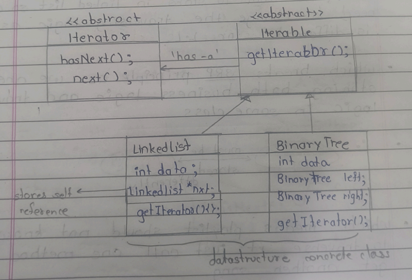
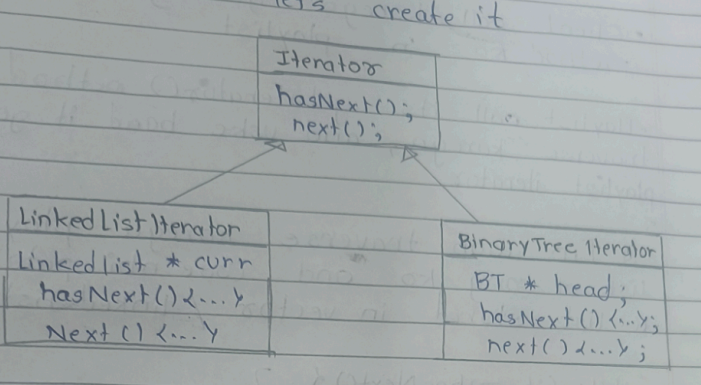
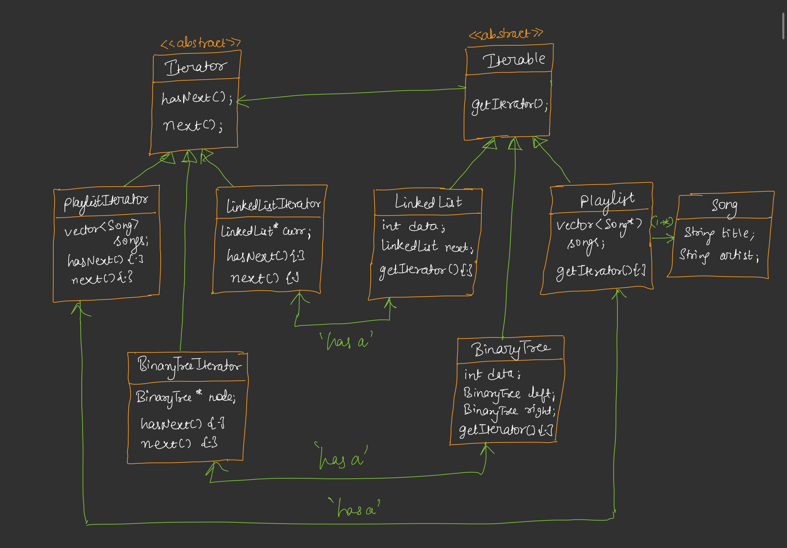
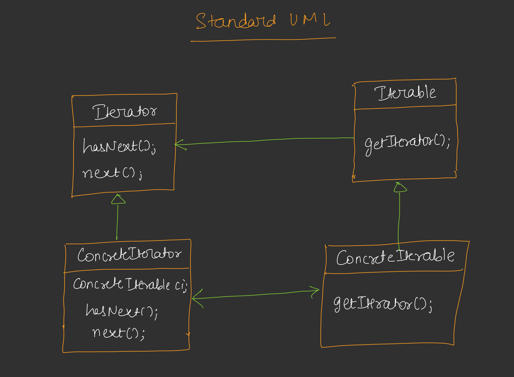

# 🟦 Day 29 – Iterator Design Pattern

---

# 🟩 Introduction

👉 Iterator Design Pattern is used to **traverse (iterate) elements of a collection**.

* Har data structure me traversal hota hai
* Traversal depends on:

  * Linked List → pointer traversal
  * Binary Tree → preorder, inorder, postorder
  * Vector → loop traversal


## 🧠 Problem

👉 Different DS = different traversal logic

```
Vector → for loop
LinkedList → temp pointer
Tree → recursion
```

👉 Yeh sab client ko pata hona chahiye ❌ (bad design)


## 🟨 Solution → Iterator

👉 Common interface:

```
hasNext()
next()
```

* hasNext() → check karta hai ki next element available hai ya nahi

* next() → next element return karta hai aur pointer aage move karta hai

Short:

hasNext = check

next = value + move


👉 Client ko DS ka internal structure nahi pata hona chahiye

---

# 🟩 Why Iterator Needed?


### ❌ Without Iterator

```
Playlist (vector)
→ for loop

Playlist (linked list)
→ pointer traversal
```

* Initially hum vector mein store kar rahe the songs ko so we need to iterate using for loop - for(songs :song)

* Later, we want to store in linked list so we need the traversing logic as it is different for Linked List.

👉 Agar DS change ho gaya:
➡ code bhi change karna padega ❌

## 🚨 Problem

👉 SRP (Single Responsibility Principle) break ho raha hai becoz we storing  business logic and traversing logic in same class.

```
Playlist:
✔ business logic
❌ traversal logic bhi
```

---

# ✅ With Iterator

👉 Playlist ko traversal ka idea nahi hoga

```
Playlist → iterator.getNext()
```

👉 Clean separation:

```
Business Logic ≠ Traversal Logic
```

* which means playlist should not know how to traverse , it just call one method and get another song


## 🟩 Key Idea

👉 Iterator = traversal logic ko alag class me daal do

```
Playlist → sirf call karega
Iterator → traversal karega
```

* Methods par koi effect hi nhi aayega becoz hum changes nhi krege as they will just call hasNext() and next() method
of iterator passed to them.

## 🔥 Benefit

✔ SRP follow
✔ DS change hone par code safe
✔ Flexible

---

# 🟩 UML Diagram of Example

## Concrete Data Structure 



* Ab humne han DS mein baar baar getIterator() method banane ke jagah abatract class bana diya h  named as Iterable. (any DS which can be iteratable should inherit it )

## 🧠 Meaning

👉 Iterator → traversal ka logic
👉 Iterable → jo traverse ho sakta hai


## Concrete Iterators



* getIterator() method of every DS hamko return karega ek iterator.


## 🔍 Traversal Logic (LL)

```
hasNext():
    if curr->next != NULL → true
    else false

next():
    curr = curr->next
```

---

# 🟩 Important Relation


```
LinkedList "has-a" LinkedListIterator
BinaryTree "has-a" BinaryTreeIterator
```

👉 Each DS has its own iterator

---

# 🟩 Playlist Example Flow

* Client call kakega getsongByName() method ko in playlist.

* Playlist call its getIterator() method joh traverse karega, and uske baad it gets its playlist iterator.

* Fir woh traverse karega playlist ke list of song ko and usse nhi pata hoga ki list stored in vector / linked list, etc.


### Step-by-step Flow

```
Client → playlist.getSongByName()

Playlist:
    → getIterator()

Iterator:
    while(hasNext()):
        next()
```

👉 Until required song found asked by client.

## 🔥 Key Insight

👉 Client ko nahi pata:

* vector hai
* linked list hai

👉 Sirf iterator use karega

---

# 🟩 Final UML of Example



---

# 🟩 Standard UML


---

# 🟩 Standard Definition

👉 Iterator provides a way to access elements 
of a collection sequentially without exposing 
its internal structure.

---

# 🟩 Real Life Example

👉 Netflix Playlist / Spotify Playlist

```
Songs stored in:
✔ Array

✔ LinkedList

✔ DB

User:
    just presses "Next"
```

👉 User ko internal structure nahi pata

---

# 🟩 Advantages

✔ SRP follow

✔ Clean code

✔ Flexible traversal

✔ Easy to extend

✔ Data structure change safe

---

# 🟩 Disadvantages

❌ Extra classes

❌ Slight complexity increase

---

# 🟩 Interview One-Line

👉 Iterator hides traversal logic and gives a 
standard way to iterate over any collection.

---

# 🟩 Super Simple Summary

👉

```
Without Iterator:
Client → knows DS → BAD

With Iterator:
Client → only uses hasNext(), next() → GOOD
```

