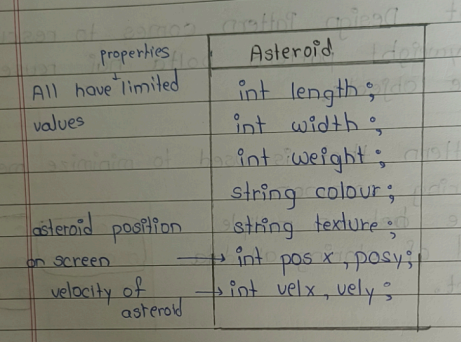
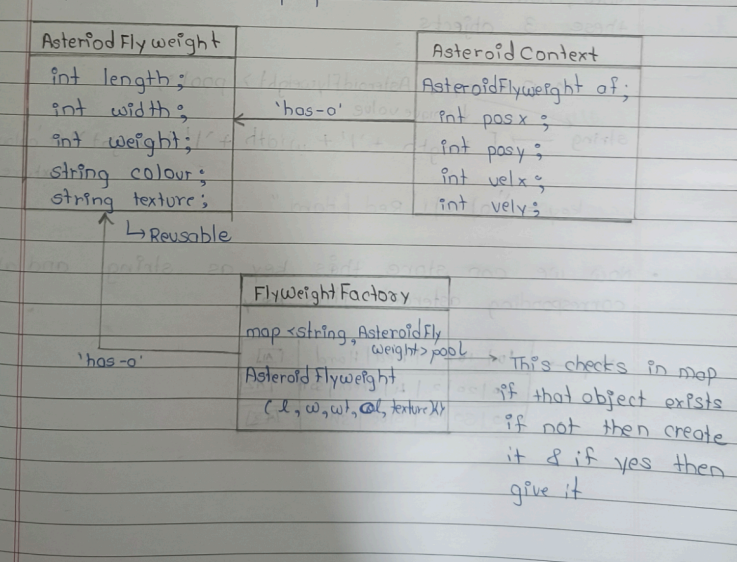
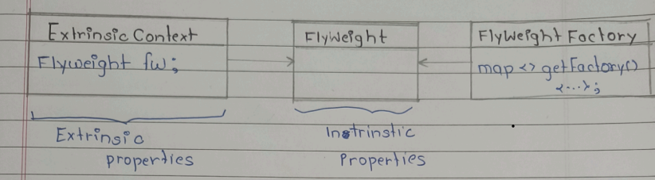

---

# 🟦 Day 30 – Flyweight Design Pattern
---

# 🟩 Introduction

👉 Flyweight Design Pattern is used to reduce memory usage when we need to create a very large number of similar objects.

* Flyweight pattern that is used to minimize memory usage by sharing common parts of state between muliple objects instead of storing all data in each object.

Let's Takes an Example:

* Suppose hum game bana rahe hain
* Bahot saare objects create ho rahe hain
* RAM limited hoti hai
* Agar har object ka pura data alag store karenge toh memory issue aa sakta hai

---

# 🟩 Game Example 

* You are developing a game. You have spaceship which shoots laser and many asteriods are also coming and you have to shoot that asteroids.

## 🎮 Scenario

Spaceship laser shoot karta hai.

Bahot saare asteroids aa rahe hain.

Difficulty level ke according:

```text
Easy  → 3-4 asteroids
Hard  → hundreds of asteroids
```

👉 Agar memory optimize nahi hui toh:

```text
Game crash ho sakta hai
```

## ❌ Problem Without Flyweight

Suppose game me:

```text
1000 Asteroids
```

Aur har asteroid me same properties store ho:

```text
length
width
weight
color
texture
```

👉 Toh unnecessary memory waste hogi.


## Solution 

👉 Reuse already created objects instead of creating new objects again and again.

```text
Instead of:

Create 1000 same objects

        ↓

Reuse common objects
```


## 🟩 Why Flyweight Needed?


👉 Common properties ko share karo.

👉 Sirf unique properties alag rakho.


* Object ko 2 parts me divide karo:


1. Intrinsic Properties
2. Extrinsic Properties


## 🟦 Intrinsic Properties

👉 Shared properties

👉 Reusable properties

```text
length
width
weight
color
texture
```

Ye multiple asteroids me same ho sakti hain.


## 🟨 Extrinsic Properties

👉 Unique properties

👉 Har object me alag


```text
position (x,y)
velocity (vx, vy)
```

---

# 🟩 Asteroid Example Before Optimization



---

# 🟩 After Flyweight Optimization



## 🟩 Understanding the Diagram

### 🟦 AsteroidFlyweight

👉 Shared reusable object

Contains:

```text
length
width
weight
color
texture
```

👉 Same object multiple asteroids use karenge.


### 🟨 AsteroidContext

👉 Runtime unique object

Contains:

```text
position
velocity
```


## 🟩 Flyweight Factory


Factory ka kaam:

```text
Check if object already exists
```

If exists:

```text
Return existing object
```

Else:

```text
Create new object
Store in pool
Return object
```

---

## 🟩 Internal Working

Factory ek map maintain karta hai.

```text
map<key, AsteroidFlyweight> pool
```

## 🟩 How Key is Generated?


```text
key =
length + width + weight + color + texture
```

Example:

```text
10|10|1|Red|Hard
```


## 🟩 Example Pool

```text
Map:

10|10|1|Red|Hard  → A1
20|20|2|Green|Soft → A2
30|30|3|Blue|SH → A3
```

## 🟩 Huge Memory Optimization

Suppose combinations:

```text
length  → 10,20,30
width   → 10,20,30
weight  → 1,2,3
color   → R,G,B
texture → H,S,SH
```

👉 Total combinations become limited.

Instead of:

```text
1000 objects
```

We may create only:

```text
3 or few flyweight objects
```

## ⚠ Flyweight Objects Should be Immutable

Because:

```text
If shared object changes,
all users get affected
```

Example:

```text
A1 used by 500 asteroids
```

If color changed:

```text
All 500 asteroids change
```

---

# 🟩 Standard UML




## 🟩 UML Explanation

### 🟦 Flyweight

Stores:

```text
Intrinsic properties
```


### 🟨 ExtrinsicContext

Stores:

```text
Extrinsic properties
```

### 🟩 FlyweightFactory

Responsible for:

```text
Creating / reusing objects
```

---

# 🟩 Standard Definition


👉

```text
Flyweight uses sharing to support
large numbers of fine-grained objects efficiently.
```

---

# 🟩 Real World Examples

## 🎮 Games (GTA-5)

Used to optimize RAM usage.


## 📝 Text Editors

Characters share same:

```text
font
size
style
```

But different:

```text
position
```

---

# 🟩 Real Life Analogy

Suppose school me:

```text
1000 students
```

Uniform same hai:

```text
shirt
pant
tie
```

👉 Uniform shared ho sakta hai.

But unique things:

```text
name
roll no
seat no
```

alag honge.

---

# 🟩 Advantages

✔ Huge memory optimization

✔ Reuse objects

✔ Faster performance

✔ Efficient large-scale systems

✔ Less RAM usage

---

# 🟩 Disadvantages

❌ Code complexity increase

❌ Factory management needed

❌ Hard debugging

❌ Immutable objects required

---

# 🟩 When to Use?

Use Flyweight when:

✔ Bahot saare similar objects ho

✔ Memory optimization needed ho

✔ Shared data possible ho

---

# 🟩 Interview One-Line

👉

```text
Flyweight pattern minimizes memory usage
by sharing common object data.
```


