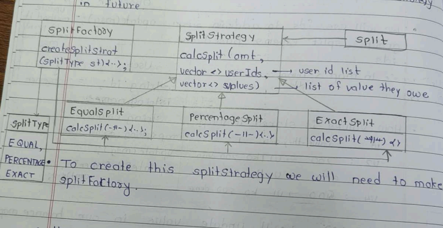
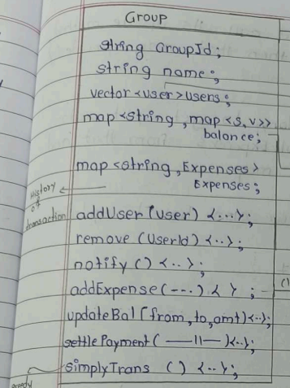
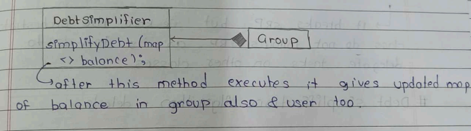
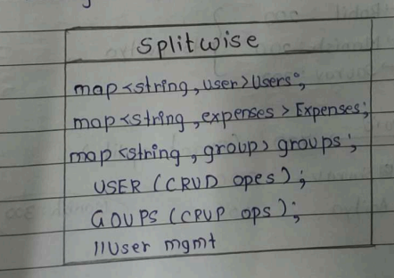
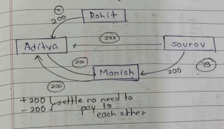
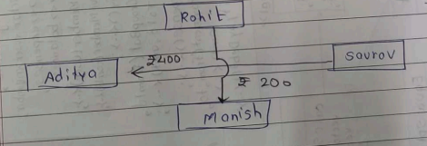
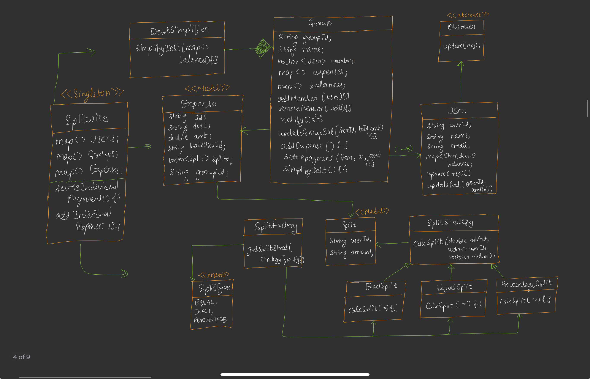

---

# 🟦 Day 31 – Splitwise Clone 

---

# 🟩 Introduction

Splitwise is an application used to **manage shared expenses** among multiple users.

Instead of calculating manually who owes whom, the application automatically:

* Adds expenses
* Splits money
* Maintains balances
* Settles payments
* Sends notifications
* Simplifies transactions

### Examples

* Friends trip
* Flatmates
* College hostel
* Office team lunch
* Family expenses

---

# 🟩 Requirements

According to the notes, our system should support:

✔ User can join a group

✔ User can leave a group

✔ User can add expense inside a group

✔ User can settle payment

✔ Multiple expense split strategies

* Equal Split
* Percentage Split
* Exact Split

✔ User cannot leave until all dues are cleared

✔ Individual (one-to-one) expenses

✔ Notification whenever

* Expense added
* Expense settled

✔ Transaction Simplification (Greedy Algorithm)

---

# 🟩 Happy Flow

```
            User
              │
              ▼
        Splitwise App
              │
      ┌───────┴────────┐
      │                │
   Groups         Individual Expense
      │                │
      └───────┬────────┘
              │
        Notification Server
              │
     Notify all affected users
```

Whenever

* Expense is added
* Payment is settled

everyone receives notification.

---

# 🟩 Extra Requirement

The notes also mention one additional optimization.

```
Simplify Transactions
```

Instead of keeping many unnecessary transactions,

the application should reduce them using

```
Greedy Algorithm
```

This decreases the total number of payments.

(We study this later.)

---

# 🟩 UML Development Approach

The lecture recommends

```
Bottom-Up Approach
```

instead of Top-Down.

Meaning:

```
Start from smaller modules

↓

Build reusable classes

↓

Connect everything

↓

Create final Splitwise class
```

The first module built is

```
Notification System
```

because many classes depend on it.

---

# 🟩 Notification System

Notification System is implemented using the

```
Observer Design Pattern
```

because

Whenever an expense changes,

many users must be notified automatically.


## Observer Diagram

```
              <<Abstract>>

              Observer

          + update(message)
                  ▲
                  │
             implements
                  │
              +---------+
              |  User   |
              +---------+
```

Whenever Observable calls

```
update(message)
```

the User receives and prints the notification.

Example:

```
Expense Added

↓

Observable

↓

User.update()

↓

Notification shown
```


## 🟩 Two Possible Observable Designs

The lecture discusses two options.

### Option 1 (Preferred)

Every Group is an Observable.

```
Group

↓

Notify only its members
```

Advantages

✔ Less unnecessary notifications

✔ Better design

✔ More scalable


### Option 2

Entire Splitwise Application becomes Observable.

```
Splitwise

↓

Notify everyone
```

Not preferred because

many unrelated users also become observers.

---

# 🟩 User Class

The User class acts as an Observer.

```
+----------------------+
|        User          |
+----------------------+
| string id            |
| string name          |
| string email         |
| map<id,double> bal   |
+----------------------+
| update(message)      |
| updateBal(id,amt)    |
+----------------------+
```


## Variables

### id

Unique identifier of every user.

Example

```
U1

U2

U3
```


### name

Stores user name.


### email

Stores email.


### balance Map

This is the most important variable.

```
map<string,double>
```

Stores

```
Other User ID

↓

Money Balance
```

Example

```
U2 → 200

means

U2 owes me ₹200
```

Another example

```
U3 → -150

means

I owe U3 ₹150
```

## 🟩 Why use IDs instead of Objects?

The notes specifically mention

Use

```
User IDs
```

instead of passing User objects everywhere.

Reason

```
Objects are heavy

IDs are lightweight

Easy lookup using Map
```

Example

```
map<string,User>

UserID

↓

User Object
```

## 🟩 Balance Map Example

Suppose

```
U1 paid ₹800
```

Members

```
U1

U2

U3

U4
```

Each share

```
₹200
```

Then balance becomes

```
U2 → U1 = 200

U3 → U1 = 200

U4 → U1 = 200
```

Meaning

Everyone owes U1.


## 🟩 updateBal()

Whenever money changes

```
updateBal()
```

updates

```
balance map
```

instead of recalculating everything.

This method is called frequently throughout the application.


---

# 🟩 Expense Class

Every expense is represented using an Expense object.

```
+-------------------------+
|        Expense          |
+-------------------------+
| expenseId              |
| description            |
| amount                 |
| paidUserId             |
| vector<Split> splits   |
| groupId                |
+-------------------------+
```

## Variables

### expenseId

Unique ID.

Example

```
EXP101
```


### description

Stores purpose.

Example

```
Lunch

Movie

Trip
```


### amount

Stores total money.

Example

```
₹800
```


### paidUserId

Stores

Who actually paid the money.

Example

```
Aditya
```

paid ₹800.

### splits

Stores

Who owes how much.

Instead of

```
vector<pair<id,amount>>
```

the lecture creates a separate class

```
Split
```

because it becomes easier to extend later.

---

### groupId

Stores

```
Which group
```

this expense belongs to.

If it is an individual expense

```
groupId = NULL
```
---

# 🟩 Split Class

Instead of using pair, a dedicated class is created.

```
+----------------+
|     Split      |
+----------------+
| string userId  |
| double amount  |
+----------------+
```

Each object means

```
This user should pay this amount.
```

Example

```
Split

↓

User = U2

Amount = 200
```

Meaning

```
U2 owes ₹200
```


## 🟩 Why Create Split Class?

Instead of

```
pair<string,double>
```

we create

```
Split
```
because later we can easily extend it.

Example

Later we may add

```
Status

Paid Time

Payment Mode
```

without changing existing code.

This follows the Open/Closed Principle.

## 🟩 Relationship Between Expense and Split

```
Expense
   │
   │ 1
   │
   ▼
Multiple Splits

Expense

↓

Split(U2,200)

Split(U3,200)

Split(U4,200)
```

One expense contains multiple Split objects.

---

* Now we need different strategies to split money among all the members and we will  use Strategy Pattern so that we can add more strategy in Future.





# 🟩 Split Strategy Pattern

The notes explain that **every expense is not split in the same way**.

Sometimes users want

* Equal Split
* Exact Split
* Percentage Split

Instead of writing all logic inside the `Expense` class, we use the **Strategy Design Pattern**.


## Why Strategy Pattern?

Without Strategy

```text
Expense

if(Equal)
...

else if(Exact)
...

else if(Percentage)
...
```

❌ Every time a new split type comes, we modify the `Expense` class.

This violates the **Open/Closed Principle (OCP).**

## Solution

Move every split algorithm into its own class.

```text
              ISplitStrategy
                     ▲
      ┌──────────────┼──────────────┐
      │              │              │
 EqualSplit     ExactSplit    PercentageSplit
```

Expense simply calls

```cpp
strategy->calculateSplit();
```

It doesn't know which algorithm is being used.

### 🟩 Equal Split Strategy

Example

```text
Expense = ₹1200

Members = 4
```

Each member pays

```text
1200 / 4

= ₹300
```

Algorithm

```text
share = amount / totalMembers

for each member

Split(member, share)
```

### 🟩 Exact Split Strategy

Suppose

```text
Restaurant Bill

A = 500

B = 300

C = 200
```

No calculations are required.

User already specifies everyone's amount.

```text
Split(A,500)

Split(B,300)

Split(C,200)
```


### 🟩 Percentage Split Strategy

Example

```text
Expense = ₹1000

A = 50%

B = 30%

C = 20%
```

Calculation

```text
A

1000 × 50% = 500

----------------

B

1000 × 30% = 300

----------------

C

1000 × 20% = 200
```

---

# 🟩 Group Class

Now the notes introduce the **Group** class.

A group contains

* users
* expenses

and manages balances.


## UML


* Details about methods

## 1. addUser()

Purpose

Add a new member into the group.

Flow

```text
User joins

↓

Push into vector

↓

Notify everyone
```

Notification Example

```text
Rahul joined Goa Trip.
```

## 2. removeUser()

A user **cannot leave directly**.

First check

```text
Pending Balance ?

↓

YES

↓

Cannot Leave

----------------

NO

↓

Remove User
```

Reason

Otherwise money gets lost.


## 3. addExpense()

This is the most important method.

* Tells splitFactory to get split vector when it get then it ereate Expenses from that and store them in expense map.

Flow

```text
Client

↓

addExpense()

↓

Choose Strategy

↓

Create Expense

↓

Update Balance

↓

Store Expense

↓

Notify Members
```

* Jab bhi expense is add, we also have to update balance list also


###  updateBal()

This method updates every user's balance.

Example

Before

```text
A

0

B

0

C

0
```

After expense

```text
A

+600

B

-300

C

-300
```

Instead of recalculating everything,

only affected users are updated.

This makes the application much faster.


## 4. settlePayment()

Purpose

Pay back money.

Example

Before

```text
B owes A ₹500
```

B pays A

↓

Update

```text
B owes A ₹0
```

↓

Notify users.


## 5. notify()

Whenever

```text
Expense Added

Expense Updated

Expense Settled

User Joined

User Left
```

↓

notify()

↓

Observer Pattern

↓

Every User gets update()

---

* agar hum addExpensec() / settlePayment() call kare, tho indono case mein updatebal() call hoga which will update Balance map and also notify() jo saare user ko update / notify karta hai.
* Humare requirement mein transaction simplify algo
ko implement krna har using Greedy Algo.

* To create simplify Trans() method ek aur class
banana padega - Debt simplifier



## 7. Simplify Trons (map<>balance) 

Calls balance map & then it simplify balance map. Then Debt Simplifier returns updated and simplified map to simplifyTran()
Fhir group ka balance map bhi update kro

### 🟩 Debt Simplification (Greedy Algorithm)

After multiple expenses, the balance sheet becomes very complicated.

Example:

```text
A paid for B

B paid for C

C paid for D

D paid for A
```

There may be **many unnecessary transactions**.

Instead of asking everyone to pay multiple people, we simplify the debts.


### Example Without Simplification

```text
A → B = ₹500

B → C = ₹500
```

Transactions = **2**


### After Simplification

Instead of

```text
A → B → C
```

Directly

```text
A → C = ₹500
```

Transactions = **1**

### Greedy Algorithm Used

The notes use the **Greedy Algorithm**.

Idea

```text
Always match

Largest Debtor

↓

Largest Creditor
```

until everyone's balance becomes zero.


#### Example

Balances

```text
A = +700

B = -400

C = -300
```

Algorithm

```text
Step 1

B pays A

₹400

Remaining

A = +300

B = 0

C = -300

-----------------

Step 2

C pays A

₹300

Done
```

Final Transactions

```text
B → A ₹400

C → A ₹300
```

Only **2 transactions**.

---

# 🟩 Splitwise Facade Responsibilities

Facade provides methods like

```text
createUser()

createGroup()

addExpense()

settlePayment()

showBalance()

simplifyDebt()
```

Internally,

Facade coordinates all other classes.



## 🟩 Facade Flow

```text
Client

↓

SplitwiseFacade

↓

UserManager

↓

ExpenseManager

↓

Notification

↓

DebtSimplifier
```

Client never directly accesses internal classes.

---
* We heve completed all requirement except one
→ Add individual expense

### 🟩 Individual Expense 

Till now, our Splitwise system supports **Group Expenses** only.

But one requirement is still left:

> **Add Individual Expense**

Example:

```text
Aditya pays ₹500 for Rahul.

(No Group Involved)
```

To implement this, we already have the `updateBal()` method inside the `User` class.

Now there are **2 options**:

1. **Create a UserManager class** to handle user-related operations.
2. **Let the Splitwise (Orchestrator) class manage users directly.**

The teacher chooses **Option 2** because the **Splitwise class is an Orchestrator**, and its job is to coordinate different classes by delegating tasks, even if it doesn't strictly follow SRP.

---
## 🟦 Debt Simplification Algorithm 

### 👥 Example

Members:

```text
Aditya
Rohit
Manish
Sourav
```

### 🟩 Transaction 1 (Equal Split)

Aditya paid **₹800** for lunch.

Equal split among 4 people:

```text
Each share = ₹200
```

So,

```text
Rohit  → Aditya = ₹200

Manish → Aditya = ₹200

Sourav → Aditya = ₹200
```


### 🟩 Transaction 2 (Exact Split)

Manish paid **₹700**.

Exact split:

```text
Sourav → Manish = ₹200

Aditya → Manish = ₹200

Manish's own share = ₹300
```


## 🟦 Before Debt Simplification

Current transactions are:

```text
Rohit  → Aditya = ₹200

Manish → Aditya = ₹200

Sourav → Aditya = ₹200

Sourav → Manish = ₹200

Aditya → Manish = ₹200
```

Notice:

```text
Aditya ↔ Manish
```

Both have to pay each other.

This creates **unnecessary transactions**.




## 🟦 Net Gain / Net Loss

Instead of looking at every transaction separately, calculate each person's final balance.

```text
Aditya  = +₹400  (Credit)

Manish  = +₹200  (Credit)

Rohit   = -₹200  (Debit)

Sourav  = -₹400  (Debit)
```

Meaning:

* **Credit (+)** → Person should receive money.
* **Debit (-)** → Person has to pay money.


## 🟦 After Debt Simplification

Now match **debtors** with **creditors**.

```text


Sourav → Aditya = ₹400

Rohit → Manish = ₹200
```

No need for **Aditya ↔ Manish** transaction anymore.




## 🟦 Final Idea

Instead of storing many small transactions,

```text
Calculate Net Credit

+

Calculate Net Debit

↓

Match them using Greedy Algorithm

↓

Generate Minimum Transactions
```

---

# UML Diagram

