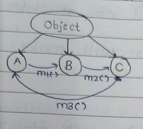
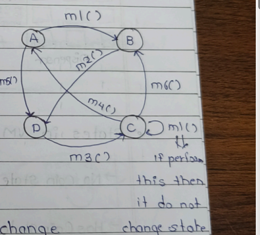
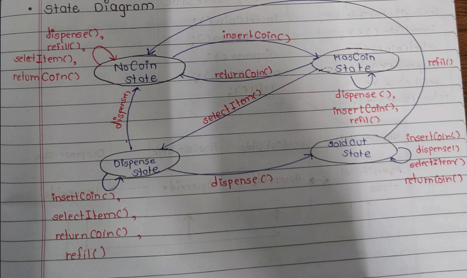
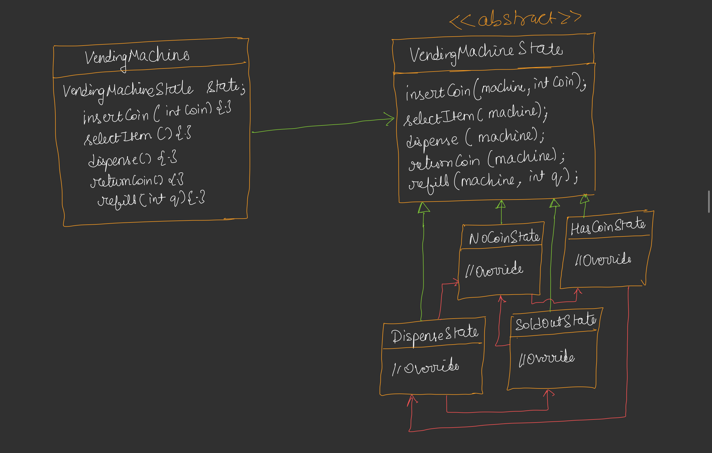
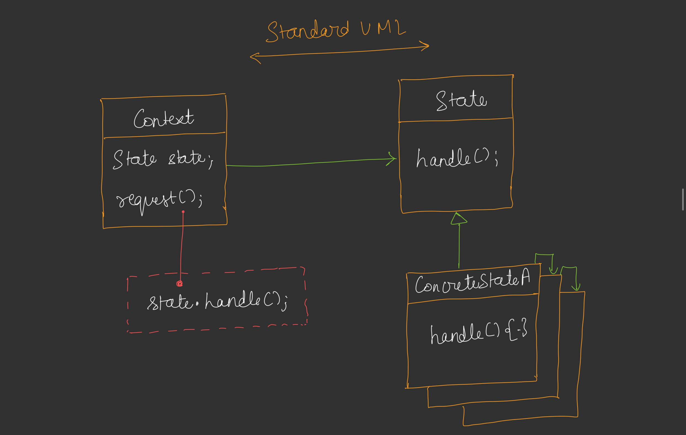

---

# 🟦 Day 32 – State Design Pattern

---

# 🟩 Introduction

The **State Design Pattern** is used when an object can exist in **a finite number of states**, and its behavior changes depending on its current state.

Instead of writing many `if-else` or `switch` statements, we create **separate classes for each state**.

Whenever the object's state changes, its behavior automatically changes.

---

## State Machine

A State Machine shows

* Current State
* Operations (Methods)
* Next State

### Example



Meaning

```
m1() : A → B

m2() : B → C

m3() : C → A
```

Whenever a method executes, the object may move to another state.

---

# 🟩 State Machine Diagram

Another example contains four states.

```
States

A
B
C
D
```

Methods

```
m1() : A → B

m2() : B → D

m3() : D → C

m4() : C → A

m5() : A → D

m6() : C → B
```

Different methods cause different transitions between states.

---

## Important Observation

Whenever we call a method on an object,

Either

```
Current State
        │
        ▼
Change to another state
```

or

```
Current State
        │
        ▼
Remain in same state
```

Both are completely valid.


## Note

Both

* Number of States
* Number of Operations

should generally be **finite**.

---

# 🟩 When to Use State Pattern?

Use the State Pattern when

* Object changes its state after an operation.
* Different states require different behavior.
* Too many if-else conditions are present.
* Behavior depends completely on the current state.

---

# 🟩 Example – Building a Vending Machine

The notes use a **Vending Machine** because it always stays in a limited number of states.


## Working

```
          Vending Machine

+----------------------------+

        Items

        [ ] [ ] [ ]

        [ ] [ ] [ ]

        [ ] [ ] [ ]

        Screen

        Keypad

       Dispenser

+----------------------------+
```

Flow

```
User inserts coin

    ↓

Selects item

    ↓

Machine verifies payment

    ↓

Machine dispenses item

    ↓

Returns remaining money (if any)
```

Using the State Pattern makes the design **loosely coupled**.

---

# 🟩 States of Vending Machine

According to the notes, the machine contains five logical states.


## 1. NoCoinState

```
Coin not inserted.
```

Allowed operations

* Insert Coin
* Refill


## 2. HasCoinState

```
Coin inserted.
```

Now user can select an item.

## 3. DispenseState

```
Machine is dispensing item.
```


## 4. SoldOutState

```
Items finished.
```

Machine cannot sell anything.

## 5. ReturnCoinState

Machine returns money when

* Item unavailable
* Extra money inserted
* User cancels
* Any other failure

---

# 🟩 Situations Where State Does NOT Change

The notes mention two important situations but it will happens many times at every state.


## Case 1

Operation is not allowed in that state.

Example

```
Current State

HasCoin

↓

dispense()
```

Item hasn't been selected.

So

```
Operation rejected

State remains HasCoin
```


## Case 2

Operation succeeds

but state remains same.

Example

```
refill()
```

Machine becomes full.

Current State

```
NoCoin
```

After refill

```
Still NoCoin
```

Only inventory changed.

State didn't.

Another example

```
insertCoin()

Current State

HasCoin
```

Machine already has one coin.

Another coin may be rejected.

State still remains

```
HasCoin
```

---

# 🟩 Complete State Diagram




## Invalid Operations

Every state has some invalid operations.

Example

```
NoCoin State

dispense()

selectItem()

returnCoin()
```

All are invalid.

Only

```
insertCoin()
```

is valid.

---

# 🟩 State Transition Table

The notes also provide a transition table.

| Current State | Insert Coin | Select Item | Dispense         | Return Coin | Refill   |
| ------------- | ----------- | ----------- | ---------------- | ----------- | -------- |
| NoCoin        | HasCoin     | ❌           | ❌                | ❌           | NoCoin   |
| HasCoin       | ❌           | Dispense    | ❌                | NoCoin      | HasCoin  |
| Dispense      | ❌           | ❌           | NoCoin / SoldOut | ❌           | Dispense |
| SoldOut       | ❌           | ❌           | ❌                | ❌           | NoCoin   |

This table clearly tells which operation is valid in each state.

---

# 🟩 UML Design

Instead of writing one huge VendingMachine class,

Create one abstract state class.

Every state becomes a separate class.


## UML




---

# 🟩 Context Class

The notes call **VendingMachine** the **Context Class**.

Why?

Because it does not implement business logic itself.

It simply delegates work to the current state.

```
Client

↓

VendingMachine

↓

Current State Object

↓

Actual Work
```

---

# 🟩 How Methods Work

Suppose

```
Current State

NoCoin
```

Client calls

```
insertCoin()
```

Flow

```
Client

↓

VendingMachine

↓

currentState->insertCoin()

↓

NoCoinState

↓

State changes

↓

HasCoinState

↓

currentState updated
```

Now

```
currentState

=

HasCoinState
```

---

Next

```
selectItem()
```

Flow

```
VendingMachine

↓

HasCoinState

↓

selectItem()

↓

DispenseState

↓

currentState updated
```

---

Next

```
dispense()

↓

DispenseState

↓

NoCoinState
```

or

```
SoldOutState
```

depending upon inventory.

---

## Important Point

The VendingMachine itself is almost a "dumb" object.

Its only job is

```
Store current state

↓

Forward request

↓

Update current state reference
```

Actual business logic exists inside each state class.

---

## Invalid Request Example

Suppose

```
Current State

NoCoin
```

User directly calls

```
selectItem()
```

Flow

```
Client

↓

VendingMachine

↓

NoCoinState

↓

"Insert coin first"

↓

State remains NoCoin
```

Nothing changes.

Only an error message is shown.

---

# 🟩 Standard UML



---

# 🟩 Standard Definition

**State Pattern allows an object to alter its behavior when its internal state changes. The object appears to change its class because different state objects handle the behavior.**

---

# 🟩 Advantages

* Removes long if-else chains.
* Follows Open/Closed Principle.
* Easy to add new states.
* Each state has a single responsibility.
* Improves readability and maintainability.
* Loose coupling between context and behavior.

---

# 🟩 Disadvantages

* Increases the number of classes.
* Slightly more complex design.
* Not suitable when there are very few states.

---

# 🟩 Real World Examples

According to the notes:

1. **Vending Machine**
2. **Document Editor**

   * Draft
   * Published
   * Archived
3. **ATM Machine** (behavior changes based on state)

Additional examples:

* Elevator (Idle, Moving, Door Open)
* Traffic Signal (Red, Yellow, Green)
* Music Player (Playing, Paused, Stopped)

---

# 🟩 Design Principles Followed

* ✔ Single Responsibility Principle (each state handles one behavior)
* ✔ Open/Closed Principle (new states can be added without modifying existing ones)
* ✔ Polymorphism (behavior changes through state objects)
* ✔ Composition over Inheritance (Context has a State object)

---

# 🟩 Interview Questions

**Q1. When should we use the State Pattern?**

When an object's behavior depends on its current state and changes frequently.

**Q2. What is the Context Class?**

The class that stores the current state and delegates requests to it.

**Q3. Does every operation change the state?**

No. Some operations may be invalid or may execute successfully while keeping the object in the same state.

**Q4. What is the biggest advantage?**

It removes complex conditional logic and makes behavior extensible.
