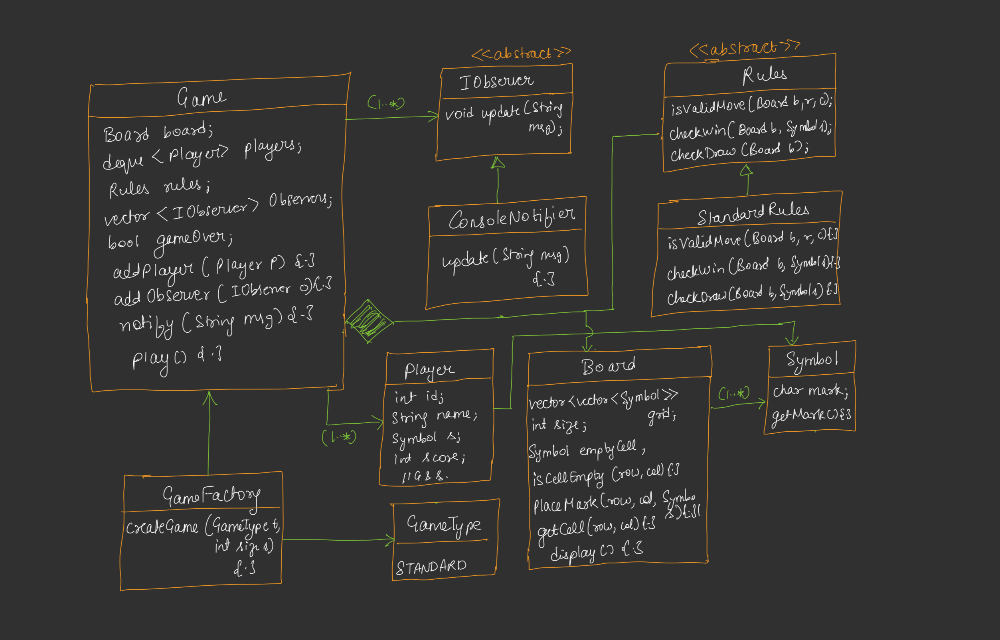

---

# 🟦 Day 33 – Build Tic-Tac-Toe Game

---

# 🟩 Introduction

In this lecture, we design a **Tic-Tac-Toe Game** using **Low Level Design (LLD)** principles.

The focus is not only on making the game work but also on designing it in a way that it is:

* Scalable
* Extensible
* Easy to maintain
* Follows SOLID principles
* Can support new features in the future

---

# 🟩 Requirements

Before designing any system, first collect the requirements.


### ✅ 1. Board Size Should Be Scalable

The board should not be fixed to **3 × 3**.

It should support:

```text
3 × 3

4 × 4

5 × 5

...

N × N
```

Instead of hardcoding the board size, it should be passed dynamically.


### ✅ 2. Rules Should Be Extendable

The game should not be limited to the standard Tic-Tac-Toe rules.

In the future, we may want to support:

* Different winning conditions
* Custom board sizes
* Different rule sets

Therefore, the rule logic should be separated from the board.

### ✅ 3. Support Notifications

Whenever something important happens:

* Player wins
* Draw occurs
* Invalid move
* Game starts
* Game ends

The system should notify users.

This requirement naturally suggests using the **Observer Design Pattern**.

---

# 🟩 UML Design Approach

It follow a **Top-Down Approach**.

Instead of creating small classes first, we start with the highest-level class.

```text
Game
 │
 ├── Board
 │
 ├── Players
 │
 ├── Rules
 │
 ├── Notifications
 │
 └── Symbols
```


## Why Top-Down?

We first identify the main class.

```text
Game
```

Then we ask:

"What objects does Game need?"

Answer:

```text
Game

↓

Board

↓

Player

↓

Rules

↓

Observer

↓

Symbol
```

This makes the design much easier.

---

# 🟩 Step-by-Step Design

## Step 1 – Create Game Class

The **Game** class acts as the controller.

It coordinates everything.

It contains references to:

* Board
* Players
* Rules
* Observers

The Game class controls the entire game flow.

## Step 2 – Create Board Class

The board is where players play.

The notes mention that the board internally stores a **2D Grid**.

```text
Board

────────────

Grid

↓

2D Array
```

Each position of the board stores a symbol.

Example

```text
X  O  _

_  X  O

O  _  X
```


## Step 3 – Small Supporting Classes

Instead of putting everything inside Game,

Create separate classes.

Example

```text
Game

↓

Board

↓

Player

↓

Rules

↓

Symbol
```

This follows **Single Responsibility Principle (SRP).**

---

# 🟩 Empty Cell Representation

A board cell can be empty.

Instead of storing

```text
NULL
```

the notes suggest using

```text
'_'
```

(underscore)

Reason:

* Avoid NullPointer/Null exceptions
* Easier comparison
* Cleaner implementation

Example

```text
X | O | _

O | X | _

_ | O | X
```

---

# 🟩 Board Responsibility (SRP)

It clearly mention:

Board should only manage the board.

Board should **NOT** know:

* Who wins
* Draw conditions
* Game rules

Board should only provide operations like:

```text
Place symbol

Read cell

Display board

Check empty cell
```

This follows **Single Responsibility Principle.**

---

# 🟩 Rules Class

Instead of placing game logic inside Board,

create a separate **Rules** class.

The notes define three important methods.


## 1. checkWin()

```cpp
checkWin(Board b, Symbol s)
```

Purpose

Checks whether the given symbol has won.

Internally checks:

* Rows
* Columns
* Diagonals

Returns

```text
true

or

false
```

## 2. checkDraw()

```cpp
checkDraw(Board b)
```

Purpose

Checks whether the game is a draw.

Logic

```text
Board Full

AND

No Winner
```

Then

```text
Draw
```

## 3. isValidMove()

```cpp
isValidMove(Board,row,col)
```

Checks whether a move is allowed.

Conditions

```text
Inside board

AND

Cell Empty
```

If true

```text
Move Valid
```

Otherwise

```text
Invalid Move
```

---

# 🟩 Abstract Rules Class

It mention making Rules an abstract class.

Reason:

Different games may have different rule strategies.

```text
Rules (Abstract)

│

├── StandardRules

├── CustomRules

└── AdvancedRules
```

This makes the system extensible.

---

# 🟩 Managing Players

The game should support:

```text
2 Players

3 Players

4 Players
```

Therefore,

do not hardcode the number of players.


## Why Not Simple List?

The notes suggest that players may vary in future.

Hence, the player management should remain flexible.

## 🟩 Using Deque for Turn Management

Instead of manually tracking turns,

use

```text
deque<Player>
```

Reason:

It efficiently rotates turns.

Example

```text
Initial

P1

P2

P3
```

After one move

```text
P2

P3

P1
```

After another move

```text
P3

P1

P2
```

Diagram

```text
Front

↓

P1 P2 P3

↓

Pop Front

↓

Push Back

↓

P2 P3 P1
```

This is exactly what the notebook diagram explains.

---

# 🟩 Player Class

Create a separate Player class.

Player stores information like:

```text
Player ID

Name

Score

Symbol
```

Player only stores player information.

---

# 🟩 Notifications (Observer Pattern)

One requirement was:

Support notifications.

Examples

```text
Player Wins

Draw

Invalid Move

Game Started

Game Over
```

Instead of Game sending notifications directly,

use the **Observer Pattern**.


## Observer Flow

```text
Game

↓

Notify()

↓

ConsoleNotifier

↓

Players
```

## ConsoleNotifier

The notes specifically create

```text
ConsoleNotifier
```

Purpose

Display notifications on screen.

Example

```text
Player 1 Won

Game Draw

Invalid Move
```


## Multiple Observers

Observer Pattern allows multiple notification systems.

Example

```text
Game

↓

Console Notifier

↓

Email Notifier

↓

SMS Notifier

↓

Mobile Push Notification
```

No change is required inside Game.

---

# 🟩 Game Over Variable

The notes use

```cpp
bool gameOver;
```

Meaning

If

```text
false
```

↓

Game still running.

If

```text
true
```

↓

Game finished.

Reason may be

```text
Winner

OR

Draw
```

Diagram

```text
GameOver

      |

+-----+------+

|            |

True       False

|            |

Win/Draw   Continue Game
```

---

# 🟩 Final UML Diagram Explanation



## 1. Game

Responsibilities

* Owns Board
* Owns Players
* Owns Rules
* Owns Observers
* Starts game
* Controls turns
* Notifies observers

Methods

```text
play()

addPlayer()

notify()
```


## 2. Board

Stores

```text
Grid

Board Size

Empty Symbol
```

Methods

```text
placeMark()

display()

isCellEmpty()

getCell()
```


## 3. Symbol

Represents

```text
X

O
```

Methods

```text
getMark()
```


## 4. Player

Stores

```text
ID

Name

Score

Symbol
```


## 5. Rules (Abstract)

Defines

```text
checkWin()

checkDraw()

isValidMove()
```


## 6. StandardRules

Implements

```text
checkWin()

checkDraw()

isValidMove()
```


## 7. Observer (Abstract)

Method

```text
update(message)
```


## 8. ConsoleNotifier

Implements

```text
update(message)
```

Displays notification on console.


## 9. GameFactory (Optional)

The notes mention GameFactory as **optional but preferable**.

Purpose

Create Game objects.

Instead of

```cpp
Game g(...);
```

Use

```cpp
GameFactory::createGame(...)
```

Benefits

* Centralized object creation
* Cleaner code
* Easier future modifications
* Follows Factory Design Pattern

---

# 🟩 Overall Application Flow

```text
Client

↓

GameFactory

↓

Game

↓

Create Board

↓

Create Players

↓

Create Rules

↓

Register Observers

↓

Start Game

↓

Current Player Turn

↓

Check Valid Move

↓

Place Symbol

↓

Display Board

↓

Check Win

↓

Check Draw

↓

Notify Players

↓

Next Turn

↓

Repeat until GameOver
```

---

# 🟩 Design Principles Used

* ✅ Single Responsibility Principle (Board, Rules, Player each have one responsibility)
* ✅ Open/Closed Principle (new rules and observers can be added)
* ✅ Strategy Pattern (Rules)
* ✅ Observer Pattern (Notifications)
* ✅ Factory Pattern (GameFactory)
* ✅ Composition (Game has Board, Rules, Players)

---

# 🟩 Advantages

* Scalable board size
* Easy to add new rule sets
* Notifications are extensible
* Easy to maintain
* Follows SOLID principles
* Loose coupling between components
* Clean object-oriented design

---

# 🟩 Interview Questions

**Q1. Why separate Board and Rules?**

Board manages only the grid, while Rules contain the game logic. This follows the Single Responsibility Principle.

**Q2. Why use `deque` for players?**

It efficiently rotates player turns by popping from the front and pushing to the back.

**Q3. Why make Rules abstract?**

To allow different implementations (e.g., `StandardRules`, `CustomRules`) without changing the Game class.

**Q4. Why use Observer Pattern?**

To send notifications (console, email, SMS, push notifications) without tightly coupling the Game class to notification implementations.

**Q5. Why use a GameFactory?**

It centralizes object creation, keeps the client code clean, and makes future changes easier.
