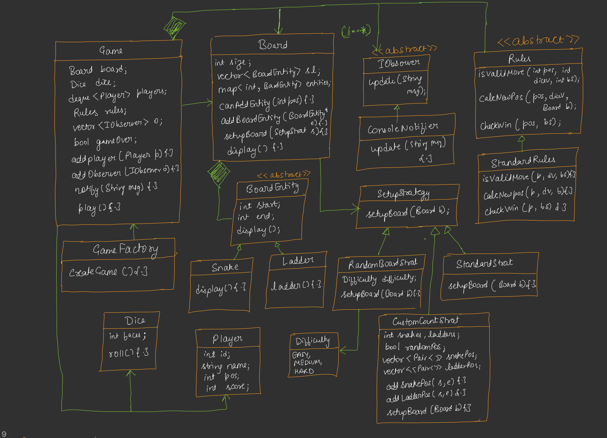

---

# 🟦 Day 34 – Build Snake and Ladder Game

---

# 🟩 Introduction

Snake and Ladder is a very good LLD project because it combines multiple Design Patterns and SOLID Principles.

Instead of directly writing the code, we first analyze the requirements and then design the classes.

The goal is to make the game:

* Scalable
* Extendable
* Easy to maintain
* Easy to add new features without changing existing code

---

# 🟩 Requirements

According to the notes, the game should satisfy the following requirements:

### 1. Scalable Board

The board size should not be fixed.

Instead of always creating a **10 × 10 board (100 cells)**, the client should be able to create any size.

Example

```
10 x 10

20 x 20

50 x 50
```

Instead of hardcoding

```
Board = 100
```

we write

```
Board(size)
```

Now the board becomes scalable.


### 2. Standard Rules should be Extendable

Initially we follow the normal Snake & Ladder rules.

Later we may need

```
Kids Rules

Tournament Rules

Custom Rules

Online Rules
```

Our design should support adding new rules without modifying existing classes.


### 3. Multiple Board Setup Strategies

Different ways of creating the board should be supported.

Example

```
Standard Setup

Random Setup

Custom Setup
```

Instead of writing

```
if(type==1)
```

```
if(type==2)
```

```
if(type==3)
```

we use the **Strategy Pattern**.


### 4. Notifications

The game should support notifications.

Example

```
Player moved

Snake bite

Climbed ladder

Winner announced
```

Later

```
Console Notification

GUI Notification

Email Notification
```

can also be added.

This requirement will be implemented using the **Observer Pattern**.

---

# 🟩 UML Design Approach

The notes mention following a **Top-Down Design Approach**.

Instead of designing small classes first, we begin with the main orchestrator.

```
Game
   │
   ▼
Board
   │
   ▼
Snake
Ladder
Dice
Player
Rules
Notification
```

The Game class controls everything.

Supportive classes are created whenever required.

---

# 🟩 Why Not Use a 2D Board?

Initially, it looks natural to create

```
vector<vector<Cell>>
```

But actually this is unnecessary.

The board can simply be stored as

```
1
2
3
4
5
...
100
```

So one-dimensional storage is enough.

```
vector<Cell>
```

is sufficient.

---

# 🟩 Problem of Using Only Vector

Suppose

```
Snake
40 → 12
```

or

```
Ladder
15 → 55
```

How do we know whether a particular position contains a snake or ladder?

Searching the whole vector every time would be inefficient.


# 🟩 Solution → Use Map

Instead of storing everything inside the vector,

store only the snake and ladder positions inside a map.

```
map<int, BoardEntity*>
```

Key

```
Starting Position
```

Value

```
Snake / Ladder Object
```

Example

```
40 → Snake

15 → Ladder

75 → Snake
```

Now lookup becomes very fast.

---

# 🟩 Creating the Main Classes

The notes suggest creating the following classes first.

```
Game

↓

Board

↓

BoardEntity

↓

Snake

↓

Ladder
```

---

# 🟩 Initial Class Design

```
Game
-------------------
Board board;
```

Game owns one Board.

```
Board
--------------------
int size;

vector<BoardEntity*> entities;
```

Board stores

* board size
* all snakes
* all ladders

---

# 🟩 Board Scalability

Instead of

```
Board()
```

we create

```
Board(int size)
```

Now

```
Board(100)

Board(400)

Board(1000)
```

all become possible.

---

# 🟩 Snake and Ladder Design

Initially we may think of creating

```
vector<Snake>

vector<Ladder>
```

But this duplicates logic.

Both Snake and Ladder have

```
Start

End

Display()
```

Common properties should be moved into a parent class.

---

# 🟩 Abstract Parent Class

```
            BoardEntity
          ----------------
          start
          end
          display()

             ▲
      ┌──────┴──────┐
      │             │
    Snake        Ladder
```

Snake and Ladder inherit from BoardEntity.


## 🟩 Why BoardEntity?

Both objects share

```
start

end

display()
```

Instead of writing these twice,

inherit them from one abstract class.

This follows

```
Code Reuse

Open Closed Principle

Polymorphism
```

---

# 🟩 Snake Movement

Snake always moves

```
Head

↓

Tail
```

Example

```
80

↓

35
```

Player loses position.

---

# 🟩 Ladder Movement

Ladder always moves

```
Bottom

↓

Top
```

Example

```
12

↓

70
```

Player gains position.

---

# 🟩 Board Stores Entities Using Map

```
Board
--------------------------

map<int, BoardEntity*> entities;
```

Meaning

```
Key

↓

Snake Head

OR

Ladder Bottom
```

Value

```
Actual Snake/Ladder Object
```

Example

```
15 → Ladder

40 → Snake

78 → Snake
```

Whenever a player reaches

```
15
```

Board immediately knows

```
Ladder exists.
```

---

# 🟩 Why Use Map Instead of Array?

The notes explain that board positions are continuous (1 to size), but **snakes and ladders exist only at a few positions**.

Using a map stores **only the required positions**, making lookup efficient without wasting extra space.

---

# 🟩 Board Class

The **Board** class is one of the most important classes in the system.

It is responsible for managing the game board and all the entities (Snakes and Ladders).

According to the notes, **Board should NOT contain the game logic**.

Its responsibility is only to manage the board.

---

## Responsibilities of Board

✔ Store board size

✔ Store snakes

✔ Store ladders

✔ Check whether any entity exists at a position

✔ Return the destination if player lands on snake/ladder

✔ Initialize board using a setup strategy

---

### UML

```text
                Board
-----------------------------------
- int size

- map<int, BoardEntity*> entities

-----------------------------------

+ initialize()

+ addEntity()

+ removeEntity()

+ hasEntity()

+ getEntity()

+ display()
```


## Board Attributes

### size

Stores the total number of cells.

Example

```text
Board(100)

↓

Cells

1 → 100
```

### entities

```cpp
map<int, BoardEntity*> entities;
```

Stores all snakes and ladders.

Example

```text
15 → Ladder

32 → Snake

60 → Ladder

89 → Snake
```

Only occupied positions are stored.


# 🟩 Board Methods


## initialize()

Purpose

Creates the initial board.

Instead of Board itself deciding where snakes and ladders should be,

it asks the **Setup Strategy**.

```text
Board

↓

Strategy

↓

Place Snakes

↓

Place Ladders
```


## addEntity()

Adds a snake or ladder.

```text
addEntity(entity)
```

Example

```text
Snake

Head = 80

Tail = 45

↓

Stored inside map
```


## removeEntity()

Removes an entity.

Useful for

* Testing
* Custom board
* Dynamic board generation

## hasEntity(position)

Checks whether current cell contains

* Snake

or

* Ladder

Returns

```text
true

or

false
```


## getEntity(position)

Returns

```text
Snake

or

Ladder
```

If nothing exists

```text
nullptr
```


## display()

Prints board information.

Useful for debugging.

---

# 🟩 Why Board Doesn't Create Snakes?

Suppose Board contains

```cpp
createSnake()

createLadder()
```

Then whenever setup changes,

Board must also change.

This violates

```text
Open Closed Principle
```


Instead

```text
Board

↓

calls

↓

Setup Strategy
```

Now Board never changes.

---

# 🟩 Setup Strategy Pattern

The notes introduce another Strategy Pattern.

Instead of Board deciding how to place snakes,

we create

```text
BoardSetupStrategy
```

### UML

```text
           BoardSetupStrategy
          ----------------------

          setup(Board)

                 ▲

     ┌───────────┼─────────────┐

     │           │             │

Standard     Random       Custom
Setup         Setup         Setup
```


## Why Strategy?

Different games need different board layouts.

Examples

```text
School Version

Competition Version

Kids Version

Online Version
```

Instead of

```cpp
if(type==1)

if(type==2)

if(type==3)
```

Use

```text
Strategy Pattern
```

---

# 🟩 Abstract Strategy

```cpp
class BoardSetupStrategy
{
    setup(Board&);
};
```

Purpose

Defines one common interface.

Every strategy implements

```text
setup()
```

## 1.Standard Setup Strategy

Implements the traditional Snake & Ladder board.

Example

```text
Snake

98 → 12

Snake

76 → 25

Ladder

5 → 34

Ladder

18 → 72
```

Every game creates the same board.


### Flow

```text
Board

↓

StandardSetup

↓

Insert predefined snakes

↓

Insert predefined ladders
```


## 2.Random Setup Strategy

Instead of predefined positions,

positions are generated randomly.

Example

```text
Snake

63 → 22

Snake

91 → 50

Ladder

8 → 70

Ladder

40 → 88
```

Every game becomes different.


### Flow

```text
Board

↓

RandomSetup

↓

Generate Random Numbers

↓

Create Snakes

↓

Create Ladders
```

## 3.Custom Setup Strategy

Allows client to create his own board.

Example

```text
Snake

90 → 40

Snake

45 → 20

Ladder

7 → 60

Ladder

32 → 95
```

Mostly useful for

* Testing
* Teachers
* Custom tournaments

---

# 🟩 Why Strategy Pattern Here?

Without Strategy

```text
Board

↓

if Standard

↓

if Random

↓

if Custom
```

Board changes every time.


With Strategy

```text
Board

↓

setup()

↓

Current Strategy
```

Board never changes.

---

# 🟩 Difficulty Enum

The notes introduce

```cpp
Difficulty
```

Purpose

Client simply chooses

```text
Easy

Medium

Hard
```

instead of manually placing snakes.

Example

```text
Difficulty

↓

Easy
```

↓

Few snakes

More ladders


```text
Medium
```

↓

Balanced


```text
Hard
```

↓

More snakes

Few ladders


### Flow

```text
Difficulty

↓

Factory

↓

Setup Strategy

↓

Board
```

---

# 🟩 Dice Class

The Dice class generates random moves.


### UML

```text
            Dice
----------------------------

faces

roll()
```


## Attribute

```text
faces
```

Normally

```text
6
```

But future games may use

```text
8

10

12
```

Hence

```cpp
Dice(int faces)
```

---

## roll()

Returns

```text
1

2

3

4

5

6
```

Randomly.


### Flow

```text
Player Turn

↓

Dice.roll()

↓

Random Number

↓

Move Player
```

---

# 🟩 Why Separate Dice Class?

Instead of

```cpp
Game

↓

rand()%6
```

Create

```text
Dice
```

Advantages

✔ Reusable

✔ Easy testing

✔ Different dice possible

---

# 🟩 Relationships

```text
Game

HAS-A

Board

HAS-A

Dice

HAS-A

Players
```


```text
Board

USES

BoardSetupStrategy
```


```text
Board

HAS-A

BoardEntities
```

---

# 🟩 Complete Flow Till Now

```text
Client

↓

Game

↓

Create Board

↓

Choose Difficulty

↓

Create Setup Strategy

↓

Board.initialize()

↓

Strategy creates

Snakes

+

Ladders

↓

Board Ready

↓

Dice Created

↓

Players Added

↓

Game Starts
```
---

# 🟩 Player Class

The **Player** class represents every player participating in the game.

The Game class **should not store all player information directly**.

Now will create dequeue in Game class For
Players and then create Playen class

Instead, each player has its own object.

## Responsibilities

✔ Store player information

✔ Store current position

✔ Move player

✔ Return current position

✔ Reset player position

## UML

```text
                Player
--------------------------------

- string name

- int id

- int currentPosition

--------------------------------

+ move()

+ getPosition()

+ setPosition()

+ reset()
```


## Attributes

### id

Uniquely identifies a player.

Example

```text
Player 1

Player 2

Player 3
```


### name

Stores player name.

Example

```text
Aditya

Rahul

Aman
```


### currentPosition

Stores player's current board position.

Initially

```text
0
```

After rolling

```text
0

↓

4

↓

17

↓

35

↓

52
```


# 🟩 Player Movement

Whenever Dice is rolled,

Game calculates

```text
newPosition

=

currentPosition

+

diceValue
```

Example

```text
Current Position = 25

Dice = 6

↓

31
```

Now Game checks

```text
Board

↓

Snake?

↓

Ladder?
```

If ladder exists

```text
31

↓

60
```

If snake exists

```text
31

↓

14
```

Finally

```text
Player Position Updated
```

---

# 🟩 Why Player Should Not Know Board?

Player only stores

```text
Position
```

Player does **NOT** know

* Snake

* Ladder

* Rules

* Winner

That is Game's responsibility.

This follows

```text
SRP
```

---

# 🟩 Rules Class

The notes create a separate **Rules** abstraction.

Reason

Different Snake & Ladder games may have different rules.


## UML

```text
              Rule
--------------------------------

movePlayer()

isWinner()

canMove()

```


Game simply calls

```text
Rule

↓

movePlayer()
```

The Rule object decides everything.


## 🟩 Standard Rule

Implements the original Snake & Ladder rules.


## Rule 1

Player rolls dice.

Move forward.


## Rule 2

If player reaches ladder

```text
Bottom

↓

Top
```

## Rule 3

If player reaches snake

```text
Head

↓

Tail
```


## Rule 4

Winning Position

Exactly

```text
Board Size
```

Example

```text
Board =100

Need

100
```

## Rule 5

Suppose

```text
Current

98

Dice

5
```

Player reaches

```text
103
```

This move is invalid.

Player remains

```text
98
```

---

# 🟩 Why Separate Rule Class?

Without Rule class

```text
Game

↓

100 lines

↓

if snake

↓

if ladder

↓

if winner

↓

if overflow
```

Huge class.


With Rule

```text
Game

↓

Rule

↓

Decision
```

Cleaner design.

---

# 🟩 Observer Pattern

The notes introduce Observer Pattern for notifications.

Whenever important events happen

Game notifies all observers.


## Events

```text
Player moved

Snake bite

Ladder climbed

Winner

Game Over
```


## UML

```text
             Observer
----------------------------

update(message)

          ▲

          │

 ConsoleObserver
```


## Observer Flow

```text
Game

↓

notify()

↓

ConsoleObserver

↓

Print Message
```

Example

```text
Player 1 rolled 6

Player reached 45

Snake Bite!

Moved to 18
```

## Why Observer?

Without Observer

Game itself prints

```cpp
cout<<"Winner";
```

Now if GUI comes

Need to modify Game.


With Observer

```text
Game

↓

Observer

↓

Console

GUI

Email

Mobile Notification
```

Game never changes.

---

# 🟦 Game Class

The **Game** class is the **main controller (orchestrator)** of the Snake & Ladder game. It controls the complete game flow by coordinating all other classes.

### Methods

### **1. addObserver(observer)**

* Registers an observer (Console, GUI, etc.).
* Whenever an event occurs, Game notifies all observers.

```text
Game
  ↓
addObserver(ConsoleObserver)
```


### **2. addPlayer(player)**

* Adds players to the game.
* Stores them in a list/deque for turn management.

```text
Player1
Player2
Player3
      ↓
addPlayer()
```


### **3. bool isGameOver**

* Keeps track of whether the game has ended.
* Initially:

```cpp
isGameOver = false;
```

* After every move:

```cpp
Rule::checkWin();
```

If a player wins:

```cpp
isGameOver = true;
```


### **4. play()**

This is the **main game loop**.

```cpp
while(!isGameOver)
{
    // Current player's turn
    // Roll dice
    // Move player
    // Check Snake/Ladder
    // Check Winner
    // Notify observers
}
```

### **5. notify()**

* Sends notifications to all registered observers.

Example:

```text
Player A rolled 6

Player climbed Ladder

Player Won!
```

---

# 🟦 GameFactory 

The **GameFactory** is responsible for **creating and initializing the complete game**.

Instead of the client creating every object manually,

```cpp
Board
Dice
Rule
Players
Observers
Game
```

the client simply calls:

```cpp
Game* game = GameFactory::createGame();
```

The factory internally:

* Creates Board
* Creates Dice
* Creates Rules
* Creates Players
* Adds Observers
* Returns a ready-to-play Game


# 🟩 Complete UML Diagram Explanation



The final UML diagram combines all the classes designed throughout the notes.

Instead of putting everything inside one class, the system is divided into multiple classes where each class has a single responsibility.


## 1️⃣ Game (Main Orchestrator)

The **Game** class is the central controller of the application.

It does not contain all the business logic itself.

Instead, it coordinates different classes.

### Responsibilities

* Initialize the game
* Manage player turns
* Roll the dice
* Ask Rules to validate moves
* Ask Board for snakes/ladders
* Update player positions
* Notify observers
* Check winner
* End the game

### Relationships

```text
Game
│
├── HAS-A Board
├── HAS-A Dice
├── HAS-A Rule
├── HAS-MANY Players
└── HAS-MANY Observers
```


## 2️⃣ Board

Board represents the Snake and Ladder board.

It stores:

* Board Size
* Snakes
* Ladders

It **does not** contain game logic.

### Responsibilities

✔ Store board entities

✔ Return snake/ladder at position

✔ Display board

✔ Initialize board


## 3️⃣ BoardEntity

This is an abstract parent class.

Both Snake and Ladder share common properties.

Instead of duplicating code,

they inherit from BoardEntity.

```text
          BoardEntity
        -----------------
        startPosition
        endPosition
              ▲
        ┌─────┴─────┐
        │           │
      Snake      Ladder
```


## 4️⃣ Snake

Stores

```text
Head Position

Tail Position
```

Movement

```text
Head

↓

Tail
```

Example

```text
95

↓

40
```


## 5️⃣ Ladder

Stores

```text
Bottom Position

Top Position
```

Movement

```text
Bottom

↓

Top
```

Example

```text
10

↓

70
```


## 6️⃣ Dice

Dice generates random numbers.

```text
Dice

↓

roll()

↓

1–6
```

Game never directly generates random numbers.

Everything goes through Dice.


## 7️⃣ Player

Stores

```text
Player Name

ID

Current Position
```

Player only knows its own information.

It does not know

* Snake
* Ladder
* Rules


## 8️⃣ Rule

Rule decides

✔ Valid move

✔ Winner

✔ Snake

✔ Ladder

✔ Overflow

Game simply asks

```text
Rule

↓

What should I do?
```


## 9️⃣ Observer

Whenever something important happens

Game sends notifications.

Example

```text
Player moved

Snake Bite

Ladder Climbed

Winner
```

Observer prints or displays the message.

---

# 🟩 Complete Relationship Diagram

```text
                 Game
                   │
      ┌────────────┼────────────┐
      │            │            │
    Board        Dice         Rule
      │
      │
      ▼
BoardEntity (Abstract)
      ▲
 ┌────┴─────┐
 │          │
Snake     Ladder

Game
 │
 ├────────────► Player

Game
 │
 └────────────► Observer
```

---

# 🟩 Complete Game Flow

The following flow explains how the complete game executes.

```text
Start Game

      │

      ▼

Create Board

      │

      ▼

Choose Setup Strategy

      │

      ▼

Generate Snakes & Ladders

      │

      ▼

Create Dice

      │

      ▼

Create Players

      │

      ▼

Register Observers

      │

      ▼

Game Starts
```

---

## Player Turn Flow

Every player's turn follows the same sequence.

```text
Current Player

      │

      ▼

Roll Dice

      │

      ▼

Calculate New Position

      │

      ▼

Rule checks validity

      │

      ▼

Board checks

Snake ?

Ladder ?

      │

      ▼

Update Position

      │

      ▼

Notify Observer

      │

      ▼

Winner ?

      │

  ┌───┴─────┐

No          Yes

│            │

▼            ▼

Next Turn   End Game
```

---

# 🟩 Sequence Diagram (Simplified)

```text
Player

   │

Roll Dice

   │

   ▼

Game

   │

Dice.roll()

   │

   ▼

Rule.move()

   │

   ▼

Board.hasEntity()

   │

   ▼

Snake / Ladder ?

   │

   ▼

Update Player

   │

   ▼

Observer.notify()

   │

   ▼

Rule.isWinner()

   │

   ▼

Game End / Next Player
```

---

# 🟩 Design Patterns Used


## 1. Strategy Pattern

Used for

```text
Board Setup

↓

Standard Setup

Random Setup

Custom Setup
```

Also used for

```text
Rule

↓

Standard Rule

Custom Rule
```

### Why?

Because behavior may change in the future.


## 2. Observer Pattern

Used for

```text
Notifications
```

Example

```text
Player Won

Snake Bite

Game Over
```

Instead of Game printing everything,

Observers handle notifications.


## 3. Factory Pattern

Used for

```text
GameFactory
```

Creates

```text
Board

Dice

Rules

Observers

Game
```

Client simply writes

```text
GameFactory.createGame()
```


## 4. Composition

Game owns

```text
Board

Dice

Rules

Players
```

Meaning

```text
Game

HAS-A

Board
```


## 5. Inheritance

```text
BoardEntity

↓

Snake

↓

Ladder
```

---

# 🟩 SOLID Principles Used


## SRP (Single Responsibility Principle)

Each class has one responsibility.

```text
Board

↓

Only Board
```

```text
Dice

↓

Only Dice
```

```text
Rule

↓

Only Rules
```

```text
Observer

↓

Only Notifications
```


## OCP (Open Closed Principle)

New Rules

↓

No modification inside Game.

New Observer

↓

No modification inside Game.

New Setup Strategy

↓

Board remains unchanged.


## LSP (Liskov Substitution Principle)

```text
BoardEntity

↓

Snake

↓

Ladder
```

Anywhere BoardEntity is expected,

Snake or Ladder can be used.


## ISP (Interface Segregation Principle)

Each interface contains only required methods.

Example

```text
Observer

↓

update()
```

Only one responsibility.


## DIP (Dependency Inversion Principle)

Game depends upon

```text
Rule Interface

Observer Interface

Setup Strategy Interface
```

Instead of concrete classes.


# 🟩 Interview Questions

### Q1. Why is Board separated from Rules?

Because the Board should only manage the board state, while Rules decide how the game is played. This follows the **Single Responsibility Principle (SRP)**.


### Q2. Why use `BoardEntity`?

Both Snake and Ladder share common properties (`startPosition` and `endPosition`). Creating a common abstract class avoids duplicate code and supports polymorphism.


### Q3. Why use the Strategy Pattern?

To support different board setup algorithms (Standard, Random, Custom) and different game rule implementations without modifying existing classes.


### Q4. Why use the Observer Pattern?

To notify multiple listeners (Console, GUI, Mobile App, etc.) whenever game events occur without tightly coupling them to the Game class.


### Q5. Why use a Factory?

To centralize object creation and keep the client code clean and independent of construction details.


### Q6. Why does the Game class not contain all the logic?

The Game class acts as an **orchestrator**. It coordinates different components rather than implementing all business logic itself, which keeps the design modular and maintainable.

---

# 🟩 Real-Life Analogy

Imagine a real board game:

* **Game** → Referee
* **Board** → Physical game board
* **Player** → People playing
* **Dice** → Dice used to roll numbers
* **Rules** → Rule book
* **Observer** → Audience/Scoreboard announcing events
* **Factory** → Shopkeeper who sets up the game before play begins

Each component has its own job, and together they make the game work smoothly.
