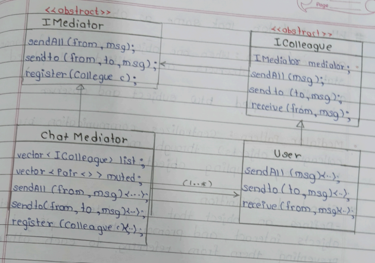
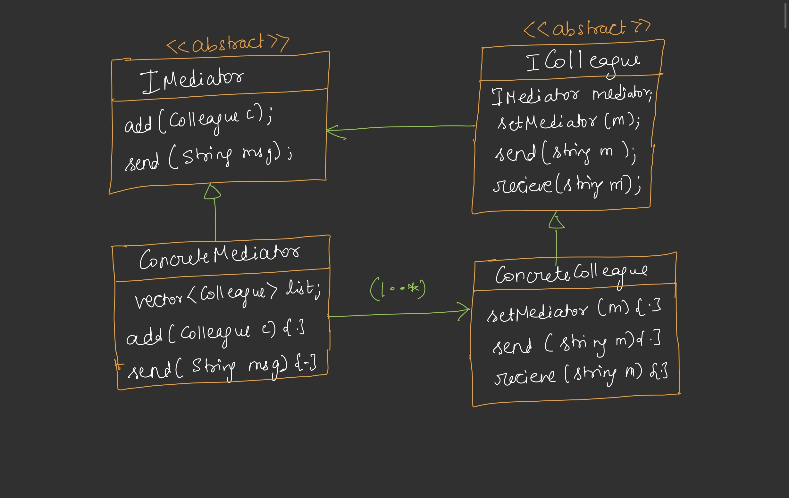

---

# 🟦 Day 35 – Mediator Design Pattern

---

# 🟩 Introduction

Mediator Design Pattern is a **Behavioral Design Pattern**.

It is one of the most **simple and widely used** design patterns. The main purpose of this pattern is to **reduce direct communication between objects**. Instead of objects talking to each other directly, they communicate through a **Mediator**. 

---

# 🟩 Problem

Suppose there are two objects.

```
Object1  ------------->  Object2
```

If Object1 wants to communicate with Object2,

Object1 must store Object2's reference.

Similarly,

Object2 must also store Object1's reference.

```
Object1
---------
Object2* obj2;

Object2
---------
Object1* obj1;
```

Everything works fine.

Now suppose one more object is added.

```
        Obj1
       /   \
    Obj2---Obj3
```

Now,

* Obj1 stores Obj2 and Obj3
* Obj2 stores Obj1 and Obj3
* Obj3 stores Obj1 and Obj2

Every object stores references of every other object.


Suppose we have **N objects**.

Each object stores references of **(N-1)** objects.

```
Obj1
 ├── Obj2
 ├── Obj3
 ├── Obj4

Obj2
 ├── Obj1
 ├── Obj3
 ├── Obj4

Obj3
 ├── Obj1
 ├── Obj2
 ├── Obj4
```

Problems:

* Memory increases.
* Too many references.
* Tight Coupling.
* Difficult to maintain.
* Violates Open/Closed Principle because every new object requires changes in existing objects. 

---

# 🟩 Solution — Mediator Pattern

Instead of storing references of every object,

Create one object called **Mediator**.

Every object stores **only one reference**.

```
           Mediator
         /    |    \
      Obj1  Obj2  Obj3
```

Now

Obj1 wants to send message to Obj3.

Instead of

```
obj3.receive(msg)
```

it does

```
mediator.send(obj3,msg)
```

Mediator knows where Obj3 is stored.

Mediator forwards the message.

### Benefits

✔ Loose Coupling

✔ Less Memory

✔ Easy Maintenance

✔ Easy to add new objects

✔ Objects don't know each other

✔ Centralized communication logic 

---

# 🟩 Communication Flow

#### Without Mediator

```
Obj1 -----> Obj2
 │          ▲
 │          │
 ▼          │
Obj3 ------>│
```

Every object communicates directly.


#### With Mediator

```
Obj1
   │
   ▼
Mediator
   │
   ▼
Obj2
```

Only Mediator communicates.

Objects never communicate directly.

---

# 🟩 Chat Room Example (Without Mediator)

Suppose we are building a Chat Room.

There are multiple users.

```
Rahul
Rohit
Aditya
Aman
```

Every user can

* Broadcast message
* Personal message

So every User class stores

```
vector<User*> users;
```

Functions

```
sendAll(msg)

send(msg,to)

receive(msg)

mute()
```


## sendAll()

```
for(all users)
    user.receive(msg)
```

Message goes to every user.


## send(msg,to)

```
Find user

Call receive()
```

Private message.


##### Problem

Every user stores all other users.

```
User1
   │
   ├──User2
   ├──User3
   ├──User4
```

Memory increases.

References increase.

Coupling increases. 

---

# 🟩 Complex Requirement

Suppose we adds one more feature.

```
mute(user)
```

If Mohan mutes Rahul,

Rahul's messages should not reach Mohan.

Now

sendAll()

needs extra logic.

```
for(auto user:users)
{
    if(user muted)
        continue;

    receive();
}
```

Tomorrow another feature comes

```
Block User

Priority User

Admin

Archive Chat
```

Again modify sendAll()

Again modify send()

Again modify receive()

User class becomes very large.

Breaks SRP.

Hard to maintain.

Solution?

Mediator Pattern. 

---

# 🟩 Chat Room With Mediator

Now User stores only

```
Mediator* mediator;
```

No users vector.

```
User1
   │
   ▼
Mediator
```

Mediator stores

```
vector<User*> users;
```

Now

User wants to send

```
send(msg,to)
```

↓

Mediator

↓

Receiver


Text Diagram

```
          ChatMediator

       /      |       \

    User1   User2   User3

         Communication
         only through
          Mediator
```

Users become loosely coupled.

---

# 🟩 UML (Chat Room)



## IMediator

```
<<abstract>>

IMediator

+ sendAll(from,msg)

+ sendTo(from,to,msg)

+ register(colleague)
```


## ChatMediator

```
ChatMediator

vector<IColleague*> list

vector<pair<>> muted

sendAll()

sendTo()

register()
```

Mediator stores all users.

Handles communication.

Handles mute logic.

Handles routing.


## IColleague

```
<<abstract>>

IMediator mediator

sendAll()

sendTo()

receive()
```

Every colleague knows only Mediator.

## User

```
User

sendAll()

sendTo()

receive()
```

Simple class.

Business logic only.

Communication delegated to Mediator. 

---

# 🟩 Standard UML



Relationship

```
ConcreteMediator

HAS-A

Many Colleagues
```

Every colleague

HAS-A

Mediator

---

# 🟩 Working Flow

```
User1

↓

send("Hello",User3)

↓

Mediator

↓

Find User3

↓

User3.receive()

↓

Display Message
```

Entire communication passes through Mediator.

---


# 🟩 Observer vs Mediator

## Observer Pattern:
Observer Pattern is used for **notification**. One object (Subject) notifies all registered observers whenever its state changes. The observers only receive updates and do not communicate with each other. **Example:** YouTube sends a notification to all subscribers when a new video is uploaded.

## Mediator Pattern:
Mediator Pattern is used for **communication**. Instead of objects communicating directly with each other, they communicate through a central **Mediator** object. This reduces coupling and centralizes communication logic. **Example:** In a chat room, users send messages through the Chat Room (Mediator), not directly to other users.


## Observer

```
Subject

↓

Notify

↓

Observer1

Observer2

Observer3
```

Purpose

Notify multiple observers when subject changes.

Communication

One → Many

---

## Mediator

```
User1

↓

Mediator

↓

User2
```

Purpose

Control communication between colleagues.

Communication

Many ↔ Many (through Mediator)

---

### Difference Table

| Observer                   | Mediator                        |
| -------------------------- | ------------------------------- |
| Subject notifies observers | Mediator controls communication |
| One → Many                 | Many ↔ Many                     |
| Event Notification         | Object Communication            |
| Used for updates           | Used for coordination           |


---

# 🟩 Standard Definition

> **Mediator defines an object that encapsulates how a set of objects interact. It promotes loose coupling by preventing objects from referring to each other explicitly and lets you vary their interaction independently.** 

---

# 🟩 Advantages

✔ Loose Coupling

✔ Centralized communication

✔ Less memory usage

✔ Easy Maintenance

✔ Easy to extend

✔ Cleaner classes

✔ Follows SRP

✔ Objects don't know each other

✔ Reusable communication logic

---

# 🟩 Disadvantages

❌ Mediator may become very large (God Object)

❌ More responsibility on one class

❌ Slight performance overhead

❌ Difficult if mediator becomes too complex

---

# 🟩 Real Life Examples

* Chat Room
* WhatsApp Group
* Air Traffic Control
* Railway Signal System
* Online Matchmaking
* Customer Support System
* Smart Home Hub
* Auction System

---

# 🟩 Interview Questions

### Q1. Why Mediator Pattern?

To remove direct communication between objects and reduce coupling.


### Q2. Which SOLID Principle does it improve?

Single Responsibility Principle (SRP)

Dependency Inversion Principle (DIP)

Open Closed Principle (OCP)


### Q3. Difference between Observer and Mediator?

Observer → Notification

Mediator → Communication


### Q4. Who stores object references?

Mediator stores references of all colleagues.

Each colleague stores only one reference to the Mediator.


### Q5. Is Mediator Behavioral Pattern?

Yes.
