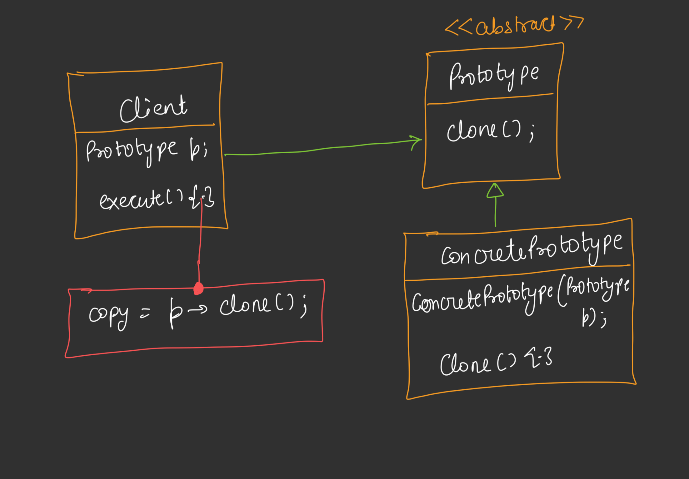

---

# 🟦 Day 36 – Prototype Design Pattern

---

# 🟩 Introduction

The **Prototype Design Pattern** is a **Creational Design Pattern**.

Its main purpose is to **create new objects by copying (cloning) an existing object instead of creating a new object from scratch**. This is useful when object creation is expensive or time-consuming. 

---

# 🟩 Why Prototype Design Pattern?

Normally, whenever we need a new object, we do:

```cpp
A* obj1 = new A();
A* obj2 = new A();
A* obj3 = new A();
```

Every time,

* Memory is allocated.
* Constructor executes.
* Initialization happens again.

If we need hundreds or thousands of similar objects,

this becomes expensive.

---

# 🟩 Problem Statement

Suppose we already created one object.

```text
        Class A

           │

           ▼

        Object A1
```

Now we need another object having almost the same properties.

Normally,

```cpp
A* a1 = new A();

A* a2 = new A();
```

Again,

* Memory allocation
* Constructor call
* Initialization

Everything repeats.


## Why is Object Creation Expensive?

Object creation may involve expensive operations like:

1. Database Connection

```text
Application

↓

Connect Database

↓

Create Object
```

2. Complex Calculations

Example

```text
Large Mathematical Computation

↓

Object Initialization
```


3. Loading Large Files

Example

```text
Configuration File

↓

Images

↓

Models

↓

Object
```

Creating the same object repeatedly wastes both time and resources. 

---

# 🟩 Solution – Prototype Pattern

Instead of creating a new object,

create **one object** first.

Whenever another similar object is needed,

**clone the existing object**.

```text
   Original Object

        │

      clone()

        │

        ▼

   Copied Object
```

Only the required properties are modified afterward.

---

# 🟩 Real Example – NPC (Non-Player Character)

We explain the Prototype Pattern using an **NPC (Non-Player Character)** example. NPCs are background characters in games that perform predefined tasks (for example, pedestrians in GTA). 

Examples:

* GTA pedestrians
* Shopkeepers
* Soldiers
* Villagers
* Police

Suppose a game needs

```text
1000 NPCs
```

All NPCs are almost identical.

Example

```text
Health = 100

Power = 50

Weapon = Gun

Dress = Same
```

Only

```text
Name

Position

Color

Weapon
```

may change.


#### Without Prototype

```text
Create NPC1

Create NPC2

Create NPC3

...

Create NPC1000
```

Every object performs expensive initialization.


#### With Prototype

```text
Create NPC1

↓

Clone NPC1

↓

Clone NPC2

↓

Clone NPC3

↓

Update Small Changes
```

Only one expensive object is created.

The remaining objects are copied.

This greatly reduces object creation time. 

---

# 🟩 How Prototype Solves the Problem

### Step 1

Create the first object.

```cpp
NPC* npc1 = new NPC();
```

### Step 2

Need another NPC?

Instead of

```cpp
NPC* npc2 = new NPC();
```

Do

```cpp
NPC* npc2 = npc1->clone();
```

### Step 3

Update only the required properties.

Example

```text
npc1

Health =100

Power =50

Name ="Soldier"

↓

Clone

↓

npc2

Health =100

Power =50

Name ="Police"
```

Everything else remains the same.

---

# 🟩 Cloning Concept

Prototype Pattern is based on the idea of **copying an existing object**.

Instead of constructing a new object,

we duplicate an existing one.

```text
Original Object

↓

clone()

↓

New Object
```

The cloned object contains the same data as the original object.

---

# 🟩 How Does clone() Work?

We mention that cloning is implemented using a **Copy Constructor**. 

Instead of manually copying each property,

the copy constructor creates a new object using the existing object.

Example

```cpp
NPC(const NPC& other)
{
    name = other.name;
    health = other.health;
    power = other.power;
}
```

Now

```cpp
clone()
```

simply returns

```cpp
return new NPC(*this);
```

---

# 🟩 Three Constructors

The notes mention three common constructors:

### 1. Default Constructor

```cpp
NPC()
```

No parameters.

### 2. Parameterized Constructor

```cpp
NPC(string name,int health,int power)
```

Creates an object with specific values.


### 3. Copy Constructor

```cpp
NPC(const NPC& other)
```

Creates a new object by copying another object.

Prototype Pattern mainly uses the **Copy Constructor**.

---

# 🟩 Key Idea

Instead of

```text
Create

Create

Create

Create
```

Use

```text
Create Once

↓

Clone Many Times
```

This saves

* Time
* Memory allocation cost
* Expensive initialization

---

# 🟩 Copy Constructor

The **Prototype Design Pattern** mainly works using the **Copy Constructor**.

Instead of creating a completely new object,

we create a copy of an existing object.


## What is a Copy Constructor?

A Copy Constructor creates a **new object by copying another object of the same class**.

Syntax

```cpp
ClassName(const ClassName& other)
{
    // Copy data
}
```


## Example

Suppose we have an NPC object.

```cpp
NPC npc1("Soldier", 100, 50);
```

Now instead of creating another NPC manually,

```cpp
NPC npc2(npc1);
```

The copy constructor copies all the values from **npc1** into **npc2**.


## Working

```text
NPC1

Name = Soldier

Health =100

Power =50

        │
        │ Copy Constructor
        ▼

NPC2

Name = Soldier

Health =100

Power =50
```

Both objects are different,

but their data is the same.

---

# 🟩 Clone Method

Instead of exposing the Copy Constructor directly,

Prototype Pattern provides a **clone()** method.

Example

```cpp
NPC* clone()
{
    return new NPC(*this);
}
```

Here,

```cpp
*this
```

means

> Copy the **current object**.

## Working Flow

```text
Existing Object

        │

    clone()

        │

        ▼

Copy Constructor

        │

        ▼

New Object
```

The client never calls the copy constructor directly.

It simply calls

```cpp
clone()
```

---

# 🟩 NPC UML Diagram
```
                    <<abstract>>
                    Clonable
                -------------------
                + clone() : Clonable*
                -------------------
                         ▲
                         │
                         │ inherits
                         │
            -------------------------
                        NPC
            -------------------------
            - string name
            - int health
            - int power
            --------------------------
            + NPC(name, health, power)          // Parameterized Constructor
            + NPC(const NPC& n)                 // Copy Constructor
            + clone() : Clonable*
            ---------------------------

```

## 🟦 Prototype UML

### **1. Clonable (Abstract Class)**

```text
<<abstract>>
Clonable
------------
clone()
```

* `Clonable` is the **Prototype interface**.
* Any class that inherits it **must implement `clone()`**.
* It makes the class **cloneable**.

### **2. NPC Class**

```text
NPC
--------------------
name
health
power
--------------------
NPC(name,h,p)
NPC(const NPC& n)
clone()
```

NPC stores the object data and implements the `clone()` method.


### **3. Parameterized Constructor**

```cpp
NPC("Soldier",100,50);
```

* Creates the **first/original object**.


### **4. Copy Constructor**

```cpp
NPC(const NPC& n)
```

* Creates a **new object by copying** another NPC object.

Example:

```text
npc1  ───►  npc2

Name     = Soldier
Health   = 100
Power    = 50
```

### **5. clone() Method**

```cpp
clone()
{
    return new NPC(*this);
}
```

* `*this` means **current object**.
* It calls the **Copy Constructor**.
* Returns a **new copied object**.

## 🟩 Flow

```text
Create Original NPC
        │
        ▼
npc1
        │
clone()
        │
        ▼
Copy Constructor
        │
        ▼
New NPC (Copied Object)
```


---

# 🟩 Standard UML




## 🟩 Standard Definition

> **Prototype Pattern specifies the kinds of objects to create using a prototypical instance and creates new objects by copying this prototype.**


### Flow

```text
Client

   │

clone()

   │

Prototype

   │

Returns

   ▼

New Object
```

---

# 🟩 Prototype Flow

```text
Client

      │

Need New Object

      │

      ▼

Existing Prototype

      │

clone()

      │

      ▼

Copy Constructor

      │

      ▼

New Object
```

---

# 🟩 Why Not Create New Objects?

Without Prototype

```text
Create Object

↓

Constructor

↓

Initialization

↓

Ready
```

Every object repeats the same expensive work.


With Prototype

```text
Existing Object

↓

clone()

↓

Ready
```

Only one object is initialized.

The rest are copied.

---

# 🟩 Real Life Examples

Prototype Pattern is useful when many similar objects are required.

Examples:

* Game NPCs
* Enemy Characters
* Bullets
* Trees
* Cars
* Documents/Templates
* Resume Templates
* PowerPoint Templates

Instead of creating everything from scratch,

copy an existing object and modify only the required fields.

---

# 🟩 Shallow Copy

Shallow Copy copies only the **references (addresses)** of objects.

```text
Object A

Pointer ─────────► Data

        │

        │ Copy

        ▼

Object B

Pointer ─────────► Same Data
```

Both objects share the same memory.

If one object changes the shared data,

the other object is also affected.

## Problem with Shallow Copy

```text
Object1

Pointer ─────► Address

Object2

Pointer ─────► Same Address
```

Deleting one object may cause problems because both point to the same memory.

---

# 🟩 Deep Copy

Deep Copy creates **completely new memory**.

```text
Object A

Pointer ─────► Data1

Object B

Pointer ─────► Data2
```

Each object owns its own copy.

Changing one object does not affect the other.

---

## Difference

| Shallow Copy              | Deep Copy               |
| ------------------------- | ----------------------- |
| Copies reference          | Copies actual data      |
| Shared memory             | Separate memory         |
| Faster                    | Slightly slower         |
| Unsafe for dynamic memory | Safe for dynamic memory |

---


# 🟩 Advantages

✔ Faster object creation

✔ Reduces expensive initialization

✔ Less object creation cost

✔ Easy to clone complex objects

✔ Good for games

✔ Reduces duplicate code

✔ Improves performance

---

# 🟩 Disadvantages

❌ Cloning complex objects can be difficult

❌ Deep Copy implementation may become complex

❌ Circular references are difficult to clone

❌ Every class must implement `clone()`

---

# 🟩 Interview Questions

### Q1. What problem does Prototype solve?

It avoids creating expensive objects repeatedly by cloning an existing object.


### Q2. Which constructor is mainly used?

**Copy Constructor**


### Q3. Difference between Copy Constructor and clone()?

* **Copy Constructor** copies an object internally.
* **clone()** is a public method that usually uses the copy constructor to create and return a new object.


### Q4. When should Prototype be used?

When object creation is expensive and many similar objects are required.


### Q5. What is the difference between Shallow Copy and Deep Copy?

* **Shallow Copy** copies references, so objects share the same memory.
* **Deep Copy** creates a separate copy of the data, so each object has independent memory.
