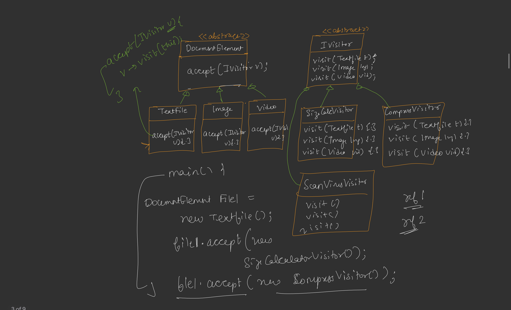
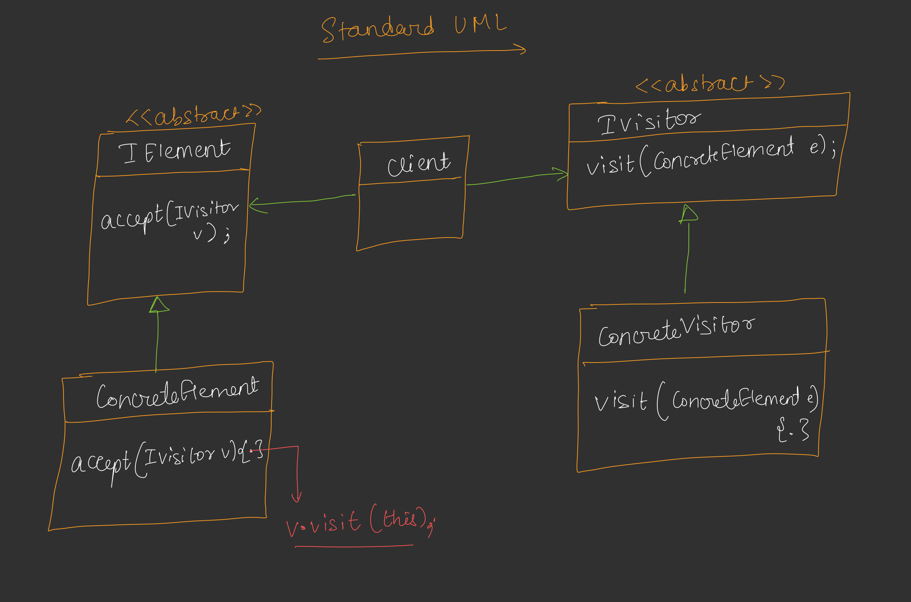

---

# 🟦 Day 38 – Visitor Design Pattern

---

> **Core Idea:** Visitor Pattern ka use tab karte hain jab **existing classes/elements relatively stable ho**, but **new operations frequently add ho rahe ho**. Isme operations ko existing classes se bahar nikal kar separate Visitor classes mein rakhte hain. 

---

# 🟩 What is Visitor Design Pattern?

**Visitor Design Pattern** ek **Behavioral Design Pattern** hai.

Iska main purpose:

> **Existing classes ko modify kiye bina unmein new operations add karna.**

Suppose:

```text
Class A
 ├── M1()
 └── M2()
```

Future mein requirements aati hain:

```text
M3()
M4()
M5()
```

Agar hum har baar `Class A` mein methods add karte rahenge:

```text
Class A
 ├── M1()
 ├── M2()
 ├── M3()
 ├── M4()
 ├── M5()
 └── M6()
```

To class continuously large and complex hoti jayegi. 

---

# 🟩 Problem with Adding Operations

Existing class mein baar-baar new operations add karne se:

### 1️⃣ OCP Violation

**OCP = Open for Extension, Closed for Modification**

Hum new operation add karne ke liye existing class ko repeatedly modify kar rahe hain.

```text
New Operation
      ↓
Modify Existing Class
      ↓
OCP Violation
```

### 2️⃣ SRP Violation

Ek class multiple responsibilities handle karne lagti hai.

```text
Class A
 ├── calculate()
 ├── compress()
 ├── scan()
 ├── print()
 └── export()
```

Class ke change hone ke multiple reasons ho jaate hain.

### 3️⃣ Complexity

Methods badhte jaate hain → class complex hoti jaati hai → testing bhi difficult ho sakti hai. 

---

# 🟩 File System Example

Suppose hamare paas different types ke documents/files hain:

```text
                 DocumentElement
                       │
          ┌────────────┼────────────┐
          ↓            ↓            ↓
      TextFile      ImageFile    VideoFile
```

Initially har file ka operation:

```text
TextFile
 └── calculateSize()

ImageFile
 └── calculateSize()

VideoFile
 └── calculateSize()
```

Ab `compress()` add karna hai:

```text
TextFile
 ├── calculateSize()
 └── compress()

ImageFile
 ├── calculateSize()
 └── compress()

VideoFile
 ├── calculateSize()
 └── compress()
```

Phir `scanForVirus()`:

```text
TextFile
 ├── calculateSize()
 ├── compress()
 └── scanForVirus()

ImageFile
 ├── calculateSize()
 ├── compress()
 └── scanForVirus()

VideoFile
 ├── calculateSize()
 ├── compress()
 └── scanForVirus()
```

### ❌ Problem

Har new operation ke liye **TextFile, ImageFile aur VideoFile sabko modify karna padega**. 

---

# 🟩 Important Assumption

Visitor Pattern ka use karne se pehle ek important condition hai:

### Document types frequently change nahi honge.

```text
TextFile
ImageFile
VideoFile
```

Ye mostly fixed hain.

But operations frequently increase ho sakte hain:

```text
calculateSize()
compress()
scanVirus()
print()
encrypt()
export()
...
```

So:

```text
Document Types → Stable
Operations     → Frequently Changing
```

### ⭐ This is the main situation for Visitor Pattern.


---

# 🟩 Core Idea of Visitor

Design principle:

> **Extract what varies.**

Yahan kya frequently change ho raha hai?

```text
Operations
```

Therefore operations ko document classes ke andar rakhne ke bajay **bahar nikal dete hain**.

### Before Visitor

```text
TextFile
 ├── calculateSize()
 ├── compress()
 └── scanVirus()

ImageFile
 ├── calculateSize()
 ├── compress()
 └── scanVirus()

VideoFile
 ├── calculateSize()
 ├── compress()
 └── scanVirus()
```

### After Visitor

```text
TextFile
ImageFile
VideoFile
     │
     └── accept()
```

And separate Visitor hierarchy:

```text
              IVisitor
                 │
       ┌─────────┼──────────┐
       ↓         ↓          ↓
 SizeVisitor  CompressVisitor  VirusVisitor
```


---

# 🟩 IVisitor

Visitor ke liye ek abstract interface banate hain:

```cpp
class IVisitor {
public:
    virtual void visit(TextFile t) = 0;
    virtual void visit(ImageFile i) = 0;
    virtual void visit(VideoFile v) = 0;
};
```

### Why 3 `visit()` methods?

Because hamare paas 3 different elements hain:

```text
TextFile
ImageFile
VideoFile
```

Therefore:

```cpp
visit(TextFile)
visit(ImageFile)
visit(VideoFile)
```

Same method name `visit()` but different parameters.

👉 This is **Method Overloading**. 

---

# 🟩 Concrete Visitors

Har operation ke liye separate Visitor class banate hain.

## 🔹 SizeCalculationVisitor

```text
SizeCalculationVisitor
       │
       ├── visit(TextFile)
       ├── visit(ImageFile)
       └── visit(VideoFile)
```

Kaam:

```text
TextFile  → size calculate
ImageFile → size calculate
VideoFile → size calculate
```

## 🔹 CompressionVisitor

```text
CompressionVisitor
       │
       ├── visit(TextFile)
       ├── visit(ImageFile)
       └── visit(VideoFile)
```

Kaam:

```text
TextFile  → compress
ImageFile → compress
VideoFile → compress
```

## 🔹 VirusScanVisitor

```text
VirusScanVisitor
       │
       ├── visit(TextFile)
       ├── visit(ImageFile)
       └── visit(VideoFile)
```

Kaam:

```text
TextFile  → virus scan
ImageFile → virus scan
VideoFile → virus scan
```

Kal agar `Encrypt` operation add karna ho:

```text
EncryptionVisitor
```

bana denge.

**Existing document classes ko modify karne ki zarurat nahi.** 

---

# 🟩 Element Classes

Ab document classes mein operations nahi rahenge.

Unmein mainly:

```cpp
accept(IVisitor)
```

rahega.

Structure:

```text
              DocumentElement
                    │
        ┌───────────┼───────────┐
        ↓           ↓           ↓
    TextFile    ImageFile    VideoFile
        │           │           │
     accept()    accept()    accept()
```

---

# 🟩 `accept()` Method ⭐

TextFile:

```cpp
void accept(IVisitor* v) {
    v->visit(this);
}
```

ImageFile:

```cpp
void accept(IVisitor* v) {
    v->visit(this);
}
```

VideoFile:

```cpp
void accept(IVisitor* v) {
    v->visit(this);
}
```

Teeno mein important line:

```cpp
v->visit(this);
```

### `this` kya hai?

`this` means **current object**.

For TextFile:

```text
this → TextFile
```

For ImageFile:

```text
this → ImageFile
```

For VideoFile:

```text
this → VideoFile
```


---

# 🟩 Complete Flow 

Suppose:

```cpp
TextFile file;
file.accept(new SizeCalculationVisitor());
```

Flow:

```text
Client
  │
  │ accept(SizeCalculationVisitor)
  ↓
TextFile
  │
  │ v->visit(this)
  ↓
SizeCalculationVisitor
  │
  │ visit(TextFile)
  ↓
Calculate TextFile Size
```

### Step-by-step

**Step 1**

Client creates:

```cpp
TextFile file;
```

**Step 2**

Client calls:

```cpp
file.accept(new SizeCalculationVisitor());
```

**Step 3**

`TextFile::accept()` executes:

```cpp
v->visit(this);
```

**Step 4**

Here:

```text
v    = SizeCalculationVisitor
this = TextFile
```

So correct method:

```cpp
visit(TextFile)
```

is called.

**Step 5**

Size visitor calculates the TextFile size. 

---

# 🟩 Dry Run

### Size Calculation

```cpp
file1.accept(new SizeCalculationVisitor());
```

```text
TextFile
   ↓
accept(SizeVisitor)
   ↓
v->visit(this)
   ↓
SizeVisitor::visit(TextFile)
   ↓
Calculate Size
```

### Compression

```cpp
file1.accept(new CompressionVisitor());
```

```text
TextFile
   ↓
accept(CompressionVisitor)
   ↓
v->visit(this)
   ↓
CompressionVisitor::visit(TextFile)
   ↓
Compress File
```

### Virus Scan

```cpp
file1.accept(new VirusScanVisitor());
```

```text
TextFile
   ↓
accept(VirusScanVisitor)
   ↓
v->visit(this)
   ↓
VirusScanVisitor::visit(TextFile)
   ↓
Scan File
```


---

# 🟩 12. Complete Visitor Architecture

```text
                     IElement
                         │
          ┌──────────────┼──────────────┐
          ↓              ↓              ↓
      TextFile       ImageFile       VideoFile
          │              │              │
          └──────────────┼──────────────┘
                         │
                      accept()
                         │
                         ↓
                     IVisitor
                         │
          ┌──────────────┼──────────────┐
          ↓              ↓              ↓
    SizeVisitor   CompressionVisitor  VirusVisitor
          │              │              │
       visit()         visit()        visit()
          │              │              │
       TextFile        TextFile       TextFile
       ImageFile       ImageFile      ImageFile
       VideoFile       VideoFile      VideoFile
```


---

# 🟩 Standard UML



Visitor Pattern mein **2 major hierarchies** hoti hain.

### Element Hierarchy

```text
              IElement
                  │
        ┌─────────┼─────────┐
        ↓         ↓         ↓
       E1        E2        E3
```

Har element:

```cpp
accept(IVisitor)
```

provide karta hai.

### Visitor Hierarchy

```text
              IVisitor
                  │
        ┌─────────┼─────────┐
        ↓         ↓         ↓
       V1        V2        V3
```

Har visitor:

```cpp
visit(E1)
visit(E2)
visit(E3)
```

provide karta hai. 

---

# 🟩 Double Dispatch

Visitor Pattern ka **very important interview concept** hai.

### Simple Definition

> **Two types/references together decide which method should be called.**

Example:

```cpp
file.accept(visitor);
```

Yahan two important types hain:

```text
1. Visitor type
2. Element type
```


### First Type → Visitor

```cpp
file.accept(SizeCalculationVisitor);
```

This tells:

```text
Which Visitor?
        ↓
SizeCalculationVisitor
```

### Second Type → Element

Inside:

```cpp
v->visit(this);
```

`this` tells:

```text
Which Element?
       ↓
TextFile
```

Therefore:

```text
SizeCalculationVisitor
          +
       TextFile
          ↓
   visit(TextFile)
```

This is called **Double Dispatch**. 

---

# 🟩 Single Dispatch vs Double Dispatch

### Single Dispatch

Ek reference/type ke basis par method decide hota hai:

```text
One Reference
      ↓
Method Selection
```

### Double Dispatch

Do types together method decide karte hain:

```text
Visitor Type
     +
Element Type
     ↓
Correct visit()
```

### Remember

```text
Visitor Pattern
       ↓
Double Dispatch
```

---

# 🟩 Strategy vs Visitor

Dono patterns mein behavior ko separate classes mein move kar sakte hain, isliye confusion hota hai.

### Strategy

Strategy ka focus:

> **Behavior ko perform karne ka WAY/ALGORITHM change karna.**

Example:

```text
Robot
 ├── Fly
 ├── Talk
 └── Walk
```

`Fly` behavior fixed hai, but usko perform karne ke different ways ho sakte hain:

```text
Fly
 ├── FlyWithWings
 ├── FlyWithJet
 └── NoFly
```

So:

```text
Behavior       → Mostly Fixed
Implementation → Changes
```

---

### Visitor

Visitor ka focus:

> **Existing objects ke liye new operations add karna.**

Example:

```text
Document
 ├── TextFile
 ├── ImageFile
 └── VideoFile
```

Operations continuously add ho sakti hain:

```text
Size
Compress
Virus Scan
Encrypt
Print
Export
...
```

So:

```text
Elements   → Stable
Operations → Frequently Changing
```


---

# 🟩 Strategy vs Visitor – Quick Table

| Strategy                              | Visitor                              |
| ------------------------------------- | ------------------------------------ |
| Changes **how** behavior is performed | Adds **new operations**              |
| Algorithm/implementation changes      | Operations change                    |
| Behavior usually fixed                | Operations can continuously increase |
| Example: Fly with Wings / Jet         | Example: Size / Compress / Scan      |
| Usually single dispatch               | Uses double dispatch                 |
| Comparatively simpler                 | More complex                         |

### Easy Trick

> **Strategy = HOW?**

> **Visitor = WHAT new operation?**


---

# 🟩 If Both Behavior and Implementation Change?

Suppose:

```text
Operations change
       +
Their implementation/way also changes
```

Then Visitor can become complicated.

In such a situation, **Strategy may be simpler**.

Sometimes small OCP trade-off accept karna Visitor ko unnecessarily complex banane se better ho sakta hai. 

---

# 🟩 Standard Definition

> **Visitor allows us to add new operations to existing classes without changing their structure.**

Another important way:

> **It separates operations from the objects on which those operations operate.** 

Simple:

```text
Object
   │
accept()
   │
   ↓
Visitor
   │
Operation
```

---

# 🟩 Real-World Applications

## 🎮 1. Game Rendering Engines

Games mein objects/elements ke upar different operations perform ki ja sakti hain.

Operations time ke saath increase ho sakti hain.

Visitor operations ko objects se separate kar sakta hai.


## 🧑‍💻 2. Compiler

Compiler mein **AST (Abstract Syntax Tree)** hota hai.

AST code ko tree structure mein represent karta hai.

Different visitors tree ke different elements par different operations perform kar sakte hain.

Examples:

```text
AST
 ├── Keywords
 ├── Syntax
 └── Other Code Constructs
```

Visitor different operations ke liye useful ho sakta hai. 

---

# 🟩 When Should We Use Visitor?

Use Visitor when:

```text
Element/Class Structure
          ↓
       Stable

Operations
          ↓
Frequently Changing
```

Example:

```text
TextFile
ImageFile
VideoFile
```

mostly fixed hain.

But operations:

```text
Calculate Size
Compress
Virus Scan
Encrypt
Print
Export
...
```

continuously increase ho sakti hain. 

---

# 🟩 When NOT to Use Visitor?

Agar **elements/classes frequently change** ho rahe hain, Visitor problematic ho sakta hai.

Example:

```text
TextFile
ImageFile
VideoFile
```

Agar suddenly:

```text
AudioFile
PDFFile
```

add karte hain, then visitor interface mein bhi:

```cpp
visit(AudioFile)
visit(PDFFile)
```

add karna padega.

Isliye Visitor best hai:

```text
Elements   → Stable
Operations → Changing
```


---

# 🟩 Interview Questions

### Q1. What is Visitor Design Pattern?

**Answer:**

Visitor is a behavioral design pattern that separates operations from the objects on which they operate. It allows us to add new operations without modifying existing classes.

### Q2. Why do we use Visitor?

When **class/element structure is relatively stable** but **new operations are frequently added**.

### Q3. What is Double Dispatch?

Two types together decide which method should execute:

```text
Visitor Type + Element Type
          ↓
     Correct visit()
```

### Q4. Why is `accept()` used?

`accept()` receives the Visitor and calls:

```cpp
visitor->visit(this);
```

This helps achieve double dispatch.

### Q5. Why is `visit()` overloaded?

Because different element types need different operations:

```cpp
visit(TextFile)
visit(ImageFile)
visit(VideoFile)
```

Same method name but different parameters.

### Q6. Visitor vs Strategy?

> **Strategy changes how an existing behavior is performed, while Visitor allows new operations to be added to an existing object structure.**

